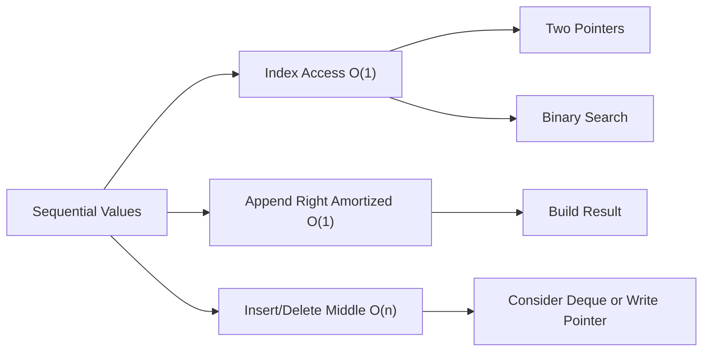

# 01. Array and List

> Array/List는 순서가 있는 데이터를 index로 빠르게 접근하게 해주는 기본 구조다. 코딩 테스트에서는 접근은 빠르지만 중간 삽입/삭제는 비싸다는 비용 모델을 끝까지 유지하는 것이 중요하다.

## 핵심 질문

순서가 있는 데이터를 **index**로 빠르게 접근해야 할 때, 어떤 연산이 빠르고 어떤 연산이 비싼지 어떻게 판단할까?

## 핵심 모델

Array는 값을 순서대로 배치하고 각 위치에 index를 붙인 구조입니다. Python의 `list`는 고정 길이 배열이 아니라 **동적 배열(dynamic array)** 에 가깝습니다. 즉, index 접근과 오른쪽 끝 추가는 빠르지만, 중간/앞쪽 삽입과 삭제는 뒤쪽 원소를 밀거나 당겨야 하므로 비싸집니다.

```text
index:  0   1   2   3   4
value: [7,  1,  5,  3,  9]
```

핵심 사고는 다음과 같습니다.

- `nums[i]`는 위치를 바로 알고 있을 때 강합니다.
- `nums.append(x)`는 오른쪽 끝에 누적할 때 강합니다.
- `nums.insert(0, x)`나 `nums.pop(0)`은 전체 이동 비용 때문에 약합니다.
- slicing은 읽기 쉽지만 새 list를 만들 수 있으므로 길이 `k`만큼 비용이 듭니다.

## 핵심 불변식

Array/List 문제에서 자주 유지해야 하는 불변식은 다음 중 하나입니다.

| Invariant | Meaning | Common Pattern |
|---|---|---|
| `0 <= i < len(nums)` | 모든 index 접근은 범위 안이다 | boundary check |
| `left <= right` | 두 pointer가 유효한 후보 구간을 나타낸다 | two pointers |
| `window = nums[left:right]` | 현재 구간이 half-open interval로 표현된다 | sliding window |
| `prefix[i] = sum(nums[:i])` | prefix index의 의미가 고정되어 있다 | prefix sum |
| `write` 이전은 처리 완료 | in-place overwrite 위치를 관리한다 | compaction |

특히 Python에서는 `range(len(nums))`보다 `enumerate(nums)`가 더 명확한 경우가 많지만, 이웃 원소나 index 계산이 필요하면 index loop가 자연스럽습니다.

## 시각화



## Python 표현

### Basic list operations

```python
nums = [3, 1, 4]

nums.append(1)      # 오른쪽 끝 추가
last = nums.pop()   # 오른쪽 끝 제거
first = nums[0]     # index 접근
sub = nums[1:3]     # 새 list 생성
```

### enumerate for index-value pairs

```python
nums = [10, 20, 30]

for index, value in enumerate(nums):
    print(index, value)
```

### in-place write pointer

```python
def remove_value(nums: list[int], target: int) -> int:
    """Remove target in-place and return the valid prefix length."""
    write = 0
    for value in nums:
        if value != target:
            nums[write] = value
            write += 1
    return write

nums = [3, 2, 2, 3, 4]
length = remove_value(nums, 3)
assert nums[:length] == [2, 2, 4]
```

### list comprehension for transformation

```python
squares = [x * x for x in range(5)]
assert squares == [0, 1, 4, 9, 16]
```

### array module when numeric compactness matters

`array.array`는 같은 C type의 숫자를 더 compact하게 저장하고 싶을 때 고려할 수 있습니다. 코딩 테스트에서는 보통 `list[int]`가 더 단순하지만, Python을 깊게 이해하려면 `list`가 “숫자 자체의 연속 배열”이 아니라 객체 참조 배열이라는 점을 알아두면 좋습니다.

```python
from array import array

values = array("i", [1, 2, 3])
values.append(4)
assert values.tolist() == [1, 2, 3, 4]
```

## 연산과 복잡도

| Operation | Typical Complexity | Notes |
|---|---:|---|
| `nums[i]` | O(1) | index가 유효할 때 |
| `nums.append(x)` | Amortized O(1) | capacity 확장 시 일시적으로 O(n) |
| `nums.pop()` | O(1) | 오른쪽 끝 제거 |
| `nums.insert(i, x)` | O(n) | 뒤쪽 원소 이동 |
| `nums.pop(0)` | O(n) | 모든 원소가 왼쪽으로 이동 |
| `x in nums` | O(n) | 선형 탐색 |
| `nums[a:b]` | O(k) | 길이 k인 새 list 생성 |
| `sorted(nums)` | O(n log n) | 새 list 반환 |
| `nums.sort()` | O(n log n) | in-place 정렬 |

## 선택 신호

Array/List를 먼저 의심할 만한 신호는 다음과 같습니다.

- 입력이 `nums`, `arr`, `list of integers` 형태다.
- index, position, contiguous subarray, subarray length가 중요하다.
- 정렬 후 양끝에서 좁혀갈 수 있다.
- “in-place로 수정하라”, “extra space O(1)” 조건이 있다.
- 결과를 새 list로 만들어도 되는지, 원본을 유지해야 하는지 판단해야 한다.

## 연결되는 패턴

- [Two Pointers](../03.%20Problem%20Solving%20Patterns/01.%20Two%20Pointers.md)
- [Sliding Window](../03.%20Problem%20Solving%20Patterns/02.%20Sliding%20Window.md)
- [Prefix Sum and Difference Array](../03.%20Problem%20Solving%20Patterns/03.%20Prefix%20Sum%20and%20Difference%20Array.md)
- [Sort Then Scan](../03.%20Problem%20Solving%20Patterns/20.%20Sort%20Then%20Scan.md)
- [Binary Search on Answer](../03.%20Problem%20Solving%20Patterns/21.%20Binary%20Search%20on%20Answer.md)

## 구현 템플릿

### 1. Safe index loop

```python
def adjacent_diffs(nums: list[int]) -> list[int]:
    result: list[int] = []
    for i in range(1, len(nums)):
        result.append(nums[i] - nums[i - 1])
    return result
```

### 2. Half-open range thinking

```python
def window_sum(nums: list[int], left: int, right: int) -> int:
    """Return sum over nums[left:right]."""
    total = 0
    for i in range(left, right):
        total += nums[i]
    return total
```

Half-open interval `[left, right)`를 사용하면 길이가 `right - left`로 깔끔해지고, 빈 구간도 `left == right`로 표현됩니다.

### 3. Build result without repeated front insertion

```python
def positives(nums: list[int]) -> list[int]:
    result: list[int] = []
    for value in nums:
        if value > 0:
            result.append(value)
    return result
```

앞쪽에 계속 삽입해야 한다면 `list.insert(0, value)`를 반복하기보다, 오른쪽에 append한 뒤 마지막에 뒤집거나 `deque`를 검토합니다.

## 실수 방지

### 1. Iterating while mutating length

```python
# 위험한 형태
# for value in nums:
#     if value < 0:
#         nums.remove(value)
```

순회 중 list 길이를 바꾸면 원소를 건너뛰기 쉽습니다. 새 list를 만들거나 write pointer를 사용합니다.

### 2. Off-by-one

`range(len(nums) - 1)`와 `range(1, len(nums))`는 둘 다 이웃 비교에 쓰이지만, 기준 index가 다릅니다. `i`가 왼쪽 원소인지 오른쪽 원소인지 먼저 정해야 합니다.

### 3. Slicing cost 무시

```python
# 재귀마다 slicing하면 전체 비용이 커질 수 있음
def bad_sum(nums: list[int]) -> int:
    if not nums:
        return 0
    return nums[0] + bad_sum(nums[1:])
```

slicing은 새 list를 만들기 때문에 큰 입력에서는 index 범위를 넘겨주는 방식이 더 안전합니다.

### 4. `list`를 queue처럼 사용

`pop(0)`을 반복하면 O(n²)가 될 수 있습니다. FIFO가 목적이면 [Queue and Deque](07.%20Queue%20and%20Deque.md)를 사용합니다.

## 쓰지 않는 편이 나은 경우

- 왼쪽 끝 삽입/삭제가 많다 → `collections.deque`
- 빠른 membership test가 핵심이다 → `set` / `dict`
- 매번 최소/최대 원소를 꺼낸다 → `heapq`
- prefix 검색이 반복된다 → Trie
- 숫자 메모리 compactness가 중요하다 → `array`, `numpy` 같은 specialized storage 검토

## 미니 체크리스트

Array/List 문제를 만나면 다음을 먼저 확인합니다.

1. 원본 순서가 중요한가?
2. 정렬해도 되는가?
3. 연속 구간인가, subsequence인가?
4. index 접근이 필요한가, membership test가 필요한가?
5. in-place 요구가 있는가?
6. slicing이 복잡도에 영향을 주는가?

## 관련 문제

실제 풀이 링크는 [Problems](../04.%20Problems/README.md)에 작성한 뒤 연결합니다.

## References

- [Python 3.14.6 Documentation - Sequence Types](https://docs.python.org/3/library/stdtypes.html#sequence-types-list-tuple-range)
- [Python 3.14.6 Documentation - array](https://docs.python.org/3/library/array.html)
- [Python Sorting HOWTO](https://docs.python.org/3/howto/sorting.html)
- [Tech Interview Handbook - Algorithms study cheatsheets](https://www.techinterviewhandbook.org/algorithms/study-cheatsheet/)
