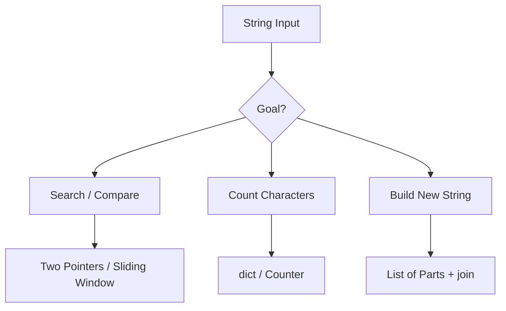

# 02. String

> String은 immutable sequence다. 코딩 테스트에서는 문자 배열처럼 다루되, 매번 새 문자열이 만들어지는 비용과 slicing/encoding 경계를 정확히 이해해야 한다.

## 핵심 질문

문자열이 immutable sequence라는 사실은 탐색, 변환, slicing, 누적 생성 방식에 어떤 영향을 줄까?

## 핵심 모델

Python의 `str`은 Unicode text sequence입니다. 문자열은 immutable이므로 한 번 만든 문자열의 특정 위치를 직접 바꿀 수 없습니다. 따라서 문자열 문제의 핵심은 보통 다음 셋 중 하나입니다.

1. **읽기**: index, slicing, two pointers, scanning
2. **분류**: character counting, membership, normalization
3. **생성**: list에 조각을 모은 뒤 `''.join(parts)`로 합치기

```text
text = "level"
index:  0  1  2  3  4
char:   l  e  v  e  l
```

문자열을 배열처럼 다룰 수는 있지만, 변경은 배열과 다릅니다.

```python
text = "abc"
# text[0] = "A"  # TypeError
text = "A" + text[1:]
assert text == "Abc"
```

위 코드는 새 문자열을 만듭니다. 큰 입력에서 반복 concatenation은 비용이 커질 수 있으므로 조심해야 합니다.

## 핵심 불변식

| Invariant | Meaning | Common Pattern |
|---|---|---|
| `0 <= i < len(text)` | index 접근은 범위 안이다 | scan |
| `left < right` | palindrome 후보 구간이 남아 있다 | two pointers |
| `window_count` reflects `text[left:right]` | 현재 window 집계가 실제 구간과 일치한다 | sliding window |
| `Counter(a) == Counter(b)` | 두 문자열이 같은 multiset을 가진다 | anagram |
| `parts` contains output fragments | 결과 문자열은 조각 list로 누적한다 | join |

## 시각화



## Python 표현

### Basic sequence behavior

```python
text = "Python"
assert text[0] == "P"
assert text[-1] == "n"
assert text[1:4] == "yth"
assert len(text) == 6
```

### Character classification

```python
char = "A"
assert char.isalpha()
assert char.lower() == "a"
```

### Joining fragments

```python
parts = ["Py", "thon", " ", "3.14"]
result = "".join(parts)
assert result == "Python 3.14"
```

### Counting characters

```python
from collections import Counter

counts = Counter("banana")
assert counts["a"] == 3
assert counts["b"] == 1
```

### Unicode code points

```python
assert ord("A") == 65
assert chr(65) == "A"
```

코딩 테스트에서 알파벳 소문자만 다룬다는 조건이 있으면 길이 26짜리 list로 빈도를 관리할 수 있습니다. 조건이 일반 Unicode 문자열이면 `dict`/`Counter`가 더 자연스럽습니다.

## 연산과 복잡도

| Operation | Typical Complexity | Notes |
|---|---:|---|
| `text[i]` | O(1) | index 접근 |
| `len(text)` | O(1) | 길이 조회 |
| `text[a:b]` | O(k) | 길이 k인 새 문자열 생성 |
| `x in text` | O(n) | substring/char 탐색 |
| `text + other` | O(n + m) | 새 문자열 생성 |
| `''.join(parts)` | O(total length) | 많은 조각 결합에 적합 |
| `Counter(text)` | O(n) | 빈도 계산 |
| `text.split()` | O(n) | token list 생성 |

## 선택 신호

String 자료구조를 중심으로 봐야 할 신호입니다.

- palindrome, anagram, substring, subsequence, prefix, suffix
- longest substring under condition
- character replacement, parsing, encoding/decoding
- 문자의 빈도나 종류 수가 조건에 들어간다.
- 결과 문자열을 직접 구성해야 한다.

## 연결되는 패턴

- [Two Pointers](../03.%20Problem%20Solving%20Patterns/01.%20Two%20Pointers.md)
- [Sliding Window](../03.%20Problem%20Solving%20Patterns/02.%20Sliding%20Window.md)
- [Hashing and Counting](../03.%20Problem%20Solving%20Patterns/04.%20Hashing%20and%20Counting.md)
- [Trie Prefix Search](../03.%20Problem%20Solving%20Patterns/10.%20Trie%20Prefix%20Search.md)
- [Sequence DP](../03.%20Problem%20Solving%20Patterns/24.%20Sequence%20DP.md)

## 구현 템플릿

### 1. Palindrome with two pointers

```python
def is_palindrome(text: str) -> bool:
    left = 0
    right = len(text) - 1

    while left < right:
        if text[left] != text[right]:
            return False
        left += 1
        right -= 1

    return True

assert is_palindrome("level")
assert not is_palindrome("python")
```

### 2. Normalize then compare

```python
def normalized_alnum_lower(text: str) -> str:
    parts: list[str] = []
    for char in text:
        if char.isalnum():
            parts.append(char.lower())
    return "".join(parts)

assert normalized_alnum_lower("A man!") == "aman"
```

### 3. Fixed alphabet count

```python
def count_lowercase(text: str) -> list[int]:
    counts = [0] * 26
    for char in text:
        index = ord(char) - ord("a")
        counts[index] += 1
    return counts

assert count_lowercase("abca")[:3] == [2, 1, 1]
```

이 template는 입력이 `'a'`부터 `'z'`까지의 소문자라는 조건이 있을 때만 안전합니다.

### 4. Build output efficiently

```python
def repeat_chars(text: str) -> str:
    parts: list[str] = []
    for char in text:
        parts.append(char)
        parts.append(char)
    return "".join(parts)

assert repeat_chars("abc") == "aabbcc"
```

## 실수 방지

### 1. 반복 문자열 덧셈

```python
# 작은 입력에서는 괜찮아 보여도 큰 입력에서는 비효율적일 수 있음
result = ""
for char in "abcdef":
    result += char.upper()
```

문자열은 immutable이므로 매번 새 객체가 만들어질 수 있습니다. 많은 조각을 합칠 때는 list + `join`을 우선합니다.

### 2. 문자 조건을 입력보다 좁게 가정

영어 소문자만 온다는 조건이 없다면 `ord(char) - ord('a')` 방식은 위험합니다. 문제 조건을 먼저 확인합니다.

### 3. slicing으로 숨은 O(n) 만들기

```python
# 매번 text[i:j]를 만들면 전체 비용이 커질 수 있음
```

슬라이싱은 읽기 좋지만 새 문자열을 만듭니다. 길이만 필요하면 index 경계를 유지하는 편이 낫습니다.

### 4. bytes와 str 혼동

`str`은 text이고, `bytes`는 binary data입니다. 문자 인코딩이 문제에 등장하면 `encode`/`decode` 경계를 명확히 해야 합니다.

## 문자열만 직접 쓰면 안 좋은 경우

- 문자를 자주 수정해야 한다 → list of characters로 변환 후 join
- prefix 검색이 매우 많다 → Trie
- binary protocol을 다룬다 → `bytes`, `bytearray`, `memoryview`
- 정규식이 더 명확한 parsing 문제다 → `re` 검토

## 미니 체크리스트

1. 입력 문자의 범위가 무엇인가?
2. 대소문자/공백/기호를 무시해야 하는가?
3. substring인가 subsequence인가?
4. 새 문자열을 반복 생성하고 있지는 않은가?
5. 빈 문자열과 길이 1 문자열을 처리했는가?
6. Unicode/encoding 이슈가 있는가?

## 관련 문제

실제 풀이 링크는 [Problems](../04.%20Problems/README.md)에 작성한 뒤 연결합니다.

## References

- [Python 3.14.6 Documentation - Text Sequence Type str](https://docs.python.org/3/library/stdtypes.html#text-sequence-type-str)
- [Python 3.14.6 Documentation - collections.Counter](https://docs.python.org/3/library/collections.html#collections.Counter)
- [Python 3.14.6 Documentation - re](https://docs.python.org/3/library/re.html)
- [Tech Interview Handbook - Algorithms study cheatsheets](https://www.techinterviewhandbook.org/algorithms/study-cheatsheet/)
