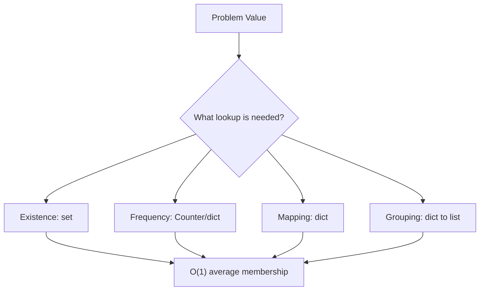

# 03. Hash Table

> Hash Table은 key를 통해 존재 여부, 빈도, 위치를 평균 O(1)에 가깝게 조회하는 구조다. 문제에서는 “다시 찾을 정보”를 무엇으로 key화할지가 핵심이다.

## 핵심 질문

값을 하나씩 비교하는 대신, **찾고 싶은 기준을 key로 바꾸면** 어떤 탐색 비용을 줄일 수 있을까?

## 핵심 모델

Hash Table은 key를 hash 값으로 변환해 저장 위치를 빠르게 찾는 구조입니다. Python에서는 `dict`와 `set`이 대표적인 hash table 기반 자료구조입니다.

```text
key ──hash──> bucket ──> value
```

코딩 테스트에서 Hash Table을 쓰는 순간은 보통 다음 중 하나입니다.

- 존재 여부를 빠르게 확인한다.
- 빈도를 센다.
- 값에서 index 또는 metadata로 역매핑한다.
- 이전에 본 상태를 저장해 중복 계산을 줄인다.

예를 들어 중첩 loop로 모든 pair를 비교하던 문제는, 한쪽 값을 dictionary에 저장해 lookup으로 바꿀 수 있습니다.

## 핵심 불변식

| Invariant | Meaning | Example |
|---|---|---|
| `seen` contains processed values | 이미 본 값만 저장한다 | pair lookup |
| `counts[x]` equals frequency of x | 빈도 table이 현재 prefix와 일치한다 | anagram, counting |
| `index_by_value[v]` points to a valid index | 값에서 위치로 역매핑한다 | complement search |
| key represents equivalence class | 같은 의미의 상태는 같은 key로 간다 | grouping |
| dict/set update order is intentional | 순서가 필요한 경우 insertion order를 의식한다 | stable grouping |

Hash Table 문제의 핵심은 “무엇을 key로 삼을 것인가?”입니다. key가 문제의 동치 조건을 정확히 표현하지 못하면 빠르지만 틀린 풀이가 됩니다.

## 시각화



## Python 표현

### dict

```python
index_by_name = {"Ada": 0, "Grace": 1}
index_by_name["Linus"] = 2
assert index_by_name["Ada"] == 0
```

### set

```python
seen = set()
for value in [3, 1, 3]:
    if value in seen:
        print("duplicate", value)
    seen.add(value)
```

### Counter

```python
from collections import Counter

counts = Counter("banana")
assert counts == {"b": 1, "a": 3, "n": 2}
```

### defaultdict

```python
from collections import defaultdict

groups: dict[str, list[str]] = defaultdict(list)
for word in ["eat", "tea", "tan"]:
    key = "".join(sorted(word))
    groups[key].append(word)
```

### get for missing keys

```python
counts: dict[str, int] = {}
for char in "banana":
    counts[char] = counts.get(char, 0) + 1
```

## 연산과 복잡도

| Operation | Typical Complexity | Notes |
|---|---:|---|
| `key in dict_or_set` | Average O(1) | hash와 equality 사용 |
| `d[key]` | Average O(1) | 없는 key면 `KeyError` |
| `d.get(key, default)` | Average O(1) | missing key 처리 |
| `d[key] = value` | Average O(1) | 삽입/갱신 |
| `del d[key]` | Average O(1) | 없는 key면 `KeyError` |
| iterate keys/items | O(n) | 전체 항목 순회 |
| build Counter | O(n) | 입력 전체 scan |

복잡도는 평균적인 관점입니다. Hash collision이나 key hashing 비용이 크면 체감 성능이 달라질 수 있습니다. 코딩 테스트에서는 보통 평균 O(1)을 기대합니다.

## Hashable Key

Python dict/set key는 hashable이어야 합니다. immutable 객체는 대체로 key가 될 수 있지만, mutable list는 key가 될 수 없습니다.

```python
valid_key = (1, 2)
invalid_key = [1, 2]

positions = {valid_key: "point"}
# positions[invalid_key] = "point"  # TypeError
```

list 상태를 key로 저장해야 한다면 tuple로 바꿉니다.

```python
state = [0, 1, 1]
key = tuple(state)
visited = {key}
```

## 선택 신호

Hash Table을 의심할 신호입니다.

- “두 값의 합”, “complement”, “이전에 본 값”
- 중복 여부, 빈도, 가장 많이 등장한 값
- anagram, grouping, canonical key
- prefix sum + 이전 prefix 조회
- O(n²) brute force에서 한쪽 loop를 lookup으로 대체 가능

## 연결되는 패턴

- [Hashing and Counting](../03.%20Problem%20Solving%20Patterns/04.%20Hashing%20and%20Counting.md)
- [Prefix Sum and Difference Array](../03.%20Problem%20Solving%20Patterns/03.%20Prefix%20Sum%20and%20Difference%20Array.md)
- [Design with Multiple Structures](../03.%20Problem%20Solving%20Patterns/11.%20Design%20with%20Multiple%20Structures.md)
- [Sliding Window](../03.%20Problem%20Solving%20Patterns/02.%20Sliding%20Window.md)

## 구현 템플릿

### 1. Seen set

```python
def has_duplicate(nums: list[int]) -> bool:
    seen: set[int] = set()
    for value in nums:
        if value in seen:
            return True
        seen.add(value)
    return False
```

### 2. Complement lookup

```python
def first_pair_with_sum(nums: list[int], target: int) -> tuple[int, int] | None:
    index_by_value: dict[int, int] = {}

    for index, value in enumerate(nums):
        complement = target - value
        if complement in index_by_value:
            return index_by_value[complement], index
        index_by_value[value] = index

    return None
```

중요한 점은 “현재 값을 먼저 넣을지, complement를 먼저 찾을지”입니다. 같은 원소를 두 번 쓰면 안 되는 문제라면 위처럼 찾고 나서 넣습니다.

### 3. Frequency table

```python
def frequencies(values: list[str]) -> dict[str, int]:
    counts: dict[str, int] = {}
    for value in values:
        counts[value] = counts.get(value, 0) + 1
    return counts
```

### 4. Group by canonical key

```python
def group_words_by_sorted_letters(words: list[str]) -> dict[str, list[str]]:
    groups: dict[str, list[str]] = {}
    for word in words:
        key = "".join(sorted(word))
        groups.setdefault(key, []).append(word)
    return groups
```

`setdefault`는 짧지만, 복잡한 default 생성이 필요하면 `defaultdict` 또는 명시적 분기가 더 읽기 쉽습니다.

## 실수 방지

### 1. Key 설계 오류

Anagram grouping에서 원래 문자열을 key로 쓰면 같은 글자 조합이 묶이지 않습니다. 문제의 동치 조건이 “정렬한 문자들이 같음”인지 “문자 빈도가 같음”인지 먼저 정해야 합니다.

### 2. Mutable key 사용

list, dict, set은 hashable하지 않습니다. 상태를 key로 저장하려면 tuple, frozenset, 문자열 encoding 등으로 바꿉니다.

### 3. Counter 비교의 의미 오해

`Counter`는 빈도 table입니다. 순서가 중요한 문제에 `Counter`만 쓰면 순서 정보를 잃습니다.

### 4. defaultdict의 부작용

`defaultdict`는 missing key를 읽는 순간 key를 만들 수 있습니다. 단순 조회만 하고 싶은 경우 `dict.get`이 더 안전할 때가 있습니다.

### 5. 값 update 순서

prefix sum 문제에서 현재 prefix를 먼저 저장하면 길이 0 구간을 허용하거나 자기 자신을 매칭할 수 있습니다. “조회 후 update”인지 “update 후 조회”인지 불변식으로 정합니다.

## 쓰지 않는 편이 나은 경우

- 순서 관계가 핵심이다 → list 정렬, heap, interval
- 범위 query가 많다 → prefix sum, segment tree 계열
- 가장 작은/큰 값을 반복해서 꺼낸다 → heap
- prefix 문자열 검색이 많다 → Trie
- key 생성 비용이 너무 크다 → 다른 representation 검토

## 미니 체크리스트

1. 내가 빠르게 찾고 싶은 것은 무엇인가?
2. key는 hashable한가?
3. key가 문제의 동치 조건을 정확히 표현하는가?
4. 조회와 update 순서가 맞는가?
5. 빈도인지 존재 여부인지 구분했는가?
6. 순서 정보가 필요한 문제인데 잃어버리지 않았는가?

## 관련 문제

실제 풀이 링크는 [Problems](../04.%20Problems/README.md)에 작성한 뒤 연결합니다.

## References

- [Python 3.14.6 Documentation - Mapping Types dict](https://docs.python.org/3/library/stdtypes.html#mapping-types-dict)
- [Python 3.14.6 Documentation - Set Types](https://docs.python.org/3/library/stdtypes.html#set-types-set-frozenset)
- [Python 3.14.6 Documentation - collections.Counter](https://docs.python.org/3/library/collections.html#collections.Counter)
- [Python 3.14.6 Documentation - collections.defaultdict](https://docs.python.org/3/library/collections.html#collections.defaultdict)
- [Tech Interview Handbook - Algorithms study cheatsheets](https://www.techinterviewhandbook.org/algorithms/study-cheatsheet/)
