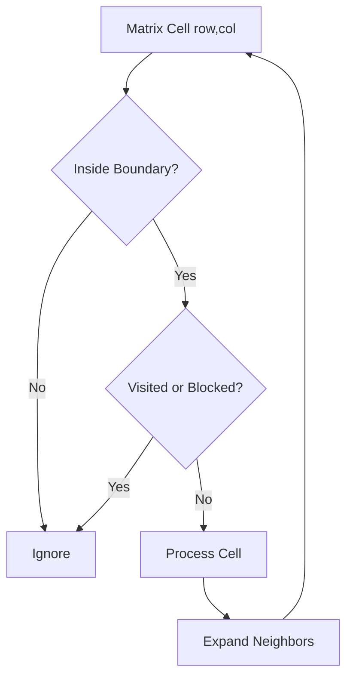

# 04. Matrix

> Matrix는 2차원 좌표 공간을 저장하는 구조다. 코딩 테스트에서는 row/col 경계, 방향 이동, 방문 상태를 일관되게 관리하는 것이 핵심이다.

## 핵심 질문

2차원 데이터를 row/column 좌표로 표현할 때, 경계 검사와 방향 이동을 어떻게 안정적으로 설계할까?

## 핵심 모델

Matrix는 2차원 좌표계를 가진 자료구조입니다. Python에서는 보통 `list[list[T]]`로 표현합니다.

```text
matrix = [
  [1, 2, 3],
  [4, 5, 6],
  [7, 8, 9],
]

matrix[row][col]
```

핵심은 좌표 언어입니다.

- `row`: 위에서 아래 방향 index
- `col`: 왼쪽에서 오른쪽 방향 index
- `rows = len(matrix)`
- `cols = len(matrix[0])` when rectangular and non-empty

Matrix 문제는 배열 문제처럼 보이지만, 많은 경우 graph 문제입니다. 각 cell을 node로 보고, 상하좌우 또는 대각선 이동을 edge로 보면 BFS/DFS가 자연스러워집니다.

## 핵심 불변식

| Invariant | Meaning | Common Pattern |
|---|---|---|
| `0 <= row < rows` | row가 matrix 안에 있다 | boundary check |
| `0 <= col < cols` | col이 matrix 안에 있다 | boundary check |
| `(row, col) not in visited` | 아직 처리하지 않은 cell이다 | DFS/BFS |
| `matrix[row][col]` is current state | cell 값이 상태를 표현한다 | in-place marking |
| directions are complete and intentional | 이동 방향이 문제 정의와 일치한다 | grid traversal |

가장 중요한 습관은 **좌표 접근 전에 경계 검사를 먼저 하는 것**입니다.

## 시각화



## Python 표현

### Rectangular matrix dimensions

```python
matrix = [
    [1, 2, 3],
    [4, 5, 6],
]

rows = len(matrix)
cols = len(matrix[0]) if matrix else 0
assert (rows, cols) == (2, 3)
```

### Direction arrays

```python
DIRECTIONS_4 = [
    (-1, 0),  # up
    (1, 0),   # down
    (0, -1),  # left
    (0, 1),   # right
]

DIRECTIONS_8 = [
    (-1, -1), (-1, 0), (-1, 1),
    (0, -1),           (0, 1),
    (1, -1),  (1, 0),  (1, 1),
]
```

### Iterate all cells

```python
for row in range(rows):
    for col in range(cols):
        value = matrix[row][col]
        print(row, col, value)
```

### Coordinate tuple

```python
cell = (2, 3)
row, col = cell
```

좌표는 tuple로 표현하면 set/dict key로 사용할 수 있습니다.

## 연산과 복잡도

| Operation | Typical Complexity | Notes |
|---|---:|---|
| Access `matrix[r][c]` | O(1) | 경계가 유효할 때 |
| Traverse all cells | O(R × C) | R rows, C cols |
| Copy matrix | O(R × C) | deep copy 필요 여부 확인 |
| DFS/BFS over grid | O(R × C) | 각 cell을 한 번 방문할 때 |
| Rotate / transpose | O(R × C) | 새 matrix 또는 in-place 여부에 따라 다름 |
| Check 4 neighbors | O(1) per cell | 방향 수가 상수 |

## 선택 신호

Matrix를 중심으로 봐야 할 신호입니다.

- grid, board, image, map, island, maze, room
- 상하좌우 이동, 대각선 이동
- flood fill, number of islands, shortest path in grid
- spiral traversal, rotate image, transpose
- row/column 독립 조건
- 2D prefix sum 또는 submatrix query

## 연결되는 패턴

- [Matrix Traversal](../03.%20Problem%20Solving%20Patterns/12.%20Matrix%20Traversal.md)
- [Graph Traversal Patterns](../03.%20Problem%20Solving%20Patterns/08.%20Graph%20Traversal%20Patterns.md)
- [Sliding Window](../03.%20Problem%20Solving%20Patterns/02.%20Sliding%20Window.md)
- [Prefix Sum and Difference Array](../03.%20Problem%20Solving%20Patterns/03.%20Prefix%20Sum%20and%20Difference%20Array.md)

## 구현 템플릿

### 1. Boundary helper

```python
def in_bounds(row: int, col: int, rows: int, cols: int) -> bool:
    return 0 <= row < rows and 0 <= col < cols
```

### 2. Neighbor iteration

```python
def neighbors4(row: int, col: int, rows: int, cols: int):
    for dr, dc in [(-1, 0), (1, 0), (0, -1), (0, 1)]:
        nr = row + dr
        nc = col + dc
        if 0 <= nr < rows and 0 <= nc < cols:
            yield nr, nc
```

### 3. BFS over grid

```python
from collections import deque


def reachable_count(grid: list[list[int]], start: tuple[int, int]) -> int:
    if not grid or not grid[0]:
        return 0

    rows = len(grid)
    cols = len(grid[0])
    start_row, start_col = start

    if not (0 <= start_row < rows and 0 <= start_col < cols):
        return 0
    if grid[start_row][start_col] == 1:  # 1 means blocked
        return 0

    queue = deque([(start_row, start_col)])
    visited = {(start_row, start_col)}

    while queue:
        row, col = queue.popleft()
        for nr, nc in neighbors4(row, col, rows, cols):
            if grid[nr][nc] == 1 or (nr, nc) in visited:
                continue
            visited.add((nr, nc))
            queue.append((nr, nc))

    return len(visited)
```

### 4. Transpose

```python
def transpose(matrix: list[list[int]]) -> list[list[int]]:
    if not matrix:
        return []
    rows = len(matrix)
    cols = len(matrix[0])
    return [[matrix[row][col] for row in range(rows)] for col in range(cols)]

assert transpose([[1, 2, 3], [4, 5, 6]]) == [[1, 4], [2, 5], [3, 6]]
```

### 5. 2D prefix sum shape

```python
def build_prefix_sum(grid: list[list[int]]) -> list[list[int]]:
    rows = len(grid)
    cols = len(grid[0]) if grid else 0
    prefix = [[0] * (cols + 1) for _ in range(rows + 1)]

    for row in range(rows):
        for col in range(cols):
            prefix[row + 1][col + 1] = (
                grid[row][col]
                + prefix[row][col + 1]
                + prefix[row + 1][col]
                - prefix[row][col]
            )

    return prefix
```

여기서 `prefix[r][c]`는 원본 grid의 `[0:r) x [0:c)` 영역 합이라는 의미를 가집니다.

## 실수 방지

### 1. Empty matrix 처리 누락

```python
# matrix[0]을 바로 접근하면 빈 입력에서 IndexError
cols = len(matrix[0]) if matrix else 0
```

### 2. row/col 혼동

`matrix[row][col]` 순서를 `matrix[x][y]`로 부르면 좌표계가 헷갈릴 수 있습니다. 문제 설명이 x/y를 쓰더라도 구현에서는 row/col 이름으로 바꾸는 편이 안전합니다.

### 3. Jagged matrix 가정 오류

모든 row 길이가 같다는 조건이 없으면 `cols = len(matrix[0])`만으로는 부족합니다. 코딩 테스트에서는 보통 rectangular grid가 주어지지만, 조건을 확인해야 합니다.

### 4. visited 처리 시점 오류

BFS에서 queue에 넣을 때 visited 처리하지 않고 꺼낼 때 처리하면 같은 cell이 여러 번 queue에 들어갈 수 있습니다. 일반적으로 enqueue 시점에 방문 처리하는 편이 중복을 줄입니다.

### 5. In-place marking의 부작용

원본 grid를 바꿔도 되는지 확인해야 합니다. 원본 유지가 필요하면 `visited` set 또는 별도 matrix를 사용합니다.

## Matrix만으로 충분하지 않은 경우

- 이동/연결 관계가 핵심이다 → Graph traversal로 전환
- 반복 구간 합 query가 핵심이다 → 2D prefix sum
- 최단 경로에 가중치가 있다 → Dijkstra/Shortest Path
- 문자열 board에서 prefix pruning이 필요하다 → Trie + Backtracking

## 미니 체크리스트

1. 빈 matrix가 가능한가?
2. rectangular matrix인가?
3. 이동 방향은 4방향인가 8방향인가?
4. cell 값이 상태인가, 단순 비용인가?
5. visited를 별도로 둘 것인가, in-place marking할 것인가?
6. BFS 최단거리인가, DFS 전체 탐색인가?
7. row/col boundary를 모든 접근 전에 확인했는가?

## 관련 문제

실제 풀이 링크는 [Problems](../04.%20Problems/README.md)에 작성한 뒤 연결합니다.

## References

- [Python 3.14.6 Documentation - Sequence Types](https://docs.python.org/3/library/stdtypes.html#sequence-types-list-tuple-range)
- [Python 3.14.6 Documentation - collections.deque](https://docs.python.org/3/library/collections.html#collections.deque)
- [Tech Interview Handbook - Algorithms study cheatsheets](https://www.techinterviewhandbook.org/algorithms/study-cheatsheet/)
