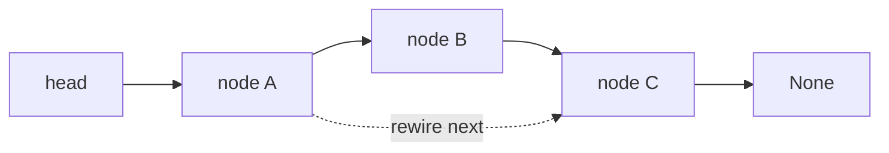

# 05. Linked List

> Linked List는 값보다 연결 관계가 중요한 자료구조다. 코딩 테스트에서는 node를 삭제하거나 뒤집는 것이 아니라, pointer가 가리키는 다음 상태를 안전하게 바꾸는 문제로 보아야 한다.

## 핵심 질문

index가 아니라 **node reference**로 연결된 구조에서, 다음 node를 잃지 않고 연결 관계를 어떻게 안전하게 바꿀까?

## 핵심 모델

Linked List는 각 node가 값과 다음 node에 대한 reference를 갖는 구조입니다.

```text
head
 ↓
[3] -> [7] -> [9] -> None
```

Python 코딩 테스트에서 Linked List는 Python 실무 자료구조라기보다 **pointer 사고 훈련**에 가깝습니다. `list`처럼 `nums[i]`로 바로 접근할 수 없고, head부터 한 칸씩 따라가야 합니다.

## 핵심 불변식

| Invariant | Meaning |
|---|---|
| `head`는 첫 node 또는 `None`이다 | empty list를 표현할 수 있다 |
| 각 node의 `next`는 다음 node 또는 `None`이다 | list가 끝난다 |
| 연결을 바꾸기 전 다음 node를 저장한다 | node를 잃지 않는다 |
| dummy node는 결과 list의 stable anchor다 | head 변경 edge case를 줄인다 |
| cycle이 없다면 traversal은 언젠가 `None`에 도달한다 | 무한 루프 방지 |

## 시각화



## Python 표현

### Basic node class

```python
from __future__ import annotations
from dataclasses import dataclass

@dataclass
class ListNode:
    value: int
    next: ListNode | None = None
```

### Build and traverse

```python
from __future__ import annotations
from dataclasses import dataclass

@dataclass
class ListNode:
    value: int
    next: ListNode | None = None


def to_list(head: ListNode | None) -> list[int]:
    result: list[int] = []
    current = head
    while current is not None:
        result.append(current.value)
        current = current.next
    return result

head = ListNode(1, ListNode(2, ListNode(3)))
assert to_list(head) == [1, 2, 3]
```

## 연산과 복잡도

| Operation | Typical Complexity | Notes |
|---|---:|---|
| Access kth node | O(k) | head부터 이동 |
| Search value | O(n) | 선형 탐색 |
| Insert after known node | O(1) | node reference가 이미 있을 때 |
| Delete after known node | O(1) | 다음 node 존재 확인 필요 |
| Delete by value | O(n) | 이전 node 탐색 필요 |
| Reverse list | O(n) | pointer 재연결 |
| Detect cycle | O(n) | fast/slow pointers |

## 선택 신호

- `ListNode`, `head`, `next`가 등장한다.
- reverse, merge, remove nth, cycle, middle node, palindrome list
- index 접근보다 node 연결 변경이 핵심이다.
- head가 바뀔 수 있다.
- extra space 없이 pointer만 바꾸라는 요구가 있다.

## 연결되는 패턴

- [Fast and Slow Pointers](../03.%20Problem%20Solving%20Patterns/05.%20Fast%20and%20Slow%20Pointers.md)
- [Two Pointers](../03.%20Problem%20Solving%20Patterns/01.%20Two%20Pointers.md)
- [In-place Reversal](../03.%20Problem%20Solving%20Patterns/13.%20In-place%20Reversal.md)

## 구현 템플릿

### 1. Dummy node for stable head

```python
from __future__ import annotations
from dataclasses import dataclass

@dataclass
class ListNode:
    value: int
    next: ListNode | None = None


def remove_value(head: ListNode | None, target: int) -> ListNode | None:
    dummy = ListNode(0, head)
    previous = dummy
    current = head

    while current is not None:
        if current.value == target:
            previous.next = current.next
        else:
            previous = current
        current = current.next

    return dummy.next
```

Dummy node를 쓰면 head 자체가 삭제되는 경우를 일반 case처럼 처리할 수 있습니다.

### 2. Reverse linked list

```python
from __future__ import annotations
from dataclasses import dataclass

@dataclass
class ListNode:
    value: int
    next: ListNode | None = None


def reverse_list(head: ListNode | None) -> ListNode | None:
    previous = None
    current = head

    while current is not None:
        next_node = current.next
        current.next = previous
        previous = current
        current = next_node

    return previous
```

핵심은 `next_node = current.next`를 먼저 저장하는 것입니다. 저장하지 않고 `current.next`를 바꾸면 남은 list를 잃습니다.

### 3. Find middle node

```python
from __future__ import annotations
from dataclasses import dataclass

@dataclass
class ListNode:
    value: int
    next: ListNode | None = None


def middle_node(head: ListNode | None) -> ListNode | None:
    slow = head
    fast = head

    while fast is not None and fast.next is not None:
        slow = slow.next
        fast = fast.next.next

    return slow
```

fast가 두 칸 움직일 때 slow는 한 칸 움직이므로, fast가 끝에 도달하면 slow는 중간에 있습니다.

### 4. Merge two sorted linked lists

```python
from __future__ import annotations
from dataclasses import dataclass

@dataclass
class ListNode:
    value: int
    next: ListNode | None = None


def merge_sorted_lists(a: ListNode | None, b: ListNode | None) -> ListNode | None:
    dummy = ListNode(0)
    tail = dummy

    while a is not None and b is not None:
        if a.value <= b.value:
            tail.next = a
            a = a.next
        else:
            tail.next = b
            b = b.next
        tail = tail.next

    tail.next = a if a is not None else b
    return dummy.next
```

## 실수 방지

### 1. 다음 node 저장 전에 연결을 바꿈

```python
# current.next를 바꾸기 전에 next_node를 저장해야 한다.
```

### 2. head 변경 case 누락

첫 node를 삭제하거나 list를 reverse하면 head가 바뀝니다. dummy node 또는 반환값을 반드시 사용합니다.

### 3. `while current.next`로 순회

마지막 node를 처리하지 못할 수 있습니다. 현재 node를 처리해야 한다면 보통 `while current is not None`입니다.

### 4. cycle 있는 list를 일반 traversal

cycle이 있으면 `while current`가 끝나지 않습니다. cycle 가능성이 있으면 visited set 또는 fast/slow를 사용합니다.

### 5. Python list처럼 생각하기

Linked List에는 O(1) random access가 없습니다. kth node를 찾으려면 O(k) 이동해야 합니다.

## 미니 체크리스트

1. head가 `None`일 수 있는가?
2. head 자체가 바뀔 수 있는가?
3. 이전 node가 필요한가?
4. 연결을 바꾸기 전에 다음 node를 저장했는가?
5. cycle 가능성이 있는가?
6. dummy node를 쓰면 edge case가 줄어드는가?

## 관련 문제

실제 문제는 [Problems](../04.%20Problems/README.md)에 기록합니다.

## References

- [Python 3.14.6 Documentation - dataclasses](https://docs.python.org/3/library/dataclasses.html)
- [Python 3.14.6 Documentation - typing](https://docs.python.org/3/library/typing.html)
- [Tech Interview Handbook - Algorithms study cheatsheets](https://www.techinterviewhandbook.org/algorithms/study-cheatsheet/)
