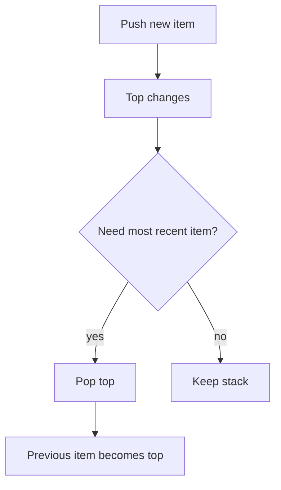

# 06. Stack

> Stack은 가장 최근 상태를 먼저 꺼내는 LIFO 구조다. 코딩 테스트에서는 괄호, 되돌리기, 경로, 단조성처럼 “마지막에 본 것”이 중요한 문제에서 강하다.

## 핵심 질문

가장 최근에 본 상태를 먼저 처리해야 한다면, 어떤 구조가 가장 단순하고 안전할까?

## 핵심 모델

Stack은 **LIFO(Last In, First Out)** 구조입니다. 마지막에 들어간 값이 먼저 나옵니다.

```text
push 1, push 2, push 3

Top
 ↓
[3]
[2]
[1]
```

Stack은 “아직 닫히지 않은 것”, “이전 상태로 돌아가기”, “최근 후보와 현재 값 비교”를 표현할 때 강합니다.

## 핵심 불변식

| Invariant | Meaning | Example |
|---|---|---|
| top is most recent unresolved item | stack top이 가장 최근 미해결 상태다 | parentheses |
| stack order encodes history | 아래쪽일수록 오래된 상태다 | undo |
| monotonic property holds | stack 값이 증가/감소 순서를 유지한다 | monotonic stack |
| path matches recursion depth | stack이 현재 탐색 경로를 나타낸다 | DFS/backtracking |

## 시각화



## Python 표현

Python에서는 일반적으로 `list`를 stack으로 사용합니다.

```python
stack: list[int] = []
stack.append(1)
stack.append(2)
assert stack.pop() == 2
assert stack[-1] == 1
```

- `append`: push
- `pop`: pop top
- `stack[-1]`: peek top

왼쪽 끝 push/pop이 필요하면 [Queue and Deque](07.%20Queue%20and%20Deque.md)의 `deque`를 고려합니다.

## 연산과 복잡도

| Operation | Typical Complexity | Notes |
|---|---:|---|
| push `append` | Amortized O(1) | 오른쪽 끝 추가 |
| pop `pop` | O(1) | 오른쪽 끝 제거 |
| peek `stack[-1]` | O(1) | empty check 필요 |
| search inside stack | O(n) | stack의 주 목적이 아님 |
| iterate stack | O(n) | 아래에서 위 순서로 순회 |

## 선택 신호

- 괄호/태그/중첩 구조 검증
- 최근 값과 현재 값의 관계
- 이전 greater/smaller element
- DFS를 재귀 대신 반복문으로 구현
- undo/backtracking state
- expression evaluation

## 연결되는 패턴

- [Monotonic Stack](../03.%20Problem%20Solving%20Patterns/06.%20Monotonic%20Stack.md)
- [Backtracking Search Patterns](../03.%20Problem%20Solving%20Patterns/09.%20Backtracking%20Search%20Patterns.md)
- [Graph Traversal Patterns](../03.%20Problem%20Solving%20Patterns/08.%20Graph%20Traversal%20Patterns.md)

## 구현 템플릿

### 1. Parentheses validation

```python
def is_valid_parentheses(text: str) -> bool:
    pairs = {")": "(", "]": "[", "}": "{"}
    opens = set(pairs.values())
    stack: list[str] = []

    for char in text:
        if char in opens:
            stack.append(char)
        elif char in pairs:
            if not stack or stack.pop() != pairs[char]:
                return False

    return not stack

assert is_valid_parentheses("([]){}")
assert not is_valid_parentheses("([)]")
```

불변식: stack에는 아직 닫히지 않은 opening bracket만 순서대로 들어 있습니다.

### 2. Iterative DFS shape

```python
def dfs_order(graph: dict[int, list[int]], start: int) -> list[int]:
    visited: set[int] = set()
    stack = [start]
    order: list[int] = []

    while stack:
        node = stack.pop()
        if node in visited:
            continue
        visited.add(node)
        order.append(node)

        for neighbor in reversed(graph.get(node, [])):
            if neighbor not in visited:
                stack.append(neighbor)

    return order
```

`reversed`를 쓰는 이유는 stack이 LIFO라서, 원래 neighbor 순서를 맞추고 싶을 때 push 순서를 반대로 하기 위함입니다.

### 3. Expression evaluation shape

```python
def evaluate_rpn(tokens: list[str]) -> int:
    stack: list[int] = []

    for token in tokens:
        if token not in {"+", "-", "*"}:
            stack.append(int(token))
            continue

        right = stack.pop()
        left = stack.pop()

        if token == "+":
            stack.append(left + right)
        elif token == "-":
            stack.append(left - right)
        else:
            stack.append(left * right)

    if len(stack) != 1:
        raise ValueError("invalid expression")
    return stack[0]
```

## 실수 방지

### 1. Empty stack에서 peek/pop

```python
if stack and stack[-1] == "(":
    ...
```

peek/pop 전에는 비어 있는지 확인해야 합니다.

### 2. Stack이 필요한데 queue처럼 처리

최근 상태가 중요하면 stack, 먼저 들어온 상태가 중요하면 queue입니다. BFS를 stack으로 구현하면 traversal 의미가 바뀝니다.

### 3. `pop(0)` 사용

list의 왼쪽 pop은 O(n)입니다. Stack은 오른쪽 끝을 사용해야 합니다.

### 4. Monotonic invariant 깨뜨림

Monotonic Stack 문제에서는 push 전에 필요한 만큼 pop해야 단조성이 유지됩니다.

### 5. 재귀 DFS와 iterative DFS 순서 차이

Stack push 순서에 따라 방문 순서가 달라집니다. 순서가 중요한 문제라면 명시적으로 조정합니다.

## 쓰지 않는 편이 나은 경우

- FIFO 순서가 필요하다 → Queue/Deque
- 임의 위치 접근이 자주 필요하다 → List
- 최소/최대 우선순위가 필요하다 → Heap
- membership test가 핵심이다 → Set/Dict

## 미니 체크리스트

1. 가장 최근에 본 값을 먼저 처리해야 하는가?
2. stack top의 의미는 무엇인가?
3. empty stack 처리를 했는가?
4. push 전에 pop해야 하는 조건이 있는가?
5. 결과 순서가 stack의 LIFO 특성에 영향을 받는가?
6. recursion을 stack으로 바꾸는 경우 상태를 모두 저장했는가?

## 관련 문제

실제 문제는 [Problems](../04.%20Problems/README.md)에 기록합니다.

## References

- [Python 3.14.6 Documentation - More on Lists](https://docs.python.org/3/tutorial/datastructures.html#more-on-lists)
- [Python 3.14.6 Documentation - Sequence Types](https://docs.python.org/3/library/stdtypes.html#sequence-types-list-tuple-range)
- [Tech Interview Handbook - Algorithms study cheatsheets](https://www.techinterviewhandbook.org/algorithms/study-cheatsheet/)
