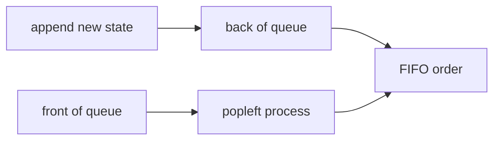

# 07. Queue and Deque

> Queue와 Deque는 처리 순서와 frontier를 관리하는 자료구조다. BFS, sliding window, producer-consumer 흐름처럼 “먼저 들어온 것” 또는 “양끝 후보”가 중요한 문제에서 핵심 도구가 된다.

## 핵심 질문

먼저 들어온 상태를 먼저 처리하거나, 양끝에서 값을 넣고 빼야 한다면 어떤 구조를 선택해야 할까?

## 핵심 모델

Queue는 **FIFO(First In, First Out)** 구조입니다. 먼저 들어간 값이 먼저 나옵니다.

```text
front                         back
  ↓                            ↓
[oldest] -> [middle] -> [newest]
```

Deque(double-ended queue)는 양쪽 끝에서 삽입/삭제가 가능한 구조입니다. Python의 `collections.deque`는 양끝 append/pop이 빠르기 때문에 BFS, fixed-size window, monotonic queue에 자주 사용됩니다.

## 핵심 불변식

| Invariant | Meaning | Example |
|---|---|---|
| queue front is next to process | 먼저 들어온 상태를 먼저 처리한다 | BFS |
| all queued states are discovered but not processed | queue는 frontier다 | graph traversal |
| deque contains current window candidates | window 밖 index는 제거된다 | sliding window |
| deque order encodes priority | 앞쪽이 현재 최적 후보다 | monotonic queue |
| `maxlen` keeps only recent items | 고정 길이 기록만 유지한다 | recent history |

## 시각화



## Python 표현

### `collections.deque`

```python
from collections import deque

queue: deque[int] = deque()
queue.append(1)
queue.append(2)
assert queue.popleft() == 1
assert queue.popleft() == 2
```

### Deque as stack too

```python
from collections import deque

items = deque([1, 2])
items.appendleft(0)
items.append(3)
assert list(items) == [0, 1, 2, 3]
```

### Fixed-length deque

```python
from collections import deque

recent = deque(maxlen=3)
for value in [1, 2, 3, 4]:
    recent.append(value)

assert list(recent) == [2, 3, 4]
```

### `queue.Queue`

`queue.Queue`는 thread 간 안전한 producer-consumer queue가 필요할 때 사용합니다. 코딩 테스트의 단일 스레드 BFS에서는 보통 `collections.deque`가 더 간단합니다.

## 연산과 복잡도

| Operation | Typical Complexity | Notes |
|---|---:|---|
| `append` | O(1) | 오른쪽 추가 |
| `appendleft` | O(1) | 왼쪽 추가 |
| `pop` | O(1) | 오른쪽 제거 |
| `popleft` | O(1) | 왼쪽 제거 |
| middle access | O(n) | deque의 주 목적이 아님 |
| list `pop(0)` | O(n) | queue로 쓰기 부적합 |

## 선택 신호

- BFS, level order traversal
- shortest path in unweighted graph/grid
- 먼저 발견한 상태부터 처리해야 한다.
- fixed-size window에서 앞쪽 값을 제거해야 한다.
- window max/min을 위해 후보를 양끝에서 관리해야 한다.
- 최근 N개만 유지하면 된다.

## 연결되는 패턴

- [Graph Traversal Patterns](../03.%20Problem%20Solving%20Patterns/08.%20Graph%20Traversal%20Patterns.md)
- [Monotonic Queue](../03.%20Problem%20Solving%20Patterns/07.%20Monotonic%20Queue.md)
- [Sliding Window](../03.%20Problem%20Solving%20Patterns/02.%20Sliding%20Window.md)
- [Matrix Traversal](../03.%20Problem%20Solving%20Patterns/12.%20Matrix%20Traversal.md)

## 구현 템플릿

### 1. Basic BFS

```python
from collections import deque


def bfs_order(graph: dict[int, list[int]], start: int) -> list[int]:
    visited = {start}
    queue = deque([start])
    order: list[int] = []

    while queue:
        node = queue.popleft()
        order.append(node)

        for neighbor in graph.get(node, []):
            if neighbor in visited:
                continue
            visited.add(neighbor)
            queue.append(neighbor)

    return order
```

불변식: queue에는 발견되었지만 아직 처리하지 않은 node만 들어 있습니다.

### 2. Level-order traversal shape

```python
from collections import deque


def levels(graph: dict[int, list[int]], start: int) -> list[list[int]]:
    visited = {start}
    queue = deque([start])
    result: list[list[int]] = []

    while queue:
        level_size = len(queue)
        level: list[int] = []

        for _ in range(level_size):
            node = queue.popleft()
            level.append(node)
            for neighbor in graph.get(node, []):
                if neighbor not in visited:
                    visited.add(neighbor)
                    queue.append(neighbor)

        result.append(level)

    return result
```

`level_size`를 먼저 고정해야 현재 level과 다음 level이 섞이지 않습니다.

### 3. Queue for grid BFS

```python
from collections import deque


def shortest_steps(grid: list[list[int]], start: tuple[int, int]) -> dict[tuple[int, int], int]:
    rows = len(grid)
    cols = len(grid[0]) if grid else 0
    queue = deque([start])
    distance = {start: 0}

    while queue:
        row, col = queue.popleft()
        for dr, dc in [(-1, 0), (1, 0), (0, -1), (0, 1)]:
            nr = row + dr
            nc = col + dc
            if not (0 <= nr < rows and 0 <= nc < cols):
                continue
            if grid[nr][nc] == 1 or (nr, nc) in distance:
                continue
            distance[(nr, nc)] = distance[(row, col)] + 1
            queue.append((nr, nc))

    return distance
```

### 4. Fixed window with deque maxlen

```python
from collections import deque


def moving_recent(values: list[int], size: int) -> list[list[int]]:
    recent = deque(maxlen=size)
    snapshots: list[list[int]] = []

    for value in values:
        recent.append(value)
        snapshots.append(list(recent))

    return snapshots
```

## 실수 방지

### 1. `list.pop(0)`로 queue 구현

`pop(0)`은 모든 원소를 이동시키므로 O(n)입니다. 반복하면 O(n²)가 될 수 있습니다. BFS queue는 `deque.popleft()`를 사용합니다.

### 2. 방문 처리를 dequeue 시점에 함

enqueue 시점에 visited 처리하지 않으면 같은 node가 queue에 여러 번 들어갈 수 있습니다. 일반적으로 발견 즉시 visited 처리합니다.

### 3. Level size를 고정하지 않음

level traversal에서 `for _ in range(len(queue))`를 loop 안에서 queue가 변하는 상태로 쓰면 level이 섞일 수 있습니다. 먼저 `level_size = len(queue)`로 고정합니다.

### 4. deque의 middle access 기대

Deque는 양끝 연산에 강합니다. 중간 random access가 많으면 list가 더 적합합니다.

### 5. `queue.Queue`와 `deque` 혼동

`queue.Queue`는 thread synchronization을 위한 도구입니다. 알고리즘 문제의 BFS에서는 일반적으로 `deque`가 더 단순합니다.

## 쓰지 않는 편이 나은 경우

- 최근 값만 처리하면 된다 → Stack
- priority가 필요하다 → Heap
- index random access가 많다 → List
- membership test가 핵심이다 → Set/Dict

## 미니 체크리스트

1. FIFO 순서가 필요한가?
2. 양끝 삽입/삭제가 필요한가?
3. BFS 최단거리 문제인가?
4. visited를 언제 표시할 것인가?
5. level 단위 처리가 필요한가?
6. fixed window인가, monotonic queue인가?

## 관련 문제

실제 문제는 [Problems](../04.%20Problems/README.md)에 기록합니다.

## References

- [Python 3.14.6 Documentation - collections.deque](https://docs.python.org/3/library/collections.html#collections.deque)
- [Python 3.14.6 Documentation - queue](https://docs.python.org/3/library/queue.html)
- [Python 3.14.6 Documentation - Data Structures Tutorial](https://docs.python.org/3/tutorial/datastructures.html)
- [Tech Interview Handbook - Algorithms study cheatsheets](https://www.techinterviewhandbook.org/algorithms/study-cheatsheet/)
