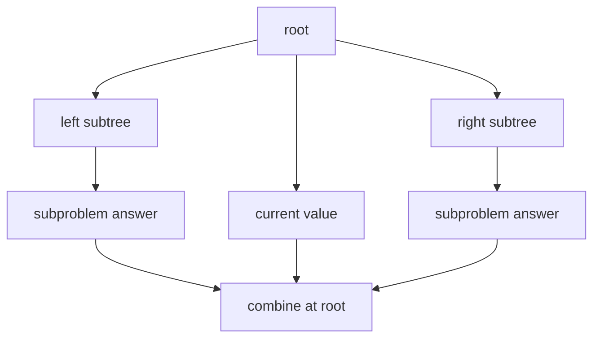

# 08. Tree

> Tree는 값을 선형으로 나열하지 않고 **부모-자식 관계**로 배치하는 자료구조다. 코딩 테스트에서는 Tree를 외우는 것보다, 각 노드가 “자기 서브트리의 답을 계산해서 부모에게 넘긴다”는 관점이 훨씬 중요하다.

## 핵심 모델

Tree 문제는 대부분 다음 질문으로 환원된다.

1. 현재 노드에서 필요한 정보는 무엇인가?
2. 왼쪽/오른쪽 또는 자식 서브트리에서 어떤 값을 받아야 하는가?
3. 현재 노드가 부모에게 반환할 값은 무엇인가?
4. 전역 답을 따로 갱신해야 하는가, 반환값만으로 충분한가?

Binary Tree 기준으로는 한 노드가 `left`, `right`를 가진다. 일반 Tree라면 `children` 리스트를 가진다. 중요한 것은 포인터 개수가 아니라 **부분 문제의 경계가 서브트리**라는 점이다.



## Python 표현

코딩 테스트에서 TreeNode는 문제에서 제공되는 경우가 많다. 직접 모델링해야 한다면 `dataclass`로 의도를 명확히 표현할 수 있다.

```python
from __future__ import annotations
from dataclasses import dataclass

@dataclass
class TreeNode:
    val: int
    left: TreeNode | None = None
    right: TreeNode | None = None
```

일반 Tree는 자식 수가 고정되어 있지 않다.

```python
from __future__ import annotations
from dataclasses import dataclass, field

@dataclass
class Node:
    val: int
    children: list[Node] = field(default_factory=list)
```

## 기본 순회

### DFS 재귀 순회

Tree DFS는 “방문 순서”보다 “현재 노드 기준으로 무엇을 할지”가 중요하다.

```python
from __future__ import annotations
from dataclasses import dataclass

@dataclass
class TreeNode:
    val: int
    left: TreeNode | None = None
    right: TreeNode | None = None


def preorder(root: TreeNode | None) -> list[int]:
    result: list[int] = []

    def dfs(node: TreeNode | None) -> None:
        if node is None:
            return
        result.append(node.val)
        dfs(node.left)
        dfs(node.right)

    dfs(root)
    return result
```

### Inorder가 특별한 경우

Binary Search Tree에서는 inorder가 정렬 순서를 만든다. 일반 Binary Tree에서는 단순히 “왼쪽-현재-오른쪽” 방문 순서일 뿐이다.

```python
from __future__ import annotations
from dataclasses import dataclass

@dataclass
class TreeNode:
    val: int
    left: TreeNode | None = None
    right: TreeNode | None = None


def inorder(root: TreeNode | None) -> list[int]:
    result: list[int] = []

    def dfs(node: TreeNode | None) -> None:
        if node is None:
            return
        dfs(node.left)
        result.append(node.val)
        dfs(node.right)

    dfs(root)
    return result
```

### Postorder는 “자식 결과를 먼저” 받는다

높이, 균형 여부, subtree size, diameter, pruning처럼 자식의 계산 결과가 필요한 문제는 postorder 사고가 자연스럽다.

```python
from __future__ import annotations
from dataclasses import dataclass

@dataclass
class TreeNode:
    val: int
    left: TreeNode | None = None
    right: TreeNode | None = None


def height(root: TreeNode | None) -> int:
    if root is None:
        return 0
    return 1 + max(height(root.left), height(root.right))
```

## Level Order Traversal

BFS는 깊이별 처리, 최단 깊이, 오른쪽에서 보이는 노드, zigzag traversal에 자주 쓰인다.

```python
from __future__ import annotations
from collections import deque
from dataclasses import dataclass

@dataclass
class TreeNode:
    val: int
    left: TreeNode | None = None
    right: TreeNode | None = None


def level_order(root: TreeNode | None) -> list[list[int]]:
    if root is None:
        return []

    result: list[list[int]] = []
    queue = deque([root])

    while queue:
        level: list[int] = []
        for _ in range(len(queue)):
            node = queue.popleft()
            level.append(node.val)
            if node.left is not None:
                queue.append(node.left)
            if node.right is not None:
                queue.append(node.right)
        result.append(level)

    return result
```

## 대표 문제 유형별 사고법

### 1. Path 문제

Root-to-leaf path인지, 임의의 두 노드 사이 path인지 먼저 분리한다.

- root-to-leaf: 현재까지 누적값을 들고 내려간다.
- any-to-any: 자식에서 올라오는 값과 현재 노드에서 끝나는 값을 구분한다.
- path count: prefix sum과 hashmap을 결합하는 경우가 많다.

```python
from __future__ import annotations
from dataclasses import dataclass

@dataclass
class TreeNode:
    val: int
    left: TreeNode | None = None
    right: TreeNode | None = None


def has_path_sum(root: TreeNode | None, target: int) -> bool:
    if root is None:
        return False

    remaining = target - root.val
    if root.left is None and root.right is None:
        return remaining == 0

    return has_path_sum(root.left, remaining) or has_path_sum(root.right, remaining)
```

### 2. Lowest Common Ancestor

LCA는 “현재 노드의 왼쪽과 오른쪽에 각각 target이 흩어져 있는가?”로 본다.

```python
from __future__ import annotations
from dataclasses import dataclass

@dataclass(eq=False)
class TreeNode:
    val: int
    left: TreeNode | None = None
    right: TreeNode | None = None


def lowest_common_ancestor(
    root: TreeNode | None,
    p: TreeNode,
    q: TreeNode,
) -> TreeNode | None:
    if root is None or root is p or root is q:
        return root

    left = lowest_common_ancestor(root.left, p, q)
    right = lowest_common_ancestor(root.right, p, q)

    if left is not None and right is not None:
        return root
    return left if left is not None else right
```

### 3. BST 문제

BST에서는 “왼쪽은 작고 오른쪽은 크다”보다 **가능한 값의 범위가 내려간다**고 보는 편이 안전하다.

```python
from __future__ import annotations
from dataclasses import dataclass

@dataclass
class TreeNode:
    val: int
    left: TreeNode | None = None
    right: TreeNode | None = None


def is_valid_bst(root: TreeNode | None) -> bool:
    def dfs(node: TreeNode | None, low: int | None, high: int | None) -> bool:
        if node is None:
            return True
        if low is not None and node.val <= low:
            return False
        if high is not None and node.val >= high:
            return False
        return dfs(node.left, low, node.val) and dfs(node.right, node.val, high)

    return dfs(root, None, None)
```

## 복잡도

| 작업 | 시간 | 공간 | 설명 |
|---|---:|---:|---|
| DFS traversal | O(n) | O(h) | `h`는 tree height, skewed tree면 O(n) |
| BFS traversal | O(n) | O(w) | `w`는 최대 level width |
| Search in balanced BST | O(log n) | O(1) 또는 O(log n) | 반복 구현이면 O(1) |
| Search in skewed BST | O(n) | O(1) 또는 O(n) | 균형 보장 없으면 선형 |

## Edge Cases

- root가 `None`인 경우
- 노드가 하나뿐인 경우
- 완전히 한쪽으로 기운 tree
- 값이 중복되는 BST 정의
- leaf에서만 조건을 확인해야 하는 문제
- 반환값과 전역 답을 혼동하는 문제

## 선택 신호

문제에서 다음 표현이 보이면 Tree 사고로 전환한다.

- root, subtree, ancestor, descendant
- depth, height, level
- leaf, internal node
- binary search tree
- serialize / deserialize
- path from root to leaf

## 연결되는 패턴

- [Tree Traversal Patterns](../03.%20Problem%20Solving%20Patterns/14.%20Tree%20Traversal%20Patterns.md)
- [Recursive Divide and Conquer](../03.%20Problem%20Solving%20Patterns/15.%20Recursive%20Divide%20and%20Conquer.md)
- [DFS and BFS](../02.%20Algorithms/04.%20DFS%20and%20BFS.md)
- [Recursion](../02.%20Algorithms/03.%20Recursion.md)
- [Queue and Deque](07.%20Queue%20and%20Deque.md)

## References

- [Python 3.14.6 dataclasses](https://docs.python.org/3/library/dataclasses.html)
- [Python 3.14.6 collections.deque](https://docs.python.org/3/library/collections.html#collections.deque)