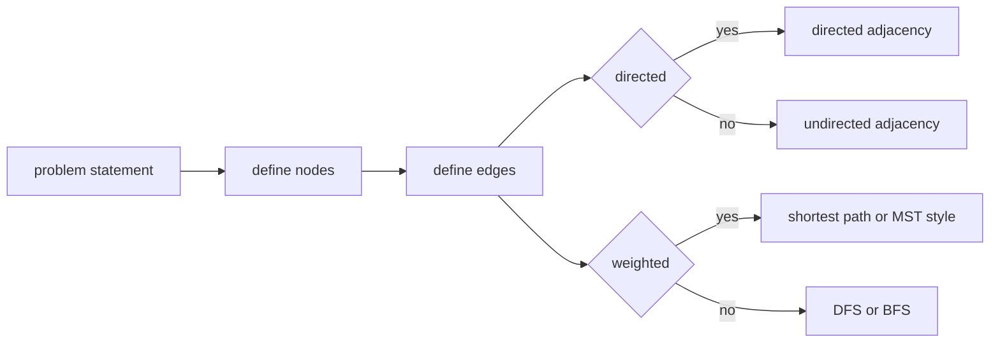

# 09. Graph

> Graph는 객체 사이의 관계를 표현하는 자료구조다. 코딩 테스트에서 Graph는 “정점과 간선”을 외우는 과목이 아니라, 문제를 **상태와 전이**로 바꾸는 언어다.

## 핵심 모델

Graph는 다음 네 가지를 먼저 결정하면 대부분 정리된다.

1. Node는 무엇인가?
2. Edge는 무엇을 의미하는가?
3. Edge 방향이 있는가?
4. Edge 비용이 있는가?



## 표현 방식

### Adjacency List

가장 많이 쓰는 표현이다. 정점 수가 크고 간선이 상대적으로 적은 sparse graph에 적합하다.

```python
def build_undirected_graph(n: int, edges: list[tuple[int, int]]) -> list[list[int]]:
    graph = [[] for _ in range(n)]
    for a, b in edges:
        graph[a].append(b)
        graph[b].append(a)
    return graph
```

Dictionary 기반 표현은 정점 이름이 문자열이거나 정점 번호가 연속적이지 않을 때 유용하다.

```python
from collections import defaultdict


def build_named_graph(edges: list[tuple[str, str]]) -> dict[str, list[str]]:
    graph: dict[str, list[str]] = defaultdict(list)
    for a, b in edges:
        graph[a].append(b)
        graph[b].append(a)
    return dict(graph)
```

### Weighted Graph

간선 비용이 있으면 neighbor만 저장하지 않고 `(neighbor, cost)`를 저장한다.

```python
def build_weighted_graph(
    n: int,
    edges: list[tuple[int, int, int]],
    directed: bool = False,
) -> list[list[tuple[int, int]]]:
    graph: list[list[tuple[int, int]]] = [[] for _ in range(n)]
    for a, b, cost in edges:
        graph[a].append((b, cost))
        if not directed:
            graph[b].append((a, cost))
    return graph
```

### Adjacency Matrix

정점 수가 작고 연결 여부를 O(1)로 자주 묻는 경우에만 고려한다. `n x n` 공간이 필요하다.

```python
def build_matrix(n: int, edges: list[tuple[int, int]]) -> list[list[bool]]:
    connected = [[False] * n for _ in range(n)]
    for a, b in edges:
        connected[a][b] = True
        connected[b][a] = True
    return connected
```

## 그래프 문제의 첫 질문

### 1. Reachability

“갈 수 있는가?”는 DFS/BFS로 충분한 경우가 많다.

```python
def can_reach(graph: list[list[int]], start: int, target: int) -> bool:
    visited = [False] * len(graph)
    stack = [start]
    visited[start] = True

    while stack:
        node = stack.pop()
        if node == target:
            return True
        for nxt in graph[node]:
            if not visited[nxt]:
                visited[nxt] = True
                stack.append(nxt)

    return False
```

### 2. Component

연결 요소 개수는 “방문하지 않은 정점에서 탐색을 몇 번 시작하는가?”로 계산한다.

```python
def count_components(n: int, edges: list[tuple[int, int]]) -> int:
    graph = build_undirected_graph(n, edges)
    visited = [False] * n
    count = 0

    for start in range(n):
        if visited[start]:
            continue
        count += 1
        stack = [start]
        visited[start] = True
        while stack:
            node = stack.pop()
            for nxt in graph[node]:
                if not visited[nxt]:
                    visited[nxt] = True
                    stack.append(nxt)

    return count
```

### 3. Shortest Path

- 간선 비용이 모두 같으면 BFS
- 비용이 0 또는 1이면 0-1 BFS
- 비용이 양수면 Dijkstra
- 음수 간선이 있으면 Bellman-Ford 계열을 고려

## Directed Graph 사고법

Directed graph에서는 단순 방문뿐 아니라 다음을 자주 묻는다.

- cycle이 있는가?
- prerequisite 순서를 만들 수 있는가?
- 모든 노드가 reachable한가?
- strongly connected component가 필요한가?

Topological sort는 DAG에서만 가능하다.

```python
from collections import deque


def has_cycle_by_topology(n: int, edges: list[tuple[int, int]]) -> bool:
    graph = [[] for _ in range(n)]
    indegree = [0] * n

    for before, after in edges:
        graph[before].append(after)
        indegree[after] += 1

    queue = deque(i for i, degree in enumerate(indegree) if degree == 0)
    visited_count = 0

    while queue:
        node = queue.popleft()
        visited_count += 1
        for nxt in graph[node]:
            indegree[nxt] -= 1
            if indegree[nxt] == 0:
                queue.append(nxt)

    return visited_count != n
```

## 복잡도

| 표현 | 공간 | Neighbor 순회 | 연결 여부 확인 | 사용 맥락 |
|---|---:|---:|---:|---|
| Adjacency List | O(V + E) | O(deg(v)) | O(deg(v)) | 대부분의 코딩 테스트 |
| Adjacency Matrix | O(V²) | O(V) | O(1) | 정점 수가 작고 dense한 경우 |
| Edge List | O(E) | O(E) | O(E) | Union Find, Bellman-Ford |

탐색 자체는 adjacency list 기준으로 보통 O(V + E)다.

## Edge Cases

- 정점은 있지만 간선이 없는 경우
- disconnected graph
- self-loop
- parallel edge
- directed edge를 undirected로 잘못 처리하는 실수
- 1-indexed input을 0-indexed 코드에 그대로 넣는 실수
- grid 문제에서 좌표가 곧 node가 되는 경우

## 선택 신호

문제에서 다음 표현이 보이면 Graph로 모델링한다.

- network, route, connection
- prerequisite, dependency
- island, region, component
- transform from A to B
- minimum cost, shortest path
- state transition

## 연결되는 패턴

- [Graph Traversal Patterns](../03.%20Problem%20Solving%20Patterns/08.%20Graph%20Traversal%20Patterns.md)
- [Union Find Connectivity](../03.%20Problem%20Solving%20Patterns/16.%20Union%20Find%20Connectivity.md)
- [Topological Ordering](../03.%20Problem%20Solving%20Patterns/17.%20Topological%20Ordering.md)
- [DFS and BFS](../02.%20Algorithms/04.%20DFS%20and%20BFS.md)
- [Shortest Path](../02.%20Algorithms/08.%20Shortest%20Path.md)

## References

- [Python 3.14.6 collections.defaultdict](https://docs.python.org/3/library/collections.html#defaultdict-objects)
- [Python 3.14.6 collections.deque](https://docs.python.org/3/library/collections.html#collections.deque)