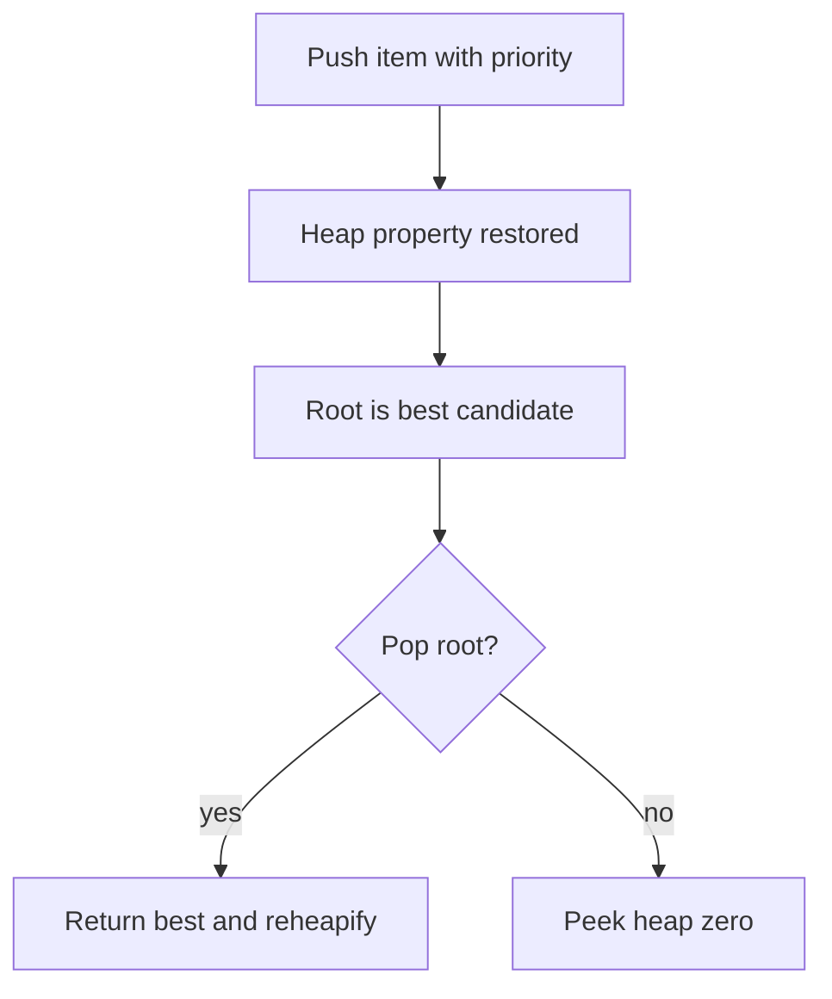

# 10. Heap

> Heap은 매번 가장 작은 후보 또는 가장 큰 후보를 빠르게 꺼내기 위한 priority 구조다. 코딩 테스트에서는 Top-K, scheduling, Dijkstra처럼 “현재 가장 유리한 후보”를 반복 선택할 때 사용한다.

## 핵심 질문

전체를 매번 정렬하지 않고도, 현재 가장 우선순위가 높은 원소를 빠르게 꺼내려면 어떤 구조가 필요할까?

## 핵심 모델

Heap은 **root가 항상 최우선 원소**가 되도록 유지하는 완전 이진 트리 기반 구조입니다. Python의 `heapq`는 list를 heap처럼 다루는 함수들을 제공합니다.

기본 `heapq`는 min-heap입니다.

```text
          1
       /     \
      3       5
    /   \
   7     9

root is minimum
```

Heap은 전체 정렬을 보장하지 않습니다. 오직 root가 최솟값 또는 최댓값이라는 불변식이 핵심입니다.

## 핵심 불변식

| Invariant | Meaning |
|---|---|
| min-heap root is smallest | `heap[0]`이 최소값이다 |
| parent priority <= child priority | heap property 유지 |
| heap list is not fully sorted | 내부 순서를 정렬 결과로 해석하면 안 된다 |
| tuple priority compares left to right | `(priority, tie_breaker, item)` 순서로 비교된다 |
| lazy deletion needs validity check | stale item을 꺼낼 때 무시해야 한다 |

## 시각화



## Python 표현

### Min-heap

```python
from heapq import heappop, heappush

heap: list[int] = []
heappush(heap, 5)
heappush(heap, 1)
heappush(heap, 3)

assert heappop(heap) == 1
assert heap[0] == 3
```

### Heapify

```python
from heapq import heapify, heappop

nums = [5, 1, 3]
heapify(nums)
assert heappop(nums) == 1
```

### Python 3.14 max-heap APIs

Python 3.14의 `heapq`에는 max-heap API가 추가되어, 음수 priority trick 없이 의도를 더 직접 표현할 수 있습니다.

```python
from heapq import heapify_max, heappop_max

nums = [5, 1, 3]
heapify_max(nums)
assert heappop_max(nums) == 5
```

다만 코딩 플랫폼의 Python 버전이 3.14보다 낮으면 max-heap API가 없을 수 있습니다. 그 경우 음수 priority를 사용해야 합니다.

## 연산과 복잡도

| Operation | Typical Complexity | Notes |
|---|---:|---|
| `heapify` | O(n) | list를 heap으로 변환 |
| `heappush` | O(log n) | 원소 추가 |
| `heappop` | O(log n) | root 제거 |
| `heap[0]` | O(1) | root peek |
| `heappushpop` | O(log n) | push 후 pop 최적화 |
| `heapreplace` | O(log n) | pop 후 push, heap이 비어 있으면 error |
| full sorted output | O(n log n) | pop을 n번 수행 |

## 선택 신호

- 매번 최소/최대 원소를 꺼내야 한다.
- Top-K, Kth largest/smallest
- streaming data에서 best k개만 유지한다.
- priority scheduling
- Dijkstra shortest path frontier
- 여러 정렬 list를 merge한다.

## 연결되는 패턴

- [Top K with Heap](../03.%20Problem%20Solving%20Patterns/18.%20Top%20K%20with%20Heap.md)
- [Graph Traversal Patterns](../03.%20Problem%20Solving%20Patterns/08.%20Graph%20Traversal%20Patterns.md)
- [Design with Multiple Structures](../03.%20Problem%20Solving%20Patterns/11.%20Design%20with%20Multiple%20Structures.md)
- [Shortest Path](../02.%20Algorithms/08.%20Shortest%20Path.md)

## 구현 템플릿

### 1. Top-K largest with min-heap

```python
from heapq import heappop, heappush


def top_k_largest(nums: list[int], k: int) -> list[int]:
    if k <= 0:
        return []

    heap: list[int] = []
    for value in nums:
        heappush(heap, value)
        if len(heap) > k:
            heappop(heap)

    return sorted(heap, reverse=True)
```

불변식: heap에는 지금까지 본 값 중 가장 큰 k개만 남아 있습니다. root는 그 k개 중 가장 작은 값, 즉 다음에 밀려날 후보입니다.

### 2. Priority queue with tie-breaker

```python
from heapq import heappop, heappush
from itertools import count


def schedule(tasks: list[tuple[int, str]]) -> list[str]:
    counter = count()
    heap: list[tuple[int, int, str]] = []

    for priority, name in tasks:
        heappush(heap, (priority, next(counter), name))

    result: list[str] = []
    while heap:
        _, _, name = heappop(heap)
        result.append(name)

    return result
```

Tie-breaker가 없으면 priority가 같은 두 item의 다음 요소를 비교하게 됩니다. item이 비교 불가능한 객체면 TypeError가 날 수 있습니다.

### 3. Merge sorted lists

```python
from heapq import heappop, heappush


def merge_sorted_lists(lists: list[list[int]]) -> list[int]:
    heap: list[tuple[int, int, int]] = []

    for list_index, values in enumerate(lists):
        if values:
            heappush(heap, (values[0], list_index, 0))

    result: list[int] = []
    while heap:
        value, list_index, item_index = heappop(heap)
        result.append(value)

        next_index = item_index + 1
        if next_index < len(lists[list_index]):
            next_value = lists[list_index][next_index]
            heappush(heap, (next_value, list_index, next_index))

    return result
```

### 4. Dijkstra frontier shape

```python
from heapq import heappop, heappush


def dijkstra(graph: dict[int, list[tuple[int, int]]], start: int) -> dict[int, int]:
    distances = {start: 0}
    heap = [(0, start)]

    while heap:
        distance, node = heappop(heap)
        if distance != distances.get(node):
            continue

        for neighbor, weight in graph.get(node, []):
            new_distance = distance + weight
            if new_distance < distances.get(neighbor, float("inf")):
                distances[neighbor] = new_distance
                heappush(heap, (new_distance, neighbor))

    return distances
```

이 template는 decrease-key를 직접 지원하지 않는 `heapq`에서 흔히 쓰는 lazy deletion 방식입니다.

## 실수 방지

### 1. Heap 내부 list를 sorted list로 착각

`heap[0]`만 최우선 원소입니다. `heap[1:]`의 순서는 정렬 결과가 아닙니다.

### 2. Max-heap을 음수로 구현하면서 부호 복구 누락

Python 3.14 미만 환경에서는 음수 priority trick을 사용할 수 있습니다. 이때 꺼낸 뒤 다시 부호를 복구해야 합니다.

```python
from heapq import heappop, heappush

heap: list[int] = []
heappush(heap, -10)
assert -heappop(heap) == 10
```

### 3. Priority tie에서 TypeError

`(priority, item)` 형태에서 priority가 같으면 item끼리 비교합니다. item이 dict/object이면 TypeError가 날 수 있으므로 tie-breaker를 넣습니다.

### 4. Top-K에서 heap 크기 불변식 누락

Top-K largest를 min-heap으로 유지할 때 heap 크기는 k를 넘지 않아야 합니다.

### 5. Lazy deletion 검증 누락

Dijkstra나 mutable priority queue에서 오래된 entry가 heap에 남을 수 있습니다. pop한 값이 현재 상태와 맞는지 확인해야 합니다.

## 쓰지 않는 편이 나은 경우

- 모든 원소를 한 번 정렬하면 충분하다 → Sorting
- FIFO 순서가 필요하다 → Queue
- membership test가 핵심이다 → Set/Dict
- 특정 원소 삭제/갱신이 자주 필요하다 → heap 단독으로는 불편, dict와 조합 필요

## 미니 체크리스트

1. 매번 최솟값/최댓값을 꺼내야 하는가?
2. 전체 정렬이 필요한가, root만 필요한다?
3. Top-K에서 heap 크기 불변식은 무엇인가?
4. priority가 같을 때 tie-breaker가 필요한가?
5. Python 버전이 max-heap API를 지원하는가?
6. stale entry를 무시해야 하는가?

## 관련 문제

실제 문제는 [Problems](../04.%20Problems/README.md)에 기록합니다.

## References

- [Python 3.14.6 Documentation - heapq](https://docs.python.org/3/library/heapq.html)
- [Python 3.14.6 Documentation - itertools.count](https://docs.python.org/3/library/itertools.html#itertools.count)
- [Tech Interview Handbook - Algorithms study cheatsheets](https://www.techinterviewhandbook.org/algorithms/study-cheatsheet/)
