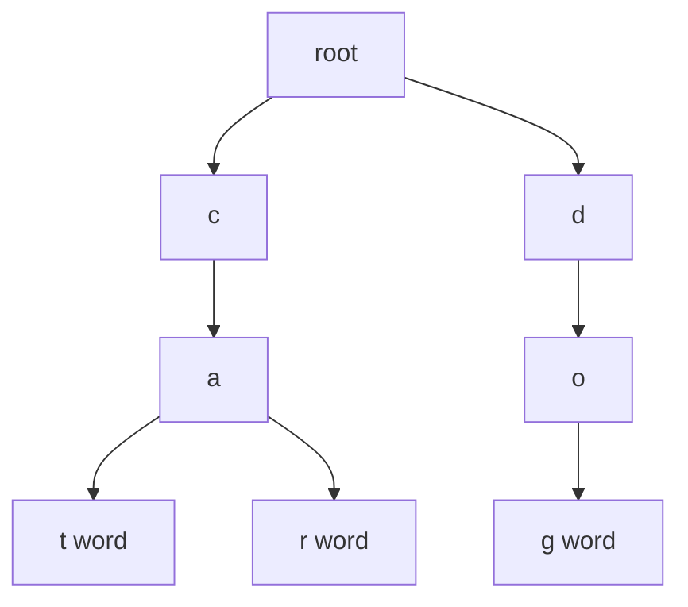

# 11. Trie

> Trie는 문자열 집합을 문자 단위의 tree로 저장하는 자료구조다. 핵심은 “단어 전체를 key로 비교하지 않고, **prefix를 공유하는 경로**로 저장한다”는 점이다.

## 핵심 모델

문자열 `cat`, `car`, `dog`를 저장하면 `ca` prefix가 공유된다. 각 노드는 문자 하나가 아니라 “여기까지 온 prefix 상태”로 보는 편이 좋다.



Trie에서 자주 묻는 것은 세 가지다.

1. 단어가 존재하는가?
2. prefix로 시작하는 단어가 있는가?
3. prefix 아래의 후보들을 어떻게 탐색할 것인가?

## Python 표현

```python
from __future__ import annotations
from dataclasses import dataclass, field

@dataclass
class TrieNode:
    children: dict[str, TrieNode] = field(default_factory=dict)
    is_word: bool = False


class Trie:
    def __init__(self) -> None:
        self.root = TrieNode()

    def insert(self, word: str) -> None:
        node = self.root
        for ch in word:
            if ch not in node.children:
                node.children[ch] = TrieNode()
            node = node.children[ch]
        node.is_word = True

    def search(self, word: str) -> bool:
        node = self._find_node(word)
        return node is not None and node.is_word

    def starts_with(self, prefix: str) -> bool:
        return self._find_node(prefix) is not None

    def _find_node(self, text: str) -> TrieNode | None:
        node = self.root
        for ch in text:
            if ch not in node.children:
                return None
            node = node.children[ch]
        return node
```

## 언제 Trie를 쓰는가?

Hash Table은 “전체 문자열이 있는가?”에는 강하다. 하지만 prefix 관련 질문이 반복되면 Trie가 자연스럽다.

| 질문 | Hash Set | Trie |
|---|---:|---:|
| 단어 전체 존재 확인 | 좋음 | 좋음 |
| prefix 존재 확인 | prefix를 따로 저장해야 함 | 자연스러움 |
| prefix 후보 나열 | 별도 index 필요 | subtree DFS |
| 한 글자씩 탐색하며 pruning | 불편함 | 강함 |

## Prefix 후보 나열

autocomplete, dictionary search, board word search에서 자주 쓰인다.

```python
from __future__ import annotations
from dataclasses import dataclass, field

@dataclass
class TrieNode:
    children: dict[str, TrieNode] = field(default_factory=dict)
    is_word: bool = False


class WordTrie:
    def __init__(self) -> None:
        self.root = TrieNode()

    def insert(self, word: str) -> None:
        node = self.root
        for ch in word:
            node = node.children.setdefault(ch, TrieNode())
        node.is_word = True

    def words_with_prefix(self, prefix: str) -> list[str]:
        node = self.root
        for ch in prefix:
            if ch not in node.children:
                return []
            node = node.children[ch]

        result: list[str] = []

        def dfs(cur: TrieNode, path: list[str]) -> None:
            if cur.is_word:
                result.append(prefix + "".join(path))
            for ch, nxt in cur.children.items():
                path.append(ch)
                dfs(nxt, path)
                path.pop()

        dfs(node, [])
        return result
```

## Trie + Backtracking

문자판에서 단어를 찾는 문제는 Trie와 DFS backtracking이 강하게 결합된다. 현재 경로가 어떤 단어의 prefix도 아니면 즉시 중단한다.

```python
from __future__ import annotations
from dataclasses import dataclass, field

@dataclass
class TrieNode:
    children: dict[str, TrieNode] = field(default_factory=dict)
    word: str | None = None


def find_words(board: list[list[str]], words: list[str]) -> list[str]:
    root = TrieNode()
    for word in words:
        node = root
        for ch in word:
            node = node.children.setdefault(ch, TrieNode())
        node.word = word

    rows, cols = len(board), len(board[0]) if board else 0
    found: list[str] = []

    def dfs(r: int, c: int, node: TrieNode) -> None:
        if r < 0 or r >= rows or c < 0 or c >= cols:
            return
        ch = board[r][c]
        if ch == "#" or ch not in node.children:
            return

        nxt = node.children[ch]
        if nxt.word is not None:
            found.append(nxt.word)
            nxt.word = None

        board[r][c] = "#"
        dfs(r + 1, c, nxt)
        dfs(r - 1, c, nxt)
        dfs(r, c + 1, nxt)
        dfs(r, c - 1, nxt)
        board[r][c] = ch

    for r in range(rows):
        for c in range(cols):
            dfs(r, c, root)

    return found
```

## 복잡도

| 작업 | 시간 | 공간 |
|---|---:|---:|
| insert(word) | O(L) | O(L) additional in worst case |
| search(word) | O(L) | O(1) auxiliary |
| starts_with(prefix) | O(P) | O(1) auxiliary |
| prefix 후보 나열 | O(P + K) | O(depth) recursion |

`L`은 단어 길이, `P`는 prefix 길이, `K`는 prefix 아래에서 실제로 방문한 문자 수다.

## Edge Cases

- 빈 문자열을 단어로 허용하는지
- 대소문자 처리
- alphabet이 고정인지, 임의 unicode 문자인지
- 같은 단어 중복 삽입
- 삭제 연산이 필요한지
- word search에서 이미 찾은 단어를 중복 추가하지 않는 처리

## 선택 신호

- prefix search
- autocomplete
- dictionary
- wildcard search
- word board search
- 많은 문자열을 공유 prefix 기준으로 pruning

## 연결되는 패턴

- [Trie Prefix Search](../03.%20Problem%20Solving%20Patterns/10.%20Trie%20Prefix%20Search.md)
- [Backtracking Search Patterns](../03.%20Problem%20Solving%20Patterns/09.%20Backtracking%20Search%20Patterns.md)
- [Tree](08.%20Tree.md)
- [String](02.%20String.md)
- [Hash Table](03.%20Hash%20Table.md)

## References

- [Python 3.14.6 dataclasses](https://docs.python.org/3/library/dataclasses.html)
- [Python 3.14.6 dict tutorial](https://docs.python.org/3/tutorial/datastructures.html#dictionaries)