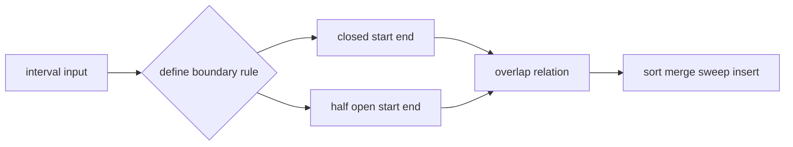

# 12. Interval

> Interval은 시작점과 끝점으로 연속 범위를 표현하는 자료구조다. 코딩 테스트에서 Interval은 단순 pair가 아니라, **겹침, 포함, 병합, 분할, 활성 상태**를 다루는 모델이다.

## 핵심 모델

Interval 문제에서 가장 먼저 정해야 하는 것은 구간 정의다.

- Closed interval: `[start, end]`, 양 끝 포함
- Half-open interval: `[start, end)`, 시작 포함, 끝 제외
- Open interval: `(start, end)`, 양 끝 제외

코딩 테스트의 회의실/스케줄 문제는 `[start, end)`로 해석하는 경우가 많다. 즉 어떤 회의가 10시에 끝나고 다른 회의가 10시에 시작하면 겹치지 않는다.



## Python 표현

가장 실전적인 표현은 `tuple[int, int]`다.

```python
Interval = tuple[int, int]


def normalize(interval: Interval) -> Interval:
    start, end = interval
    if start <= end:
        return start, end
    return end, start
```

의미를 더 강하게 드러내고 싶으면 `dataclass`를 쓸 수 있다.

```python
from dataclasses import dataclass

@dataclass(frozen=True, order=True)
class Interval:
    start: int
    end: int
```

코딩 테스트에서는 입력/출력 형식이 list of list인 경우가 많으므로, 내부에서는 tuple로 다루고 마지막에 요구 형식으로 변환하는 방식이 깔끔하다.

## Overlap 판단

Half-open interval `[a_start, a_end)`와 `[b_start, b_end)`가 겹치는 조건은 다음이다.

```python
def overlaps(a: tuple[int, int], b: tuple[int, int]) -> bool:
    a_start, a_end = a
    b_start, b_end = b
    return a_start < b_end and b_start < a_end
```

Closed interval `[a_start, a_end]`라면 `<`가 아니라 `<=`를 쓴다.

```python
def overlaps_closed(a: tuple[int, int], b: tuple[int, int]) -> bool:
    a_start, a_end = a
    b_start, b_end = b
    return a_start <= b_end and b_start <= a_end
```

## Merge Intervals

정렬 후 현재 병합 구간의 끝만 관리하면 된다.

```python
def merge_intervals(intervals: list[tuple[int, int]]) -> list[tuple[int, int]]:
    if not intervals:
        return []

    intervals = sorted(intervals)
    merged: list[tuple[int, int]] = []

    for start, end in intervals:
        if not merged or start > merged[-1][1]:
            merged.append((start, end))
        else:
            prev_start, prev_end = merged[-1]
            merged[-1] = (prev_start, max(prev_end, end))

    return merged
```

위 구현은 closed interval 기준으로 `start <= last_end`이면 겹친다고 본다. Half-open 기준으로 붙어 있는 구간 `[1, 3)`, `[3, 5)`를 합치지 않으려면 조건을 `start >= merged[-1][1]`로 조정한다.

## Insert Interval

새 interval을 넣고 겹치는 기존 interval과 병합한다.

```python
def insert_interval(
    intervals: list[tuple[int, int]],
    new_interval: tuple[int, int],
) -> list[tuple[int, int]]:
    result: list[tuple[int, int]] = []
    i = 0
    start, end = new_interval

    while i < len(intervals) and intervals[i][1] < start:
        result.append(intervals[i])
        i += 1

    while i < len(intervals) and intervals[i][0] <= end:
        start = min(start, intervals[i][0])
        end = max(end, intervals[i][1])
        i += 1

    result.append((start, end))
    result.extend(intervals[i:])
    return result
```

## Meeting Room Count

Interval은 Heap과 결합해 active set을 관리할 수 있다.

```python
import heapq


def min_rooms(intervals: list[tuple[int, int]]) -> int:
    intervals.sort()
    active_ends: list[int] = []

    for start, end in intervals:
        while active_ends and active_ends[0] <= start:
            heapq.heappop(active_ends)
        heapq.heappush(active_ends, end)

    return len(active_ends)
```

## Operations and Complexity

| Operation | Typical Complexity | Notes |
|---|---:|---|
| Overlap check | O(1) | boundary rule이 먼저 정해져야 함 |
| Sort intervals | O(n log n) | 대부분의 interval 풀이 시작점 |
| Merge sorted intervals | O(n) | 정렬 포함 시 O(n log n) |
| Insert into sorted non-overlap list | O(n) | 새 구간 주변만 병합 |
| Active interval count with heap | O(n log n) | 회의실, calendar류 |
| Sweep line events | O(n log n) | 최대 겹침, timeline 변화량 |

## Problem Signals

- merge intervals
- insert interval
- meeting rooms
- calendar booking
- overlap conflict
- minimum arrows
- active intervals
- range add/remove

## 실수 방지

- `[start, end]`인지 `[start, end)`인지 먼저 정한다.
- `start == end`인 zero-length interval을 어떻게 다룰지 확인한다.
- 입력이 이미 정렬되어 있는지, 정렬해야 하는지 확인한다.
- 병합 조건의 `<`, `<=` 하나가 답을 바꾼다.
- heap에는 종료되지 않은 interval만 남겨야 한다.
- 좌표가 큰 경우 difference array를 직접 만들지 않는다.

## 연결되는 패턴

- [Sweep Line and Intervals](../03.%20Problem%20Solving%20Patterns/19.%20Sweep%20Line%20and%20Intervals.md)
- [Sort Then Scan](../03.%20Problem%20Solving%20Patterns/20.%20Sort%20Then%20Scan.md)
- [Greedy](../02.%20Algorithms/07.%20Greedy.md)
- [Heap](10.%20Heap.md)
- [Sorting](../02.%20Algorithms/01.%20Sorting.md)