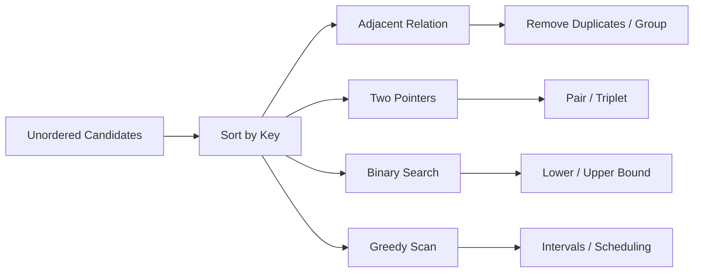

# 01. Sorting

> Sorting은 데이터에 순서를 부여해 복잡한 관계를 인접 관계나 우선순위 문제로 바꾸는 알고리즘이다. 정렬 기준이 곧 풀이의 불변식이 된다.

## 핵심 질문

데이터에 순서를 부여하면 어떤 관계가 드러나고, 어떤 탐색을 줄일 수 있을까?

## 핵심 아이디어

Sorting은 단순히 값을 오름차순으로 나열하는 작업이 아닙니다. 문제 해결에서 정렬은 **무질서한 후보를 비교 가능한 순서로 바꾸는 전처리**입니다.

정렬 후에는 다음이 쉬워집니다.

- 가장 작은 값/큰 값 찾기
- 중복 원소를 인접하게 만들기
- 두 pointer를 양끝에서 움직이기
- interval을 시작점 기준으로 병합하기
- greedy 선택 순서를 고정하기
- binary search를 적용하기

정렬은 보통 O(n log n) 비용을 먼저 지불합니다. 그 대신 이후 탐색을 O(n²)에서 O(n) 또는 O(n log n)으로 줄일 수 있다면 좋은 선택입니다.

## 선택 신호

- “순서는 상관없고 조합/쌍/그룹이 중요하다.”
- “가장 작은/큰 것을 기준으로 선택한다.”
- “겹치는 구간을 합친다.”
- “중복을 찾거나 제거한다.”
- “정렬 후 인접한 것만 비교해도 된다.”
- “정렬 후 binary search 또는 two pointers를 쓸 수 있다.”

## 정당성 불변식

정렬 기반 풀이의 핵심 불변식은 보통 다음 중 하나입니다.

| Invariant | Meaning | Example Pattern |
|---|---|---|
| 앞쪽 원소는 뒤쪽 원소보다 작거나 같다 | 순서 관계가 고정됨 | binary search |
| 같은 값/같은 key가 인접한다 | group scan 가능 | duplicate/grouping |
| 현재 선택보다 앞선 후보는 이미 처리했다 | one-pass scan 가능 | sort then scan |
| left/right 바깥 후보는 버려도 된다 | 단조 이동 가능 | two pointers |
| 정렬 기준이 greedy 우선순위다 | 첫 후보 선택이 정당함 | interval/greedy |

정렬을 써도 되는지는 “원래 순서를 잃어도 되는가?”와 “정렬 기준이 문제의 의미와 맞는가?”를 확인해야 합니다.

## 시각화



## Python 구현 노트

### `sorted()` vs `list.sort()`

```python
nums = [3, 1, 2]

ordered = sorted(nums)
assert ordered == [1, 2, 3]
assert nums == [3, 1, 2]

nums.sort()
assert nums == [1, 2, 3]
```

- `sorted(iterable)`은 새 list를 반환합니다.
- `list.sort()`는 원본 list를 in-place로 바꾸고 `None`을 반환합니다.

### `key` parameter

```python
words = ["pear", "fig", "apple"]
by_length = sorted(words, key=len)
assert by_length == ["fig", "pear", "apple"]
```

### Tuple key for multiple criteria

```python
students = [
    {"name": "Ada", "score": 90, "age": 17},
    {"name": "Grace", "score": 90, "age": 16},
    {"name": "Linus", "score": 85, "age": 18},
]

ranked = sorted(students, key=lambda s: (-s["score"], s["age"], s["name"]))
assert [s["name"] for s in ranked] == ["Grace", "Ada", "Linus"]
```

### Stable sort

Python sort는 stable합니다. 같은 key를 가진 원소들의 기존 상대 순서가 유지됩니다. 이 특성 덕분에 여러 기준 정렬을 단계적으로 적용할 수 있습니다.

```python
records = [
    ("Ada", "B"),
    ("Grace", "A"),
    ("Linus", "B"),
]

# grade 기준으로 정렬해도 같은 grade 안에서는 기존 순서가 유지됩니다.
assert sorted(records, key=lambda x: x[1]) == [
    ("Grace", "A"),
    ("Ada", "B"),
    ("Linus", "B"),
]
```

## 복잡도

| Case | Time | Space | Notes |
|---|---:|---:|---|
| `sorted(nums)` | O(n log n) | O(n) | 새 list 반환 |
| `nums.sort()` | O(n log n) | implementation-dependent | 원본 변경 |
| sort + one scan | O(n log n) | depends | 많은 문제의 기본 형태 |
| sort + two pointers | O(n log n) | depends | pair/triplet 탐색 |
| sort + binary search per item | O(n log n) | depends | O(n log n) 전체 가능 |

정렬 자체보다 정렬 후 어떤 탐색이 붙는지까지 계산해야 합니다.

## 구현 템플릿

### 1. Sort then scan duplicates

```python
def unique_sorted(nums: list[int]) -> list[int]:
    if not nums:
        return []

    nums = sorted(nums)
    result = [nums[0]]

    for value in nums[1:]:
        if value != result[-1]:
            result.append(value)

    return result

assert unique_sorted([3, 1, 3, 2]) == [1, 2, 3]
```

### 2. Sort intervals by start

```python
def merge_intervals(intervals: list[tuple[int, int]]) -> list[tuple[int, int]]:
    if not intervals:
        return []

    intervals = sorted(intervals, key=lambda x: x[0])
    merged = [intervals[0]]

    for start, end in intervals[1:]:
        last_start, last_end = merged[-1]
        if start <= last_end:
            merged[-1] = (last_start, max(last_end, end))
        else:
            merged.append((start, end))

    return merged
```

### 3. Sort then two pointers

```python
def has_pair_with_sum(nums: list[int], target: int) -> bool:
    nums = sorted(nums)
    left = 0
    right = len(nums) - 1

    while left < right:
        total = nums[left] + nums[right]
        if total == target:
            return True
        if total < target:
            left += 1
        else:
            right -= 1

    return False
```

### 4. Sort by derived key

```python
def sort_points_by_distance(points: list[tuple[int, int]]) -> list[tuple[int, int]]:
    return sorted(points, key=lambda p: p[0] * p[0] + p[1] * p[1])
```

제곱근을 계산하지 않고 거리 제곱으로 비교하면 더 단순하고 정확합니다.

## 실수 방지

### 1. 원본 순서를 잃어도 되는지 확인하지 않음

subsequence 문제처럼 원래 순서가 의미인 경우 정렬하면 문제 자체가 바뀝니다.

### 2. `list.sort()` 반환값 사용

```python
nums = [3, 1, 2]
result = nums.sort()
assert result is None
```

`sort()`는 원본을 바꾸고 `None`을 반환합니다.

### 3. 잘못된 key 기준

interval 병합에서 end 기준으로 정렬하면 일반적인 병합 scan이 깨질 수 있습니다. scan 불변식에 필요한 기준이 무엇인지 먼저 정합니다.

### 4. reverse와 tuple key 혼동

`reverse=True`는 전체 비교 결과를 뒤집습니다. 일부 기준만 내림차순이어야 하면 숫자 key에는 음수화를 쓰거나 key를 명확히 구성합니다.

```python
# score는 내림차순, age는 오름차순
key = lambda s: (-s["score"], s["age"])
```

### 5. 정렬 비용을 공짜로 생각함

O(n)으로 가능한 counting/hash 문제에 불필요하게 O(n log n) 정렬을 쓰면 최적 풀이가 아닐 수 있습니다.

## 연결되는 패턴

- [Two Pointers](../03.%20Problem%20Solving%20Patterns/01.%20Two%20Pointers.md)
- [Sort Then Scan](../03.%20Problem%20Solving%20Patterns/20.%20Sort%20Then%20Scan.md)
- [Sweep Line and Intervals](../03.%20Problem%20Solving%20Patterns/19.%20Sweep%20Line%20and%20Intervals.md)
- [Binary Search](02.%20Binary%20Search.md)
- [Interval](../01.%20Data%20Structures/12.%20Interval.md)

## 미니 체크리스트

1. 정렬해도 원래 순서를 잃는 문제가 아닌가?
2. 어떤 key로 정렬해야 scan 불변식이 생기는가?
3. 정렬 후 인접 비교, two pointers, binary search 중 무엇이 가능한가?
4. `sorted`가 필요한가, in-place `sort`가 필요한가?
5. 같은 key의 상대 순서가 중요한가?
6. 전체 복잡도는 정렬 후 처리까지 포함해 얼마인가?

## 관련 문제

실제 문제는 [Problems](../04.%20Problems/README.md)에 기록합니다.

## References

- [Python Sorting HOWTO](https://docs.python.org/3/howto/sorting.html)
- [Python 3.14.6 Documentation - list.sort](https://docs.python.org/3/library/stdtypes.html#list.sort)
- [Python 3.14.6 Documentation - sorted](https://docs.python.org/3/library/functions.html#sorted)
- [Tech Interview Handbook - Algorithms study cheatsheets](https://www.techinterviewhandbook.org/algorithms/study-cheatsheet/)
