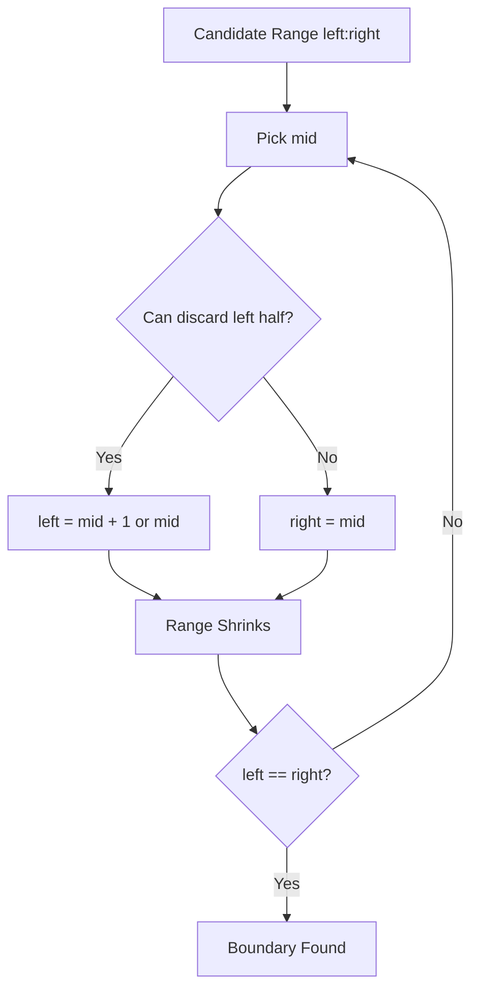

# 02. Binary Search

> Binary Search는 정렬 또는 단조성 위에서 후보 공간을 절반씩 버리는 알고리즘이다. 핵심은 mid 계산이 아니라 “어느 절반을 안전하게 버릴 수 있는가”를 증명하는 것이다.

## 핵심 질문

후보들이 정렬되어 있거나 가능/불가능이 단조적으로 나뉠 때, 어떻게 절반씩 안전하게 버릴 수 있을까?

## 핵심 아이디어

Binary Search는 “가운데를 찍어본다”가 아니라 **정답이 존재할 수 없는 절반을 증명하고 제거하는 알고리즘**입니다.

Binary Search가 가능한 대표 상황은 두 가지입니다.

1. **Sorted sequence search**: 정렬된 배열에서 값 또는 삽입 위치 찾기
2. **Search on answer**: 정답 후보 범위에서 `possible(x)`가 단조적으로 바뀌는 지점 찾기

```text
False False False True True True
                  ^ first True
```

정답을 찾는 것이 아니라 “경계(boundary)”를 찾는다고 생각하면 off-by-one이 줄어듭니다.

## 필요 조건

Binary Search에는 반드시 단조성이 필요합니다.

| Situation | Monotonic Meaning |
|---|---|
| sorted array | 왼쪽은 작고 오른쪽은 크다 |
| lower bound | target 이상이 처음 등장하는 위치가 있다 |
| upper bound | target 초과가 처음 등장하는 위치가 있다 |
| answer search | `possible(x)`가 어느 지점 이후 계속 True 또는 False다 |

단조성이 없으면 binary search를 쓰면 안 됩니다.

## 정당성 불변식

Half-open lower bound template에서는 다음 불변식을 유지합니다.

```text
search range = [left, right)
answer is inside [left, right)
```

반복이 끝나면 `left == right`이고, 이 위치가 boundary입니다.

## 시각화



## Python 표현

### `bisect_left` and `bisect_right`

```python
from bisect import bisect_left, bisect_right

nums = [1, 2, 2, 2, 4]

assert bisect_left(nums, 2) == 1
assert bisect_right(nums, 2) == 4
assert nums[bisect_left(nums, 2):bisect_right(nums, 2)] == [2, 2, 2]
```

- `bisect_left(a, x)`: `x`를 넣어도 정렬이 유지되는 가장 왼쪽 위치
- `bisect_right(a, x)`: `x`를 넣어도 정렬이 유지되는 가장 오른쪽 위치

### Direct implementation

직접 구현이 필요한 경우에는 한 가지 template를 일관되게 사용합니다.

## 복잡도

| Case | Time | Space | Notes |
|---|---:|---:|---|
| search sorted list | O(log n) | O(1) | index search |
| lower/upper bound | O(log n) | O(1) | boundary search |
| answer search | O(log R × T) | O(1) or predicate space | R: answer range, T: predicate cost |
| sort + binary search | O(n log n) + O(log n) | depends | sort cost 포함 |

## 구현 템플릿

### 1. Exact search

```python
def binary_search(nums: list[int], target: int) -> int:
    left = 0
    right = len(nums) - 1

    while left <= right:
        mid = (left + right) // 2
        if nums[mid] == target:
            return mid
        if nums[mid] < target:
            left = mid + 1
        else:
            right = mid - 1

    return -1
```

이 template는 target의 존재 위치 하나를 찾습니다. 중복 값의 첫 위치/마지막 위치를 보장하지 않습니다.

### 2. Lower bound: first index with `nums[i] >= target`

```python
def lower_bound(nums: list[int], target: int) -> int:
    left = 0
    right = len(nums)  # half-open [left, right)

    while left < right:
        mid = (left + right) // 2
        if nums[mid] < target:
            left = mid + 1
        else:
            right = mid

    return left

assert lower_bound([1, 2, 2, 4], 2) == 1
assert lower_bound([1, 2, 2, 4], 3) == 3
```

### 3. Upper bound: first index with `nums[i] > target`

```python
def upper_bound(nums: list[int], target: int) -> int:
    left = 0
    right = len(nums)

    while left < right:
        mid = (left + right) // 2
        if nums[mid] <= target:
            left = mid + 1
        else:
            right = mid

    return left

assert upper_bound([1, 2, 2, 4], 2) == 3
```

### 4. First True in monotonic predicate

```python
def first_true(low: int, high: int, possible) -> int:
    """Return first x in [low, high] such that possible(x) is True."""
    left = low
    right = high

    while left < right:
        mid = (left + right) // 2
        if possible(mid):
            right = mid
        else:
            left = mid + 1

    return left
```

이 template는 `False False True True` 형태를 가정합니다.

### 5. Last True in monotonic predicate

```python
def last_true(low: int, high: int, possible) -> int:
    """Return last x in [low, high] such that possible(x) is True."""
    left = low
    right = high

    while left < right:
        mid = (left + right + 1) // 2
        if possible(mid):
            left = mid
        else:
            right = mid - 1

    return left
```

여기서는 `True True False False` 형태를 가정합니다. `+ 1`을 넣어 오른쪽 중간값을 선택해야 무한 루프를 피할 수 있습니다.

## 선택 신호

Binary Search를 의심할 신호입니다.

- 입력 배열이 정렬되어 있다.
- “first/last position”, “insert position”, “lower/upper bound”
- 답 후보가 숫자 범위다.
- “최소 X로 가능?”, “최대 X까지 가능?” 형태다.
- 어떤 값 이상이면 계속 가능하거나, 어떤 값 이하이면 계속 가능하다.
- O(n) predicate를 O(log R)번 호출하면 충분할 것 같다.

## 실수 방지

### 1. 단조성 확인 없이 사용

Binary Search는 정렬 또는 predicate 단조성이 없으면 틀립니다. “왠지 빠르게 찾고 싶다”는 이유만으로 쓸 수 없습니다.

### 2. `while left <= right`와 `while left < right` 혼용

exact search와 boundary search는 loop 조건과 update 방식이 다릅니다. 하나의 template를 외워서 모든 문제에 억지로 끼우면 off-by-one이 납니다.

### 3. mid update 후 range가 줄지 않음

```python
# left = mid 형태를 쓰면서 mid가 left와 같으면 무한 루프 가능
```

`left < right` template에서 `left = mid`를 해야 한다면 보통 upper mid `(left + right + 1) // 2`가 필요합니다.

### 4. return value 의미 불명확

`left`가 index인지, insertion point인지, answer value인지 명확히 해야 합니다.

### 5. answer range 설정 오류

Search on answer에서는 low/high가 반드시 정답을 포함해야 합니다. 가능하면 문제 조건에서 lower/upper bound를 먼저 증명합니다.

## 연결되는 패턴

- [Binary Search on Answer](../03.%20Problem%20Solving%20Patterns/21.%20Binary%20Search%20on%20Answer.md)
- [Sort Then Scan](../03.%20Problem%20Solving%20Patterns/20.%20Sort%20Then%20Scan.md)
- [Sorting](01.%20Sorting.md)
- [Array and List](../01.%20Data%20Structures/01.%20Array%20and%20List.md)

## 미니 체크리스트

1. 정렬되어 있는가, 아니면 정렬해도 되는가?
2. 찾는 것이 값인가, 경계인가, 정답 후보인가?
3. predicate는 단조적인가?
4. `[left, right]`를 쓸 것인가, `[left, right)`를 쓸 것인가?
5. loop가 반드시 range를 줄이는가?
6. 중복 값에서 첫/마지막 위치가 필요한가?
7. 결과 index가 `len(nums)`일 수 있는가?

## 관련 문제

실제 문제는 [Problems](../04.%20Problems/README.md)에 기록합니다.

## References

- [Python 3.14.6 Documentation - bisect](https://docs.python.org/3/library/bisect.html)
- [Python Sorting HOWTO](https://docs.python.org/3/howto/sorting.html)
- [Tech Interview Handbook - Algorithms study cheatsheets](https://www.techinterviewhandbook.org/algorithms/study-cheatsheet/)
