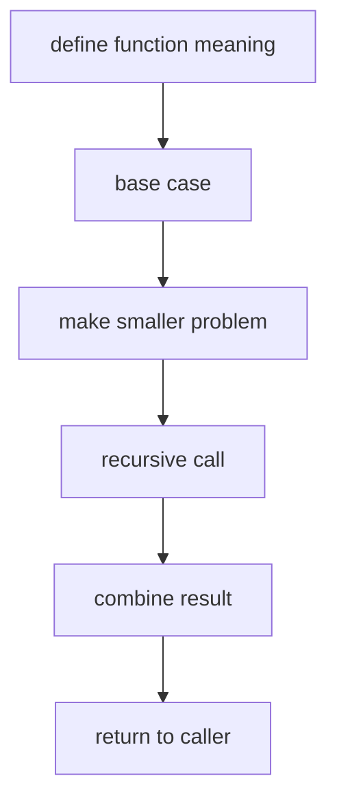

# 03. Recursion

> Recursion은 함수가 자기 자신을 호출하는 문법이 아니라, 문제를 **같은 모양의 더 작은 문제**로 바꾸는 사고법이다. Tree, DFS, Backtracking, Divide and Conquer의 언어가 된다.

## 핵심 질문

재귀를 쓰기 전에는 코드보다 아래 네 가지를 먼저 정한다.

1. 함수의 의미는 무엇인가?
2. 종료 조건은 무엇인가?
3. 한 단계에서 무엇을 줄이는가?
4. 하위 호출의 반환값을 어떻게 합치는가?



## 가장 작은 예시

```python
def factorial(n: int) -> int:
    if n < 0:
        raise ValueError("n must be non-negative")
    if n <= 1:
        return 1
    return n * factorial(n - 1)
```

이 코드에서 `factorial(n)`의 의미는 “n!”이다. `factorial(n - 1)`은 이미 정답을 준다고 믿고, 현재 단계에서는 `n`을 곱해 반환한다.

## 재귀 함수 설계 템플릿

```python
def solve(state: int) -> int:
    if state == 0:
        return 0

    sub_answer = solve(state - 1)
    answer = sub_answer + 1
    return answer
```

실전에서는 `state`가 index, node, remaining sum, current path, visited mask 등으로 바뀐다.

## 반환형 중심으로 생각하기

재귀에서 가장 중요한 것은 “이 함수가 무엇을 반환하는가”다.

| 반환형 | 의미 | 대표 문제 |
|---|---|---|
| `bool` | 조건을 만족하는 경로가 있는가 | path sum, word search |
| `int` | 크기, 깊이, 비용 | height, diameter, count |
| `list` | 모든 후보 모음 | subsets, permutations |
| `None` | 외부 result를 갱신 | backtracking, traversal |
| custom tuple | 여러 값을 동시에 반환 | balanced tree, DP on tree |

```python
from __future__ import annotations
from dataclasses import dataclass

@dataclass
class TreeNode:
    val: int
    left: TreeNode | None = None
    right: TreeNode | None = None


def is_balanced(root: TreeNode | None) -> bool:
    def check(node: TreeNode | None) -> tuple[bool, int]:
        if node is None:
            return True, 0

        left_ok, left_height = check(node.left)
        right_ok, right_height = check(node.right)
        ok = left_ok and right_ok and abs(left_height - right_height) <= 1
        height = 1 + max(left_height, right_height)
        return ok, height

    ok, _ = check(root)
    return ok
```

## Call Stack 이해

재귀 호출은 내부적으로 call stack을 쌓는다. 깊이가 너무 깊으면 Python에서는 `RecursionError`가 날 수 있다. `sys.setrecursionlimit`으로 한도를 조정할 수는 있지만, 무작정 크게 올리는 것은 안전하지 않다.

```python
def sum_to_n(n: int) -> int:
    if n == 0:
        return 0
    return n + sum_to_n(n - 1)
```

위 코드는 `n`이 매우 크면 반복문으로 바꾸는 편이 안전하다.

```python
def sum_to_n_iterative(n: int) -> int:
    total = 0
    for x in range(1, n + 1):
        total += x
    return total
```

## 재귀를 반복문으로 바꾸기

DFS 계열은 명시적 stack으로 바꿀 수 있다.

```python
def dfs_iterative(graph: list[list[int]], start: int) -> list[int]:
    visited = [False] * len(graph)
    order: list[int] = []
    stack = [start]
    visited[start] = True

    while stack:
        node = stack.pop()
        order.append(node)
        for nxt in reversed(graph[node]):
            if not visited[nxt]:
                visited[nxt] = True
                stack.append(nxt)

    return order
```

## Recursion이 강한 문제

- Tree traversal
- Divide and conquer
- Backtracking
- DFS on graph or grid
- Nested structure parsing
- “현재 선택 이후의 나머지 문제”가 같은 모양인 경우

## 실수 방지 체크리스트

- Base case가 모든 종료 상황을 덮는가?
- 매 호출마다 문제 크기가 실제로 줄어드는가?
- 반환값과 전역 result를 섞어 쓰지 않았는가?
- mutable path를 넘긴다면 append/pop이 짝을 이루는가?
- input 크기상 recursion depth가 안전한가?
- 중복 부분 문제가 많다면 memoization이나 DP가 필요한가?

## 복잡도

재귀 복잡도는 “호출 수 × 한 호출의 비용”으로 계산한다.

| 형태 | 시간 | 공간 |
|---|---:|---:|
| 선형 재귀 | O(n) | O(n) call stack |
| 이진 tree 전체 순회 | O(n) | O(h) call stack |
| 완전 이진 분기 | O(2ⁿ) | O(n) depth |
| permutation backtracking | O(n × n!) | O(n) path |

## 연결되는 노트

- [Tree](../01.%20Data%20Structures/08.%20Tree.md)
- [DFS and BFS](04.%20DFS%20and%20BFS.md)
- [Backtracking](05.%20Backtracking.md)
- [Recursive Divide and Conquer](../03.%20Problem%20Solving%20Patterns/15.%20Recursive%20Divide%20and%20Conquer.md)

## References

- [Python 3.14.6 sys.setrecursionlimit](https://docs.python.org/3/library/sys.html#sys.setrecursionlimit)