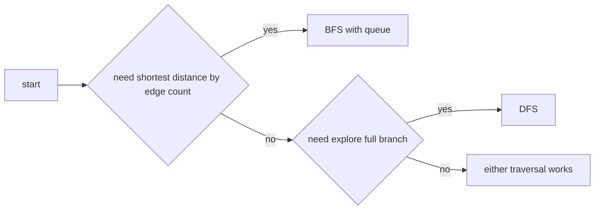

# 04. DFS and BFS

> DFS와 BFS는 graph와 tree의 가장 기본적인 탐색 알고리즘이다. 둘의 차이는 “어떤 노드를 먼저 볼 것인가”이며, 이것이 곧 문제의 불변식이 된다.

## 핵심 비교

| 알고리즘 | 자료구조 | 먼저 보는 것 | 강한 문제 |
|---|---|---|---|
| DFS | stack / recursion | 깊은 경로 | component, cycle, backtracking, tree |
| BFS | queue | 가까운 거리 | unweighted shortest path, level order |



## DFS 템플릿

Recursive DFS는 tree와 grid에서 읽기 쉽다.

```python
def dfs_recursive(graph: list[list[int]], start: int) -> list[int]:
    visited = [False] * len(graph)
    order: list[int] = []

    def dfs(node: int) -> None:
        visited[node] = True
        order.append(node)
        for nxt in graph[node]:
            if not visited[nxt]:
                dfs(nxt)

    dfs(start)
    return order
```

깊이가 커질 수 있으면 반복형이 안전하다.

```python
def dfs_iterative(graph: list[list[int]], start: int) -> list[int]:
    visited = [False] * len(graph)
    order: list[int] = []
    stack = [start]
    visited[start] = True

    while stack:
        node = stack.pop()
        order.append(node)
        for nxt in reversed(graph[node]):
            if not visited[nxt]:
                visited[nxt] = True
                stack.append(nxt)

    return order
```

## BFS 템플릿

BFS는 queue에 들어가는 순간 방문 처리하는 것이 중복 삽입을 줄이는 표준 패턴이다.

```python
from collections import deque


def bfs_order(graph: list[list[int]], start: int) -> list[int]:
    visited = [False] * len(graph)
    order: list[int] = []
    queue = deque([start])
    visited[start] = True

    while queue:
        node = queue.popleft()
        order.append(node)
        for nxt in graph[node]:
            if not visited[nxt]:
                visited[nxt] = True
                queue.append(nxt)

    return order
```

## BFS 최단거리

간선 비용이 모두 1인 그래프에서 BFS는 첫 방문 거리가 최단거리다.

```python
from collections import deque


def shortest_edges(graph: list[list[int]], start: int) -> list[int]:
    distance = [-1] * len(graph)
    queue = deque([start])
    distance[start] = 0

    while queue:
        node = queue.popleft()
        for nxt in graph[node]:
            if distance[nxt] == -1:
                distance[nxt] = distance[node] + 1
                queue.append(nxt)

    return distance
```

## Grid 탐색

Grid는 좌표가 node이고, 상하좌우 이동이 edge다.

```python
from collections import deque


def count_islands(grid: list[list[str]]) -> int:
    if not grid:
        return 0

    rows, cols = len(grid), len(grid[0])
    directions = [(1, 0), (-1, 0), (0, 1), (0, -1)]
    islands = 0

    for r in range(rows):
        for c in range(cols):
            if grid[r][c] != "1":
                continue

            islands += 1
            grid[r][c] = "0"
            queue = deque([(r, c)])

            while queue:
                cr, cc = queue.popleft()
                for dr, dc in directions:
                    nr, nc = cr + dr, cc + dc
                    if 0 <= nr < rows and 0 <= nc < cols and grid[nr][nc] == "1":
                        grid[nr][nc] = "0"
                        queue.append((nr, nc))

    return islands
```

## Cycle Detection

Undirected graph에서는 부모 노드로 되돌아가는 edge를 cycle로 세면 안 된다.

```python
def has_cycle_undirected(graph: list[list[int]]) -> bool:
    visited = [False] * len(graph)

    def dfs(node: int, parent: int) -> bool:
        visited[node] = True
        for nxt in graph[node]:
            if not visited[nxt]:
                if dfs(nxt, node):
                    return True
            elif nxt != parent:
                return True
        return False

    for start in range(len(graph)):
        if not visited[start] and dfs(start, -1):
            return True
    return False
```

Directed graph에서는 방문 상태를 `unvisited`, `visiting`, `done`으로 나누는 것이 안전하다.

```python
def has_cycle_directed(graph: list[list[int]]) -> bool:
    state = [0] * len(graph)

    def dfs(node: int) -> bool:
        if state[node] == 1:
            return True
        if state[node] == 2:
            return False

        state[node] = 1
        for nxt in graph[node]:
            if dfs(nxt):
                return True
        state[node] = 2
        return False

    return any(dfs(node) for node in range(len(graph)) if state[node] == 0)
```

## 방문 처리 타이밍

| 방식 | 장점 | 주의점 |
|---|---|---|
| push/enqueue 시 방문 | 중복 삽입 방지 | 방문 전 거리 확정 조건 필요 |
| pop/dequeue 시 방문 | 일부 Dijkstra-style 처리와 유사 | 같은 노드가 여러 번 들어갈 수 있음 |
| recursion 진입 시 방문 | DFS 표준 | backtracking 문제와 구분 필요 |
| recursion 종료 시 done 처리 | directed cycle/topology | 상태 배열 필요 |

## 복잡도

Adjacency list 기준 DFS/BFS는 모두 O(V + E) 시간, O(V) 공간이다. Grid에서는 `V = rows × cols`, `E`는 각 cell의 상하좌우 연결 수로 본다.

## 연결되는 노트

- [Graph](../01.%20Data%20Structures/09.%20Graph.md)
- [Tree](../01.%20Data%20Structures/08.%20Tree.md)
- [Queue and Deque](../01.%20Data%20Structures/07.%20Queue%20and%20Deque.md)
- [Graph Traversal Patterns](../03.%20Problem%20Solving%20Patterns/08.%20Graph%20Traversal%20Patterns.md)
- [Tree Traversal Patterns](../03.%20Problem%20Solving%20Patterns/14.%20Tree%20Traversal%20Patterns.md)

## References

- [Python 3.14.6 collections.deque](https://docs.python.org/3/library/collections.html#collections.deque)