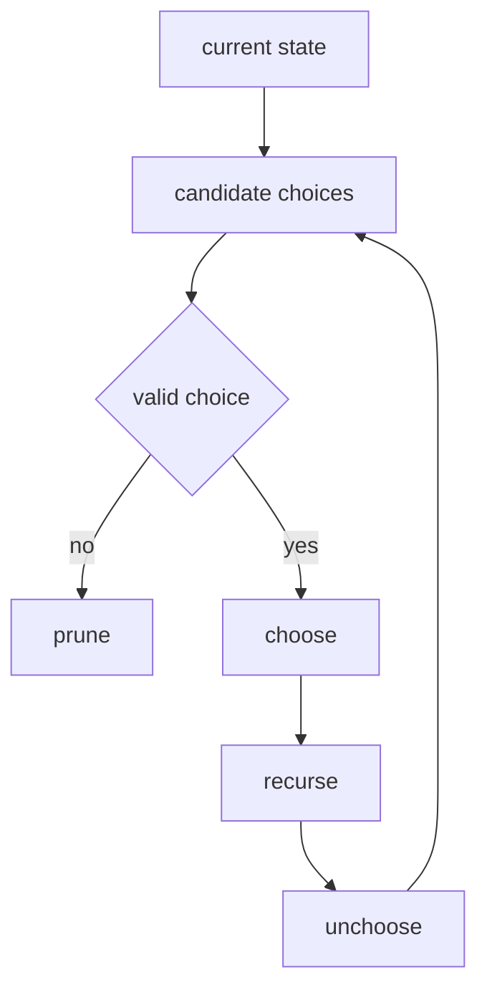

# 05. Backtracking

> Backtracking은 가능한 선택지를 만들되, 더 이상 정답이 될 수 없는 가지를 즉시 버리는 탐색 기법이다. 핵심은 `choose -> explore -> unchoose`의 균형이다.

## 핵심 모델



Backtracking은 brute force와 비슷하지만, 다음 차이가 있다.

- brute force: 모든 후보를 끝까지 만든 뒤 검사한다.
- backtracking: 만드는 도중 불가능한 후보를 버린다.

## 기본 템플릿

```python
def backtrack_template(nums: list[int]) -> list[list[int]]:
    result: list[list[int]] = []
    path: list[int] = []

    def backtrack(index: int) -> None:
        if index == len(nums):
            result.append(path.copy())
            return

        path.append(nums[index])
        backtrack(index + 1)
        path.pop()

        backtrack(index + 1)

    backtrack(0)
    return result
```

## Subsets

각 원소를 “선택한다 / 선택하지 않는다”로 나눈다.

```python
def subsets(nums: list[int]) -> list[list[int]]:
    result: list[list[int]] = []
    path: list[int] = []

    def dfs(index: int) -> None:
        if index == len(nums):
            result.append(path.copy())
            return

        path.append(nums[index])
        dfs(index + 1)
        path.pop()
        dfs(index + 1)

    dfs(0)
    return result
```

## Combinations

조합은 순서가 중요하지 않으므로 다음 선택은 항상 더 오른쪽에서 시작한다.

```python
def combine(n: int, k: int) -> list[list[int]]:
    result: list[list[int]] = []
    path: list[int] = []

    def dfs(start: int) -> None:
        if len(path) == k:
            result.append(path.copy())
            return

        needed = k - len(path)
        for value in range(start, n - needed + 2):
            path.append(value)
            dfs(value + 1)
            path.pop()

    dfs(1)
    return result
```

## Permutations

순열은 위치마다 아직 사용하지 않은 원소를 선택한다.

```python
def permute(nums: list[int]) -> list[list[int]]:
    result: list[list[int]] = []
    path: list[int] = []
    used = [False] * len(nums)

    def dfs() -> None:
        if len(path) == len(nums):
            result.append(path.copy())
            return

        for i, value in enumerate(nums):
            if used[i]:
                continue
            used[i] = True
            path.append(value)
            dfs()
            path.pop()
            used[i] = False

    dfs()
    return result
```

## 중복 제거

중복 원소가 있을 때는 정렬 후 같은 depth에서 같은 값을 두 번 시작하지 않는다.

```python
def permute_unique(nums: list[int]) -> list[list[int]]:
    nums.sort()
    result: list[list[int]] = []
    path: list[int] = []
    used = [False] * len(nums)

    def dfs() -> None:
        if len(path) == len(nums):
            result.append(path.copy())
            return

        for i, value in enumerate(nums):
            if used[i]:
                continue
            if i > 0 and nums[i] == nums[i - 1] and not used[i - 1]:
                continue
            used[i] = True
            path.append(value)
            dfs()
            path.pop()
            used[i] = False

    dfs()
    return result
```

## Pruning

부분합이 이미 target을 넘는다면 그 아래 가지는 볼 필요가 없다.

```python
def combination_sum(candidates: list[int], target: int) -> list[list[int]]:
    candidates.sort()
    result: list[list[int]] = []
    path: list[int] = []

    def dfs(start: int, remaining: int) -> None:
        if remaining == 0:
            result.append(path.copy())
            return

        for i in range(start, len(candidates)):
            value = candidates[i]
            if value > remaining:
                break
            path.append(value)
            dfs(i, remaining - value)
            path.pop()

    dfs(0, target)
    return result
```

## itertools와의 관계

Python의 `itertools`는 permutations, combinations, product를 제공한다. 문제 풀이에서는 빠르게 후보를 만들 때 유용하지만, pruning이 필요한 문제라면 직접 backtracking을 짜는 편이 낫다.

```python
from itertools import combinations


def pairs(nums: list[int]) -> list[tuple[int, int]]:
    return list(combinations(nums, 2))
```

## 복잡도

| 유형 | 후보 수 | 보통 시간 |
|---|---:|---:|
| Subsets | 2ⁿ | O(n × 2ⁿ) |
| Permutations | n! | O(n × n!) |
| Combinations | C(n, k) | O(k × C(n, k)) |
| Grid path search | 분기^길이 | pruning에 크게 의존 |

결과 자체가 큰 문제는 결과 출력 비용까지 시간복잡도에 포함한다.

## 실수 방지

- `path.copy()` 없이 `path` 자체를 result에 넣는 실수
- append와 pop의 균형이 깨지는 실수
- 중복 제거 조건을 depth 기준으로 적용하지 않는 실수
- 정렬이 필요한 pruning인데 정렬하지 않는 실수
- visited를 문제 전체 방문으로 써야 하는지, 현재 경로 방문으로 써야 하는지 혼동

## 연결되는 노트

- [Recursion](03.%20Recursion.md)
- [DFS and BFS](04.%20DFS%20and%20BFS.md)
- [Trie](../01.%20Data%20Structures/11.%20Trie.md)
- [Backtracking Search Patterns](../03.%20Problem%20Solving%20Patterns/09.%20Backtracking%20Search%20Patterns.md)

## References

- [Python 3.14.6 itertools](https://docs.python.org/3/library/itertools.html)