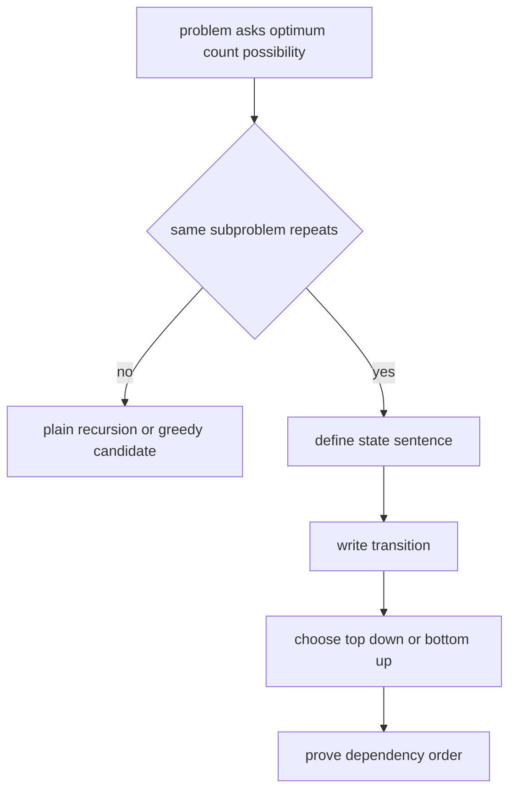

# 06. Dynamic Programming

> Dynamic Programming은 “같은 부분 문제가 반복된다”는 사실을 이용해 탐색을 계산으로 바꾸는 전략이다. 코딩 테스트에서 DP는 점화식을 외우는 분야가 아니라, **state의 의미를 문장으로 고정하고 의존 순서대로 계산하는 기술**이다.

## 핵심 모델

DP를 시작하기 전에는 항상 네 가지를 정의한다.

1. State: `dp[...]`가 정확히 무엇을 의미하는가?
2. Transition: 더 작은 state에서 현재 state를 어떻게 만드는가?
3. Base Case: 가장 작은 state의 답은 무엇인가?
4. Order: 어떤 순서로 계산해야 의존성이 깨지지 않는가?



## DP가 필요한 신호

- 최댓값, 최솟값, 경우의 수, 가능 여부를 묻는다.
- 현재 답이 이전 index, 이전 capacity, 이전 prefix에 의존한다.
- brute force recursion에서 같은 인자가 반복된다.
- “선택한다 / 선택하지 않는다” 구조가 있다.
- sequence, grid, subset, interval, tree에 부분 문제가 자연스럽게 생긴다.

## Top-down Memoization

Top-down은 재귀적 정의가 명확할 때 좋다. Python에서는 `functools.cache`를 사용하면 hashable 인자를 기준으로 결과를 저장할 수 있다.

```python
from functools import cache


def climb_stairs(n: int) -> int:
    @cache
    def ways(step: int) -> int:
        if step == n:
            return 1
        if step > n:
            return 0
        return ways(step + 1) + ways(step + 2)

    return ways(0)
```

위 코드에서 `ways(step)`의 의미는 “현재 `step`에서 정확히 `n`까지 가는 방법 수”다. 이 문장이 흔들리면 transition도 흔들린다.

## Bottom-up Tabulation

Bottom-up은 계산 순서를 직접 통제할 수 있고, recursion depth 위험이 없다.

```python
def climb_stairs_bottom_up(n: int) -> int:
    if n <= 1:
        return 1

    dp = [0] * (n + 1)
    dp[0] = 1
    dp[1] = 1

    for step in range(2, n + 1):
        dp[step] = dp[step - 1] + dp[step - 2]

    return dp[n]
```

## Rolling Array

현재 state가 직전 몇 개 state에만 의존하면 전체 table이 필요 없다.

```python
def climb_stairs_rolling(n: int) -> int:
    if n <= 1:
        return 1

    prev2, prev1 = 1, 1
    for _ in range(2, n + 1):
        cur = prev1 + prev2
        prev2, prev1 = prev1, cur
    return prev1
```

## Min/Max DP 예시: Coin Change

`dp[amount]`를 “amount를 만들기 위한 최소 동전 수”로 정의한다.

```python
def min_coins(coins: list[int], amount: int) -> int:
    inf = amount + 1
    dp = [inf] * (amount + 1)
    dp[0] = 0

    for value in range(1, amount + 1):
        for coin in coins:
            if coin <= value:
                dp[value] = min(dp[value], dp[value - coin] + 1)

    return -1 if dp[amount] == inf else dp[amount]
```

## Grid DP 예시

Grid DP는 `dp[r][c]`가 보통 “시작점에서 `(r, c)`까지의 답” 또는 “`(r, c)`에서 도착점까지의 답”을 의미한다.

```python
def min_path_sum(grid: list[list[int]]) -> int:
    if not grid:
        return 0

    rows, cols = len(grid), len(grid[0])
    dp = [[0] * cols for _ in range(rows)]
    dp[0][0] = grid[0][0]

    for r in range(1, rows):
        dp[r][0] = dp[r - 1][0] + grid[r][0]
    for c in range(1, cols):
        dp[0][c] = dp[0][c - 1] + grid[0][c]

    for r in range(1, rows):
        for c in range(1, cols):
            dp[r][c] = grid[r][c] + min(dp[r - 1][c], dp[r][c - 1])

    return dp[-1][-1]
```

## Top-down과 Bottom-up 선택

| 기준 | Top-down | Bottom-up |
|---|---|---|
| 상태 중 일부만 방문 | 강함 | 불필요한 state까지 계산할 수 있음 |
| 점화식이 자연스럽게 재귀 | 강함 | 변환이 필요함 |
| recursion depth 위험 | 있음 | 없음 |
| 메모리 최적화 | 상대적으로 어려움 | rolling array가 쉬움 |
| 계산 순서 명시성 | cache에 의존 | 직접 통제 |

## Correctness Invariant

DP의 정당성은 보통 다음 문장으로 설명한다.

> 각 state를 계산하는 시점에, transition이 참조하는 모든 이전 state는 이미 state 정의에 맞는 최적/정확한 값을 가진다.

이 문장이 성립하려면 계산 순서가 반드시 의존성을 만족해야 한다.

## 복잡도 계산

DP 복잡도는 보통 다음 공식으로 계산한다.

> 전체 state 수 × state 하나를 계산하는 transition 비용

| 예시 | State 수 | Transition 비용 | 시간 | 공간 |
|---|---:|---:|---:|---:|
| Fibonacci | O(n) | O(1) | O(n) | O(n) 또는 O(1) |
| Coin Change | O(amount) | O(coins) | O(amount × coins) | O(amount) |
| Grid DP | O(RC) | O(1) | O(RC) | O(RC) 또는 O(C) |
| LCS | O(NM) | O(1) | O(NM) | O(NM) 또는 O(M) |

## 실수 방지

- `dp[i]`의 의미를 “대충 i번째까지”로 두지 않는다. inclusive/exclusive를 명확히 한다.
- 최솟값 DP는 충분히 큰 `inf`로 초기화한다.
- 경우의 수 DP는 base case `dp[0] = 1`의 의미를 설명할 수 있어야 한다.
- 0/1 knapsack은 capacity를 뒤에서 앞으로 순회한다.
- recursion memoization에서는 list/dict 같은 unhashable 인자를 cache key로 쓰지 않는다.
- 답이 매우 커지는 경우 modulo 조건을 확인한다.

## 연결되는 패턴

- [DP State Design](../03.%20Problem%20Solving%20Patterns/22.%20DP%20State%20Design.md)
- [Knapsack Style DP](../03.%20Problem%20Solving%20Patterns/23.%20Knapsack%20Style%20DP.md)
- [Sequence DP](../03.%20Problem%20Solving%20Patterns/24.%20Sequence%20DP.md)
- [Recursion](03.%20Recursion.md)

## References

- [Python 3.14.6 functools.cache](https://docs.python.org/3/library/functools.html#functools.cache)
- [Python 3.14.6 functools.lru_cache](https://docs.python.org/3/library/functools.html#functools.lru_cache)