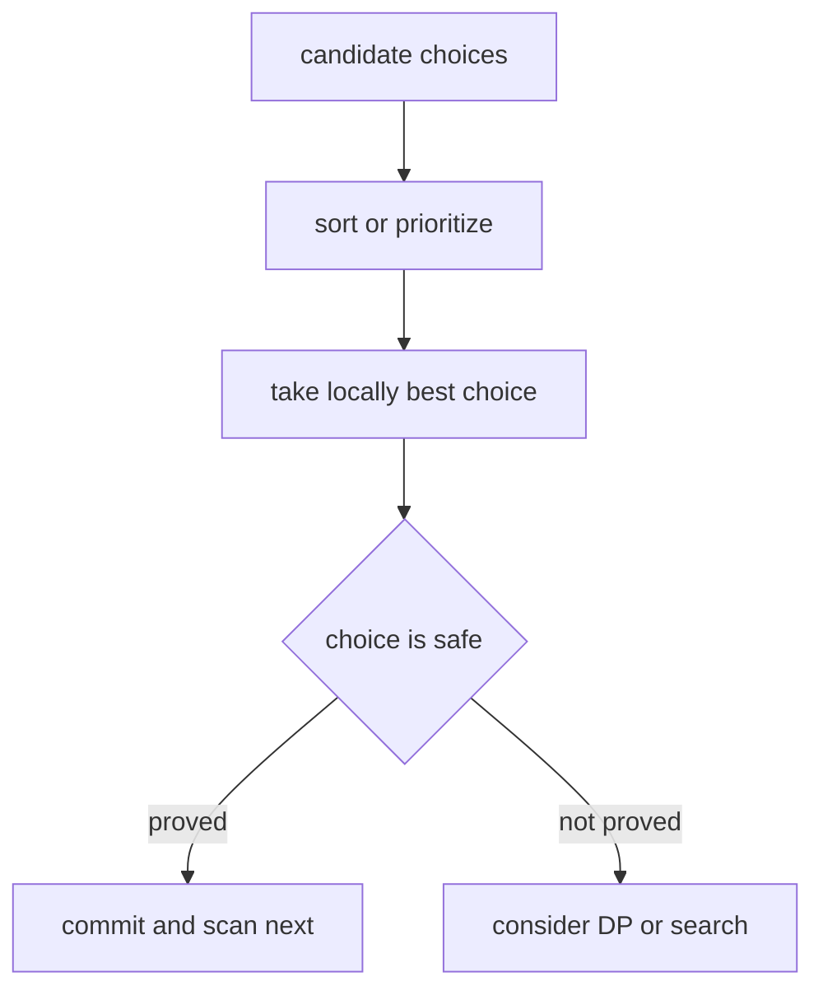

# 07. Greedy

> Greedy는 매 순간 가장 좋아 보이는 선택을 하고도 전체 최적해를 잃지 않는다는 정당성이 있을 때 쓰는 알고리즘 전략이다. 핵심은 “탐욕적으로 고른다”가 아니라, **왜 되돌아볼 필요가 없는가를 설명하는 것**이다.

## 핵심 모델

Greedy는 보통 다음 구조를 가진다.

1. 정렬 기준 또는 우선순위 기준을 정한다.
2. 앞에서부터 선택한다.
3. 선택한 뒤에는 이전 선택을 바꾸지 않는다.
4. 그 선택이 최적해를 망치지 않는다는 불변식을 증명한다.



## Greedy를 선택하는 신호

- “가장 빨리 끝나는 것”, “가장 작은 비용”, “가장 큰 이득” 같은 기준이 자연스럽다.
- 선택을 한 번 하면 이후 선택지가 단조롭게 줄어든다.
- 정렬 후 한 번 스캔하면 상태가 충분하다.
- heap으로 현재 가능한 후보 중 최선만 유지하면 된다.
- 교환 논증으로 “어떤 최적해도 이 선택을 포함하도록 바꿀 수 있다”고 말할 수 있다.

## Interval Scheduling

끝나는 시간이 빠른 회의부터 선택하면 가장 많은 non-overlapping interval을 고를 수 있다.

```python
def max_non_overlapping(intervals: list[tuple[int, int]]) -> int:
    intervals.sort(key=lambda x: x[1])
    count = 0
    last_end: int | None = None

    for start, end in intervals:
        if last_end is None or start >= last_end:
            count += 1
            last_end = end

    return count
```

불변식은 “현재까지 선택한 회의들의 마지막 종료 시간이 가능한 한 이르다”이다. 마지막 종료 시간이 이르면 미래 선택지가 줄어들지 않는다.

## Jump Game

현재까지 도달 가능한 가장 먼 위치를 유지한다. 매 index에 도달할 수 있다면 그 index에서 다시 reach를 확장한다.

```python
def can_jump(nums: list[int]) -> bool:
    farthest = 0

    for i, jump in enumerate(nums):
        if i > farthest:
            return False
        farthest = max(farthest, i + jump)
        if farthest >= len(nums) - 1:
            return True

    return True
```

## 최소 점프 수

현재 jump로 도달 가능한 구간을 level처럼 보고, 그 구간 안에서 다음 구간의 끝을 최대화한다.

```python
def min_jumps(nums: list[int]) -> int:
    if len(nums) <= 1:
        return 0

    jumps = 0
    current_end = 0
    farthest = 0

    for i in range(len(nums) - 1):
        farthest = max(farthest, i + nums[i])
        if i == current_end:
            jumps += 1
            current_end = farthest

    return jumps
```

## Heap 기반 Greedy

회의실 문제에서는 시작 시간이 빠른 순서로 보며, 현재 진행 중인 회의 중 가장 빨리 끝나는 회의를 heap top에 둔다.

```python
import heapq


def min_meeting_rooms(intervals: list[tuple[int, int]]) -> int:
    if not intervals:
        return 0

    intervals.sort()
    active_end_times: list[int] = []

    for start, end in intervals:
        if active_end_times and active_end_times[0] <= start:
            heapq.heappop(active_end_times)
        heapq.heappush(active_end_times, end)

    return len(active_end_times)
```

## 교환 논증 감각

Greedy 정당화는 다음 형태가 많다.

> 최적해가 greedy 선택을 포함하지 않는다고 가정한다. 최적해의 첫 선택을 greedy 선택으로 교체해도 나머지 선택 가능성은 나빠지지 않는다. 따라서 greedy 선택을 포함하는 최적해가 존재한다.

이 설명이 안 되면 DP, graph search, binary search on answer를 다시 고려한다.

## Greedy와 DP의 경계

| 질문 | Greedy 가능성 | DP 가능성 |
|---|---|---|
| 선택 후 미래가 단조롭게 제한되는가? | 높음 | 낮음 |
| 선택을 되돌려야 더 좋은 답이 나오는가? | 낮음 | 높음 |
| local best가 global best라는 증명이 있는가? | 높음 | 낮음 |
| 같은 state가 반복되는가? | 낮음 | 높음 |
| 모든 조합 중 최적을 찾아야 하는가? | 낮음 | 높음 |

## 복잡도

Greedy는 정렬이 포함되면 보통 O(n log n), 정렬이 필요 없고 한 번 훑으면 O(n)이다. heap을 쓰면 각 push/pop이 O(log n)이다.

## 실수 방지

- “그럴듯한 기준”과 “증명 가능한 기준”을 구분한다.
- interval 문제에서 end 기준인지 start 기준인지 확인한다.
- 같은 좌표에서 start/end 처리 순서가 문제 정의와 맞는지 확인한다.
- heap에는 현재 후보만 남아 있어야 한다.
- 동률 처리 tie-breaker가 답에 영향을 주는지 확인한다.

## 연결되는 패턴

- [Sort Then Scan](../03.%20Problem%20Solving%20Patterns/20.%20Sort%20Then%20Scan.md)
- [Sweep Line and Intervals](../03.%20Problem%20Solving%20Patterns/19.%20Sweep%20Line%20and%20Intervals.md)
- [Binary Search on Answer](../03.%20Problem%20Solving%20Patterns/21.%20Binary%20Search%20on%20Answer.md)
- [Heap](../01.%20Data%20Structures/10.%20Heap.md)
- [Sorting](01.%20Sorting.md)

## References

- [Python 3.14.6 Sorting HOWTO](https://docs.python.org/3/howto/sorting.html)
- [Python 3.14.6 heapq](https://docs.python.org/3/library/heapq.html)