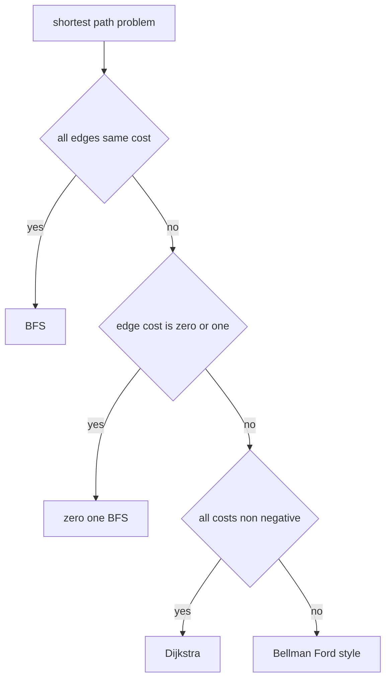

# 08. Shortest Path

> Shortest Path는 graph에서 시작점부터 다른 정점까지의 최소 비용을 구하는 알고리즘 계열이다. 가장 먼저 볼 것은 “간선 비용의 성질”이다.

## 선택 기준



코딩 테스트에서는 BFS, 0-1 BFS, Dijkstra가 가장 자주 등장한다.

## Unweighted Shortest Path: BFS

간선 비용이 모두 1이면 BFS의 첫 방문 거리가 최단거리다.

```python
from collections import deque


def shortest_unweighted(graph: list[list[int]], start: int) -> list[int]:
    distance = [-1] * len(graph)
    queue = deque([start])
    distance[start] = 0

    while queue:
        node = queue.popleft()
        for nxt in graph[node]:
            if distance[nxt] == -1:
                distance[nxt] = distance[node] + 1
                queue.append(nxt)

    return distance
```

## 0-1 BFS

간선 비용이 0 또는 1뿐이면 deque를 사용한다. 비용 0 edge는 앞에 넣고, 비용 1 edge는 뒤에 넣는다.

```python
from collections import deque


def zero_one_bfs(graph: list[list[tuple[int, int]]], start: int) -> list[int]:
    inf = 10**18
    distance = [inf] * len(graph)
    distance[start] = 0
    dq = deque([start])

    while dq:
        node = dq.popleft()
        for nxt, cost in graph[node]:
            new_dist = distance[node] + cost
            if new_dist < distance[nxt]:
                distance[nxt] = new_dist
                if cost == 0:
                    dq.appendleft(nxt)
                else:
                    dq.append(nxt)

    return distance
```

## Dijkstra

모든 간선 비용이 음수가 아니면 Dijkstra를 사용한다. Python에서는 `heapq`를 priority queue로 쓴다.

```python
import heapq


def dijkstra(graph: list[list[tuple[int, int]]], start: int) -> list[int]:
    inf = 10**18
    distance = [inf] * len(graph)
    distance[start] = 0
    heap: list[tuple[int, int]] = [(0, start)]

    while heap:
        dist, node = heapq.heappop(heap)
        if dist != distance[node]:
            continue

        for nxt, cost in graph[node]:
            new_dist = dist + cost
            if new_dist < distance[nxt]:
                distance[nxt] = new_dist
                heapq.heappush(heap, (new_dist, nxt))

    return distance
```

## 최단 경로 복원

거리뿐 아니라 실제 경로를 원하면 parent를 저장한다.

```python
import heapq


def shortest_path(
    graph: list[list[tuple[int, int]]],
    start: int,
    target: int,
) -> list[int]:
    inf = 10**18
    distance = [inf] * len(graph)
    parent = [-1] * len(graph)
    distance[start] = 0
    heap: list[tuple[int, int]] = [(0, start)]

    while heap:
        dist, node = heapq.heappop(heap)
        if dist != distance[node]:
            continue
        if node == target:
            break

        for nxt, cost in graph[node]:
            new_dist = dist + cost
            if new_dist < distance[nxt]:
                distance[nxt] = new_dist
                parent[nxt] = node
                heapq.heappush(heap, (new_dist, nxt))

    if distance[target] == inf:
        return []

    path: list[int] = []
    cur = target
    while cur != -1:
        path.append(cur)
        cur = parent[cur]
    path.reverse()
    return path
```

## Grid 최단거리

Grid에서는 각 좌표가 node다. 장애물과 boundary가 neighbor 생성 조건이 된다.

```python
from collections import deque


def shortest_grid_path(grid: list[list[int]]) -> int:
    if not grid or grid[0][0] == 1:
        return -1

    rows, cols = len(grid), len(grid[0])
    directions = [(1, 0), (-1, 0), (0, 1), (0, -1)]
    distance = [[-1] * cols for _ in range(rows)]
    queue = deque([(0, 0)])
    distance[0][0] = 0

    while queue:
        r, c = queue.popleft()
        if r == rows - 1 and c == cols - 1:
            return distance[r][c]
        for dr, dc in directions:
            nr, nc = r + dr, c + dc
            if 0 <= nr < rows and 0 <= nc < cols:
                if grid[nr][nc] == 0 and distance[nr][nc] == -1:
                    distance[nr][nc] = distance[r][c] + 1
                    queue.append((nr, nc))

    return -1
```

## 복잡도

| 알고리즘 | 조건 | 시간 | 공간 |
|---|---|---:|---:|
| BFS | unweighted | O(V + E) | O(V) |
| 0-1 BFS | cost in {0, 1} | O(V + E) | O(V) |
| Dijkstra | non-negative cost | O((V + E) log V) | O(V + E) |
| Bellman-Ford | negative edge allowed | O(VE) | O(V) |

## 실수 방지

- 가중치가 있는데 BFS를 쓰는 실수
- Dijkstra에 음수 간선이 있는 실수
- heap에서 꺼낸 오래된 거리 정보를 skip하지 않는 실수
- unreachable을 0으로 착각하는 실수
- grid에서 시작점/도착점이 장애물인 경우를 빼먹는 실수
- 경로 복원 시 parent 초기값 처리 실수

## 연결되는 노트

- [Graph](../01.%20Data%20Structures/09.%20Graph.md)
- [Heap](../01.%20Data%20Structures/10.%20Heap.md)
- [Queue and Deque](../01.%20Data%20Structures/07.%20Queue%20and%20Deque.md)
- [Graph Traversal Patterns](../03.%20Problem%20Solving%20Patterns/08.%20Graph%20Traversal%20Patterns.md)

## References

- [Python 3.14.6 heapq](https://docs.python.org/3/library/heapq.html)
- [Python 3.14.6 collections.deque](https://docs.python.org/3/library/collections.html#collections.deque)