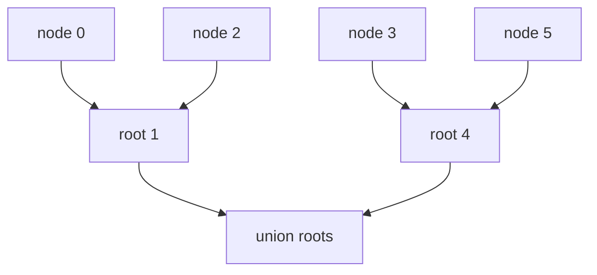

# 09. Union Find

> Union Find, 또는 Disjoint Set Union은 원소들이 어떤 그룹에 속하는지 관리하고, 두 그룹을 빠르게 합치는 자료구조/알고리즘이다. 핵심 질문은 “두 원소가 현재 같은 component인가?”이다.

## 핵심 모델

각 원소는 parent를 가진다. 대표자 root가 같으면 같은 집합이다.



## DSU 구현

Path compression과 union by size/rank를 함께 쓰면 거의 상수 시간처럼 동작한다.

```python
class DSU:
    def __init__(self, n: int) -> None:
        self.parent = list(range(n))
        self.size = [1] * n
        self.components = n

    def find(self, x: int) -> int:
        if self.parent[x] != x:
            self.parent[x] = self.find(self.parent[x])
        return self.parent[x]

    def union(self, a: int, b: int) -> bool:
        root_a = self.find(a)
        root_b = self.find(b)
        if root_a == root_b:
            return False

        if self.size[root_a] < self.size[root_b]:
            root_a, root_b = root_b, root_a

        self.parent[root_b] = root_a
        self.size[root_a] += self.size[root_b]
        self.components -= 1
        return True

    def connected(self, a: int, b: int) -> bool:
        return self.find(a) == self.find(b)
```

## 언제 쓰는가?

DFS/BFS는 이미 만들어진 graph를 탐색한다. Union Find는 edge가 들어오면서 component가 변하는 상황에 강하다.

| 질문 | 적합한 선택 |
|---|---|
| 모든 연결 요소를 한 번 세기 | DFS/BFS 또는 Union Find |
| edge가 순차적으로 추가됨 | Union Find |
| 두 노드가 같은 그룹인지 반복 질의 | Union Find |
| 실제 경로가 필요함 | DFS/BFS |
| 방향 그래프 cycle | Topological Sort 또는 DFS state |

## Connected Components

```python
class DSU:
    def __init__(self, n: int) -> None:
        self.parent = list(range(n))
        self.size = [1] * n
        self.components = n

    def find(self, x: int) -> int:
        while self.parent[x] != x:
            self.parent[x] = self.parent[self.parent[x]]
            x = self.parent[x]
        return x

    def union(self, a: int, b: int) -> bool:
        ra, rb = self.find(a), self.find(b)
        if ra == rb:
            return False
        if self.size[ra] < self.size[rb]:
            ra, rb = rb, ra
        self.parent[rb] = ra
        self.size[ra] += self.size[rb]
        self.components -= 1
        return True


def count_components(n: int, edges: list[tuple[int, int]]) -> int:
    dsu = DSU(n)
    for a, b in edges:
        dsu.union(a, b)
    return dsu.components
```

## Undirected Cycle Detection

무방향 graph에서 이미 같은 component에 속한 두 노드를 다시 연결하려 하면 cycle이 생긴다.

```python
class DSU:
    def __init__(self, n: int) -> None:
        self.parent = list(range(n))
        self.size = [1] * n

    def find(self, x: int) -> int:
        if self.parent[x] != x:
            self.parent[x] = self.find(self.parent[x])
        return self.parent[x]

    def union(self, a: int, b: int) -> bool:
        ra, rb = self.find(a), self.find(b)
        if ra == rb:
            return False
        if self.size[ra] < self.size[rb]:
            ra, rb = rb, ra
        self.parent[rb] = ra
        self.size[ra] += self.size[rb]
        return True


def has_cycle(n: int, edges: list[tuple[int, int]]) -> bool:
    dsu = DSU(n)
    for a, b in edges:
        if not dsu.union(a, b):
            return True
    return False
```

## Kruskal 스타일 사고

Minimum Spanning Tree에서 간선을 비용순으로 보며, cycle을 만들지 않는 간선만 선택한다.

```python
class DSU:
    def __init__(self, n: int) -> None:
        self.parent = list(range(n))
        self.size = [1] * n

    def find(self, x: int) -> int:
        if self.parent[x] != x:
            self.parent[x] = self.find(self.parent[x])
        return self.parent[x]

    def union(self, a: int, b: int) -> bool:
        ra, rb = self.find(a), self.find(b)
        if ra == rb:
            return False
        if self.size[ra] < self.size[rb]:
            ra, rb = rb, ra
        self.parent[rb] = ra
        self.size[ra] += self.size[rb]
        return True


def kruskal_cost(n: int, edges: list[tuple[int, int, int]]) -> int:
    dsu = DSU(n)
    total = 0
    used = 0

    for cost, a, b in sorted(edges):
        if dsu.union(a, b):
            total += cost
            used += 1

    return total if used == n - 1 else -1
```

## 복잡도

Path compression + union by size/rank를 쓰면 `find`와 `union`은 amortized almost O(1)로 다뤄도 충분하다. 전체적으로는 O((V + E) α(V))처럼 표현한다.

## 실수 방지

- 1-indexed input 보정 누락
- `union`이 실제 merge 여부를 반환하지 않아 cycle 판단을 못 하는 문제
- 방향 그래프 cycle을 Union Find로 잘못 처리하는 문제
- group size가 root에만 유효하다는 사실을 잊는 문제
- parent 배열을 직접 비교하고 find를 호출하지 않는 문제

## 연결되는 노트

- [Graph](../01.%20Data%20Structures/09.%20Graph.md)
- [Union Find Connectivity](../03.%20Problem%20Solving%20Patterns/16.%20Union%20Find%20Connectivity.md)
- [DFS and BFS](04.%20DFS%20and%20BFS.md)

## References

- [Python 3.14.6 Data Structures Tutorial](https://docs.python.org/3/tutorial/datastructures.html)