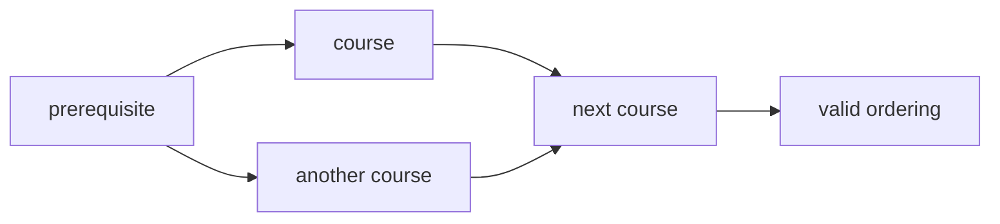

# 10. Topological Sort

> Topological Sort는 방향 그래프에서 “선행 조건을 먼저 처리하는 순서”를 만드는 알고리즘이다. 가능한 전제는 graph가 DAG, 즉 directed acyclic graph라는 것이다.

## 핵심 모델



Topological Sort 문제의 본질은 다음이다.

1. `before -> after` 방향을 정확히 잡는다.
2. indegree가 0인 노드부터 처리한다.
3. 처리하면서 다음 노드의 indegree를 줄인다.
4. 모든 노드를 처리하지 못하면 cycle이 있다.

## Kahn Algorithm

```python
from collections import deque


def topological_sort(n: int, edges: list[tuple[int, int]]) -> list[int]:
    graph = [[] for _ in range(n)]
    indegree = [0] * n

    for before, after in edges:
        graph[before].append(after)
        indegree[after] += 1

    queue = deque(i for i, degree in enumerate(indegree) if degree == 0)
    order: list[int] = []

    while queue:
        node = queue.popleft()
        order.append(node)
        for nxt in graph[node]:
            indegree[nxt] -= 1
            if indegree[nxt] == 0:
                queue.append(nxt)

    return order if len(order) == n else []
```

## Course Schedule 판단

순서 자체가 필요 없고 가능 여부만 필요하면 처리 개수만 세면 된다.

```python
from collections import deque


def can_finish(num_courses: int, prerequisites: list[tuple[int, int]]) -> bool:
    graph = [[] for _ in range(num_courses)]
    indegree = [0] * num_courses

    for course, prereq in prerequisites:
        graph[prereq].append(course)
        indegree[course] += 1

    queue = deque(i for i, degree in enumerate(indegree) if degree == 0)
    completed = 0

    while queue:
        course = queue.popleft()
        completed += 1
        for nxt in graph[course]:
            indegree[nxt] -= 1
            if indegree[nxt] == 0:
                queue.append(nxt)

    return completed == num_courses
```

## DFS 기반 Cycle Detection

Topological order는 DFS postorder reverse로도 만들 수 있다. 다만 cycle 검출을 위해 상태 배열이 필요하다.

```python
def topo_sort_dfs(n: int, edges: list[tuple[int, int]]) -> list[int]:
    graph = [[] for _ in range(n)]
    for before, after in edges:
        graph[before].append(after)

    state = [0] * n
    order: list[int] = []

    def dfs(node: int) -> bool:
        if state[node] == 1:
            return False
        if state[node] == 2:
            return True

        state[node] = 1
        for nxt in graph[node]:
            if not dfs(nxt):
                return False
        state[node] = 2
        order.append(node)
        return True

    for node in range(n):
        if state[node] == 0 and not dfs(node):
            return []

    order.reverse()
    return order
```

## graphlib.TopologicalSorter

Python 표준 라이브러리에는 `graphlib.TopologicalSorter`가 있다. 실전 코딩 테스트에서는 직접 구현이 요구되는 경우가 많지만, 프로젝트 코드나 검증용으로는 유용하다.

```python
from graphlib import TopologicalSorter


def order_tasks(dependencies: dict[str, set[str]]) -> list[str]:
    sorter = TopologicalSorter(dependencies)
    return list(sorter.static_order())
```

주의할 점은 `TopologicalSorter`의 입력 dict가 “node -> predecessors” 형태라는 것이다. 일반적인 adjacency list의 “node -> successors”와 방향 감각이 다르다.

## 복잡도

Adjacency list 기준으로 Kahn Algorithm과 DFS 방식 모두 O(V + E) 시간, O(V + E) 공간이다.

## 실수 방지

- `course -> prereq`와 `prereq -> course` 방향을 뒤집는 실수
- indegree를 after가 아니라 before에 더하는 실수
- queue 초기화에서 indegree 0 노드를 누락하는 실수
- cycle이 있으면 order 길이가 n보다 작다는 검증을 빼먹는 실수
- 여러 가능한 정답 중 하나만 요구되는 문제에서 불필요하게 정렬 기준을 추가하는 실수

## 선택 신호

- prerequisite
- dependency
- build order
- before / after
- alien dictionary
- tasks with constraints
- directed acyclic graph

## 연결되는 노트

- [Graph](../01.%20Data%20Structures/09.%20Graph.md)
- [DFS and BFS](04.%20DFS%20and%20BFS.md)
- [Topological Ordering](../03.%20Problem%20Solving%20Patterns/17.%20Topological%20Ordering.md)

## References

- [Python 3.14.6 graphlib](https://docs.python.org/3/library/graphlib.html)
- [Python 3.14.6 collections.deque](https://docs.python.org/3/library/collections.html#collections.deque)