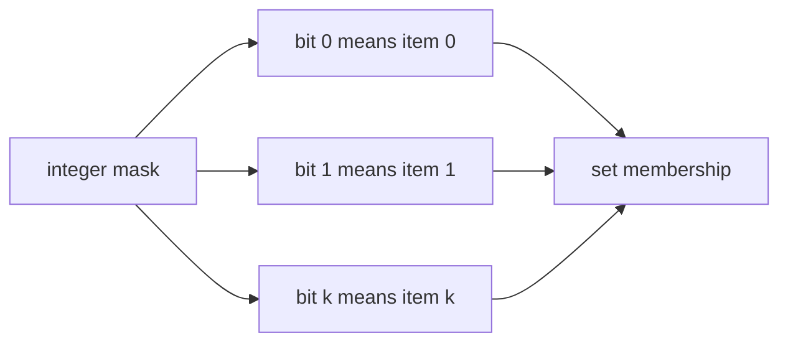

# 11. Bit Manipulation

> Bit Manipulation은 정수의 이진 표현을 이용해 상태, 집합, parity, permission을 압축하는 기법이다. Python의 `int`는 arbitrary precision이라 bit 연산을 편하게 쓸 수 있지만, 음수와 보수 표현을 다룰 때는 문제 조건을 더 엄격히 확인해야 한다.

## 핵심 모델

정수 하나를 bit들의 배열처럼 본다. `i`번째 bit가 1이면 어떤 상태가 켜져 있고, 0이면 꺼져 있다고 해석한다.



## 기본 연산

| 연산 | 의미 | 예시 |
|---|---|---|
| `x & y` | 둘 다 1인 bit | intersection |
| `x | y` | 하나라도 1인 bit | union |
| `x ^ y` | 서로 다른 bit | toggle/parity |
| `~x` | bit 반전 | mask 제한 필요 |
| `x << k` | 왼쪽 shift | `x * 2**k` |
| `x >> k` | 오른쪽 shift | `x // 2**k` 계열 |

## Bit 확인/설정/해제

```python
def has_bit(mask: int, i: int) -> bool:
    return (mask & (1 << i)) != 0


def set_bit(mask: int, i: int) -> int:
    return mask | (1 << i)


def clear_bit(mask: int, i: int) -> int:
    return mask & ~(1 << i)


def toggle_bit(mask: int, i: int) -> int:
    return mask ^ (1 << i)
```

## Lowbit

`x & -x`는 가장 낮은 1 bit만 남긴다. Fenwick Tree, subset enumeration, bit DP에서 자주 사용한다.

```python
def lowbit(x: int) -> int:
    return x & -x


def indices_in_mask(mask: int) -> list[int]:
    result: list[int] = []
    while mask:
        bit = mask & -mask
        result.append(bit.bit_length() - 1)
        mask -= bit
    return result
```

## Power of Two

양수 `x`가 2의 거듭제곱이면 1 bit가 정확히 하나다.

```python
def is_power_of_two(x: int) -> bool:
    return x > 0 and (x & (x - 1)) == 0
```

`x & (x - 1)`은 가장 낮은 1 bit를 제거한다.

## Bit Count

Python의 `int.bit_count()`는 1 bit 개수를 반환한다.

```python
def hamming_weight(x: int) -> int:
    return x.bit_count()
```

## XOR 패턴

XOR은 같은 값을 두 번 만나면 사라진다는 성질이 있다.

```python
def single_number(nums: list[int]) -> int:
    result = 0
    for num in nums:
        result ^= num
    return result
```

XOR의 핵심 성질:

- `a ^ a == 0`
- `a ^ 0 == a`
- 순서와 묶는 방식이 결과에 영향을 주지 않는다.

## Subset Enumeration

`n`이 작을 때 모든 subset을 `0`부터 `2**n - 1`까지의 mask로 표현한다.

```python
def all_subsets(nums: list[int]) -> list[list[int]]:
    n = len(nums)
    result: list[list[int]] = []

    for mask in range(1 << n):
        subset: list[int] = []
        for i, value in enumerate(nums):
            if mask & (1 << i):
                subset.append(value)
        result.append(subset)

    return result
```

특정 mask의 submask만 순회할 수도 있다.

```python
def submasks(mask: int) -> list[int]:
    result: list[int] = []
    sub = mask
    while sub:
        result.append(sub)
        sub = (sub - 1) & mask
    result.append(0)
    return result
```

## Negative Number 주의

Python의 `int`는 고정된 32-bit/64-bit 정수가 아니다. 따라서 `~x`를 사용할 때는 필요한 bit width를 mask로 제한해야 한다.

```python
def invert_with_width(x: int, width: int) -> int:
    full = (1 << width) - 1
    return (~x) & full
```

## 복잡도

| 작업 | 시간 | 설명 |
|---|---:|---|
| bit check/set/clear/toggle | O(1)처럼 취급 | 정수 크기가 매우 크면 word 수 영향 |
| `bit_count()` | O(number of machine words) | 코테에서는 보통 O(1) 또는 O(log x) 감각 |
| all subsets | O(n × 2ⁿ) | 결과 자체가 큼 |
| submask enumeration | O(3ⁿ) 전체 mask-submask 쌍 | 고급 DP에서 주의 |

## 실수 방지

- bit position과 원소 index의 mapping을 끝까지 유지한다.
- `1 << n`은 subset 개수이고, 마지막 mask는 `(1 << n) - 1`이다.
- `~x`는 width 제한 없이 쓰지 않는다.
- `x & (x - 1)`은 `x > 0` 조건과 함께 사용한다.
- XOR 문제는 값의 등장 횟수 조건이 정확히 맞아야 한다.

## 연결되는 패턴

- [Bitmask State Compression](../03.%20Problem%20Solving%20Patterns/25.%20Bitmask%20State%20Compression.md)
- [Dynamic Programming](06.%20Dynamic%20Programming.md)
- [Math](12.%20Math.md)

## References

- [Python 3.14.6 int.bit_count](https://docs.python.org/3/library/stdtypes.html#int.bit_count)