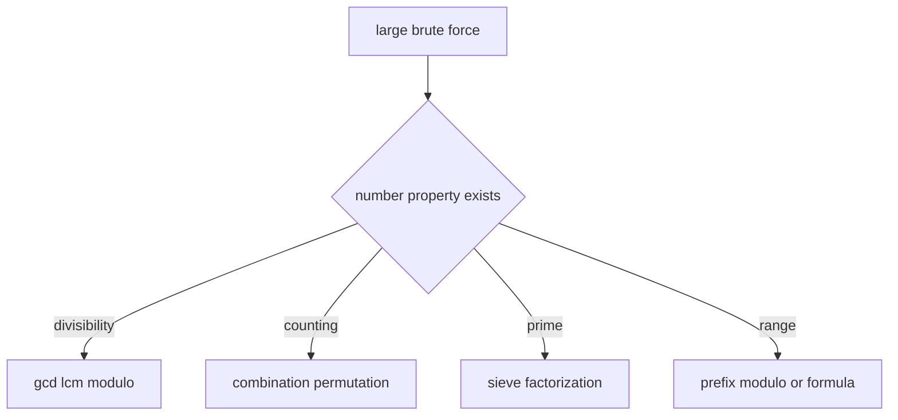

# 12. Math

> Math 알고리즘은 탐색 공간을 수학적 성질로 줄이는 도구다. 코딩 테스트에서는 어려운 정리를 많이 아는 것보다, **나눗셈, 나머지, 소수, 조합, gcd/lcm, 정수 범위**를 정확히 다루는 것이 중요하다.

## 핵심 모델



## GCD / LCM

`math.gcd`와 `math.lcm`은 여러 인자를 받을 수 있다.

```python
from math import gcd, lcm


def reduce_fraction(numerator: int, denominator: int) -> tuple[int, int]:
    if denominator == 0:
        raise ValueError("denominator must not be zero")

    g = gcd(numerator, denominator)
    numerator //= g
    denominator //= g

    if denominator < 0:
        numerator = -numerator
        denominator = -denominator

    return numerator, denominator


def lcm_of_list(nums: list[int]) -> int:
    return lcm(*nums) if nums else 1
```

## 빠른 거듭제곱과 Modular Inverse

Python의 `pow(base, exp, mod)`는 modular exponentiation을 효율적으로 수행한다. `pow(a, -1, mod)`는 modular inverse가 존재할 때 사용할 수 있다.

```python
def mod_pow(base: int, exp: int, mod: int) -> int:
    return pow(base, exp, mod)


def mod_inverse(a: int, mod: int) -> int:
    return pow(a, -1, mod)
```

mod inverse는 `a`와 `mod`가 서로소일 때 존재한다. 소수 mod에서는 `pow(a, mod - 2, mod)`도 자주 쓰지만, 문제 조건을 먼저 확인해야 한다.

## Sieve of Eratosthenes

```python
def primes_up_to(n: int) -> list[int]:
    if n < 2:
        return []

    is_prime = [True] * (n + 1)
    is_prime[0] = False
    is_prime[1] = False

    p = 2
    while p * p <= n:
        if is_prime[p]:
            for multiple in range(p * p, n + 1, p):
                is_prime[multiple] = False
        p += 1

    return [x for x in range(n + 1) if is_prime[x]]
```

## 소인수분해

```python
def factorize(n: int) -> dict[int, int]:
    factors: dict[int, int] = {}
    divisor = 2

    while divisor * divisor <= n:
        while n % divisor == 0:
            factors[divisor] = factors.get(divisor, 0) + 1
            n //= divisor
        divisor += 1 if divisor == 2 else 2

    if n > 1:
        factors[n] = factors.get(n, 0) + 1

    return factors
```

위 구현은 2 이후 홀수만 검사한다. 입력 범위가 크면 더 정교한 소수 목록 또는 다른 알고리즘이 필요할 수 있다.

## 조합론

`math.comb`와 `math.perm`은 정확한 정수 결과를 반환한다.

```python
from math import comb, perm


def count_pairs(n: int) -> int:
    return comb(n, 2)


def arrangements(n: int, k: int) -> int:
    return perm(n, k)
```

mod가 필요한 조합 계산은 factorial과 inverse factorial을 전처리한다.

```python
def build_combinations(limit: int, mod: int) -> tuple[list[int], list[int]]:
    fact = [1] * (limit + 1)
    inv_fact = [1] * (limit + 1)

    for i in range(1, limit + 1):
        fact[i] = fact[i - 1] * i % mod

    inv_fact[limit] = pow(fact[limit], -1, mod)
    for i in range(limit, 0, -1):
        inv_fact[i - 1] = inv_fact[i] * i % mod

    return fact, inv_fact


def n_ck(n: int, k: int, fact: list[int], inv_fact: list[int], mod: int) -> int:
    if k < 0 or k > n:
        return 0
    return fact[n] * inv_fact[k] % mod * inv_fact[n - k] % mod
```

## Integer Square Root

`math.isqrt`는 float 오차 없이 정수 제곱근을 구한다.

```python
from math import isqrt


def is_square(n: int) -> bool:
    if n < 0:
        return False
    root = isqrt(n)
    return root * root == n
```

## Modulo 기본 불변식

Python에서 정수 `a % m`은 `m > 0`일 때 `0 <= result < m` 범위의 값을 준다. 이 성질 때문에 prefix modulo counting을 안정적으로 구현할 수 있다.

## 복잡도

| 작업 | 시간 | 설명 |
|---|---:|---|
| gcd/lcm | O(log min(a, b)) 수준 | 유클리드 알고리즘 기반 |
| modular pow | O(log exp) | `pow(base, exp, mod)` |
| sieve | O(n log log n) | 실전에서는 매우 빠름 |
| trial division factorization | O(sqrt n) | 큰 n에는 부담 |
| factorial precompute | O(n) | 조합 query O(1) |

## 실수 방지

- `/`는 float division이고, 정수 몫은 `//`를 쓴다.
- ceiling division은 `(a + b - 1) // b`를 쓰되 `a, b`가 양수인지 확인한다.
- mod inverse는 항상 존재하지 않는다.
- overflow는 Python int에서는 덜 걱정하지만 시간과 메모리는 여전히 제한된다.
- float sqrt로 정수 판정을 하지 않는다.

## 연결되는 패턴

- [Modular Arithmetic and Counting](../03.%20Problem%20Solving%20Patterns/26.%20Modular%20Arithmetic%20and%20Counting.md)
- [Bit Manipulation](11.%20Bit%20Manipulation.md)
- [Coordinate Geometry](../03.%20Problem%20Solving%20Patterns/27.%20Coordinate%20Geometry.md)

## References

- [Python 3.14.6 math](https://docs.python.org/3/library/math.html)
- [Python 3.14.6 pow](https://docs.python.org/3/library/functions.html#pow)