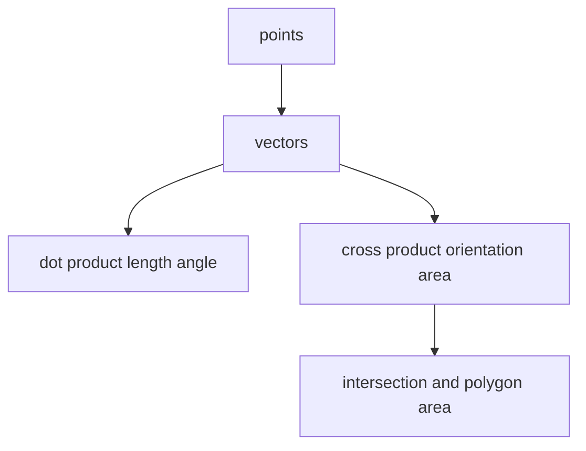

# 13. Geometry

> Geometry는 좌표, 벡터, 거리, 방향, 교차를 다루는 알고리즘 영역이다. 코딩 테스트에서는 그림보다 **정수 연산으로 관계를 판정하는 능력**이 더 중요하다.

## 핵심 모델

점은 좌표쌍, 선분은 두 점, 다각형은 점들의 순서 있는 목록이다. 관계는 보통 벡터 연산으로 바꾼다.



## Point와 Vector

```python
Point = tuple[int, int]


def subtract(a: Point, b: Point) -> Point:
    return a[0] - b[0], a[1] - b[1]


def dot(a: Point, b: Point) -> int:
    return a[0] * b[0] + a[1] * b[1]


def cross(a: Point, b: Point) -> int:
    return a[0] * b[1] - a[1] * b[0]
```

## 거리

대부분의 비교 문제에서는 실제 거리보다 거리 제곱이 안전하고 빠르다.

```python
Point = tuple[int, int]


def squared_distance(a: Point, b: Point) -> int:
    dx = a[0] - b[0]
    dy = a[1] - b[1]
    return dx * dx + dy * dy
```

실수 거리 자체가 필요하면 `math.hypot` 또는 `math.dist`를 사용할 수 있다.

```python
from math import hypot

Point = tuple[int, int]


def euclidean_distance(a: Point, b: Point) -> float:
    return hypot(a[0] - b[0], a[1] - b[1])
```

## Orientation

세 점 `a`, `b`, `c`에 대해 `(b - a) x (c - a)`의 부호가 방향을 결정한다.

```python
Point = tuple[int, int]


def orientation(a: Point, b: Point, c: Point) -> int:
    value = (b[0] - a[0]) * (c[1] - a[1]) - (b[1] - a[1]) * (c[0] - a[0])
    if value > 0:
        return 1
    if value < 0:
        return -1
    return 0
```

- `1`: counter-clockwise
- `-1`: clockwise
- `0`: collinear

## 선분 교차

```python
Point = tuple[int, int]


def orient(a: Point, b: Point, c: Point) -> int:
    value = (b[0] - a[0]) * (c[1] - a[1]) - (b[1] - a[1]) * (c[0] - a[0])
    return (value > 0) - (value < 0)


def on_segment(a: Point, b: Point, p: Point) -> bool:
    return (
        min(a[0], b[0]) <= p[0] <= max(a[0], b[0])
        and min(a[1], b[1]) <= p[1] <= max(a[1], b[1])
        and orient(a, b, p) == 0
    )


def segments_intersect(a: Point, b: Point, c: Point, d: Point) -> bool:
    o1 = orient(a, b, c)
    o2 = orient(a, b, d)
    o3 = orient(c, d, a)
    o4 = orient(c, d, b)

    if o1 != o2 and o3 != o4:
        return True

    return (
        o1 == 0 and on_segment(a, b, c)
        or o2 == 0 and on_segment(a, b, d)
        or o3 == 0 and on_segment(c, d, a)
        or o4 == 0 and on_segment(c, d, b)
    )
```

## Polygon Area

Shoelace formula는 다각형의 signed area를 구한다.

```python
Point = tuple[int, int]


def doubled_polygon_area(points: list[Point]) -> int:
    total = 0
    n = len(points)
    for i in range(n):
        x1, y1 = points[i]
        x2, y2 = points[(i + 1) % n]
        total += x1 * y2 - y1 * x2
    return abs(total)


def polygon_area(points: list[Point]) -> float:
    return doubled_polygon_area(points) / 2
```

면적 비교만 필요하면 `doubled_polygon_area`처럼 2배 면적을 정수로 유지하는 것이 좋다.

## Rectangle Overlap

축에 평행한 rectangle은 interval overlap의 2D 버전이다.

```python
def rectangles_overlap(
    a: tuple[int, int, int, int],
    b: tuple[int, int, int, int],
) -> bool:
    ax1, ay1, ax2, ay2 = a
    bx1, by1, bx2, by2 = b
    return ax1 < bx2 and bx1 < ax2 and ay1 < by2 and by1 < ay2
```

위 구현은 rectangle을 `[x1, x2) × [y1, y2)`로 본다.

## Floating Point 주의

좌표가 정수라면 가능한 한 cross product, squared distance처럼 정수 연산을 유지한다. 실수를 비교해야 한다면 `math.isclose`로 허용 오차를 명시한다.

```python
from math import isclose


def same_float(a: float, b: float) -> bool:
    return isclose(a, b, rel_tol=1e-9, abs_tol=1e-12)
```

## 복잡도

| 작업 | 시간 | 공간 |
|---|---:|---:|
| distance/orientation | O(1) | O(1) |
| segment intersection | O(1) | O(1) |
| polygon area | O(n) | O(1) |
| all pairs distance | O(n²) | O(1) 또는 O(n) |

## 실수 방지

- x/y 순서를 일관되게 유지한다.
- 기울기 division으로 방향을 판단하지 말고 cross product를 쓴다.
- float sqrt로 거리 비교를 하지 않는다.
- collinear case와 endpoint 포함 여부를 따로 처리한다.
- rectangle이 closed인지 half-open인지 먼저 정한다.

## 연결되는 패턴

- [Coordinate Geometry](../03.%20Problem%20Solving%20Patterns/27.%20Coordinate%20Geometry.md)
- [Math](12.%20Math.md)
- [Matrix](../01.%20Data%20Structures/04.%20Matrix.md)

## References

- [Python 3.14.6 math.dist, hypot, isclose](https://docs.python.org/3/library/math.html)