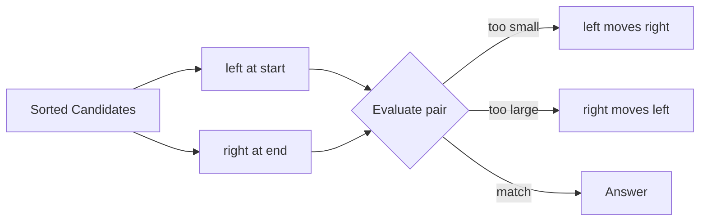

# 01. Two Pointers

> Two Pointers는 두 위치를 움직이며 불필요한 후보를 건너뛰는 패턴이다. 정렬, 양끝 비교, 같은 방향 scan에서 탐색 공간을 선형으로 줄이는 데 강하다.

## 문제 신호

Two Pointers를 떠올릴 만한 신호입니다.

- 정렬된 배열에서 두 값의 관계를 찾는다.
- 양끝에서 좁혀오면 후보를 버릴 수 있다.
- palindrome처럼 좌우 대칭을 검사한다.
- 두 배열을 동시에 merge/compare해야 한다.
- in-place로 중복 제거 또는 compaction을 해야 한다.
- linked list에서 두 node reference를 함께 움직인다.

핵심 질문은 이것입니다.

> 한 pointer를 움직였을 때, 어떤 후보들이 더 이상 정답이 될 수 없다고 증명할 수 있는가?

## 단순 접근의 병목

많은 Two Pointers 문제의 시작점은 O(n²) pair enumeration입니다.

```python
def has_pair_bruteforce(nums: list[int], target: int) -> bool:
    for i in range(len(nums)):
        for j in range(i + 1, len(nums)):
            if nums[i] + nums[j] == target:
                return True
    return False
```

정렬되어 있거나 정렬해도 되는 문제라면, 두 pointer를 이용해 한 번의 scan으로 줄일 수 있습니다.

## 핵심 전환

Two Pointers의 본질은 **두 위치가 후보 공간의 경계를 나타내도록 만들고, 매 step마다 안전하게 한쪽 경계를 이동하는 것**입니다.

대표 형태는 세 가지입니다.

| Form | Pointer Meaning | Example Use |
|---|---|---|
| Opposite ends | `left`, `right`가 후보 구간 양끝 | pair sum, palindrome |
| Same direction | `read`, `write`가 처리/기록 위치 | in-place compaction |
| Two inputs | `i`, `j`가 두 sequence의 현재 위치 | merge sorted arrays |

## 핵심 불변식

Two Pointers는 pointer 자체보다 불변식이 중요합니다.

| Pattern | Invariant |
|---|---|
| Opposite ends | `[left, right]` 안에만 아직 가능한 후보가 남아 있다 |
| Palindrome | 바깥쪽 비교는 모두 통과했고, 내부만 남았다 |
| Read/write | `write` 이전 영역은 이미 정답 형태로 정리됐다 |
| Merge | 결과에는 두 입력의 처리 완료 prefix가 정렬된 상태로 들어 있다 |

## 시각화



## 주요 도구

- [Array and List](../01.%20Data%20Structures/01.%20Array%20and%20List.md)
- [String](../01.%20Data%20Structures/02.%20String.md)
- [Sorting](../02.%20Algorithms/01.%20Sorting.md)
- [Linked List](../01.%20Data%20Structures/05.%20Linked%20List.md)

## Python 템플릿

### 1. Opposite ends on sorted list

```python
def has_pair_with_sum(nums: list[int], target: int) -> bool:
    nums = sorted(nums)
    left = 0
    right = len(nums) - 1

    while left < right:
        total = nums[left] + nums[right]
        if total == target:
            return True
        if total < target:
            left += 1
        else:
            right -= 1

    return False
```

정당성:

- 합이 너무 작으면 `nums[left]`와 현재 `right` 이하의 어떤 값도 target을 만들 수 없습니다.
- 따라서 `left`를 오른쪽으로 움직여도 안전합니다.
- 합이 너무 크면 `nums[right]`와 현재 `left` 이상의 어떤 값도 target을 만들 수 없습니다.
- 따라서 `right`를 왼쪽으로 움직여도 안전합니다.

### 2. Palindrome check

```python
def is_palindrome(text: str) -> bool:
    left = 0
    right = len(text) - 1

    while left < right:
        if text[left] != text[right]:
            return False
        left += 1
        right -= 1

    return True
```

### 3. Read/write compaction

```python
def keep_nonzero(nums: list[int]) -> int:
    write = 0

    for read, value in enumerate(nums):
        if value != 0:
            nums[write] = value
            write += 1

    return write

nums = [0, 3, 0, 4, 5]
length = keep_nonzero(nums)
assert nums[:length] == [3, 4, 5]
```

불변식: `nums[:write]`는 지금까지 읽은 값 중 유지해야 하는 값만 순서대로 담고 있습니다.

### 4. Merge two sorted arrays

```python
def merge_sorted(a: list[int], b: list[int]) -> list[int]:
    i = 0
    j = 0
    result: list[int] = []

    while i < len(a) and j < len(b):
        if a[i] <= b[j]:
            result.append(a[i])
            i += 1
        else:
            result.append(b[j])
            j += 1

    result.extend(a[i:])
    result.extend(b[j:])
    return result
```

## 복잡도

| Pattern | Time | Space | Notes |
|---|---:|---:|---|
| Opposite ends after sort | O(n log n) | O(n) or in-place | 정렬 비용 포함 |
| Opposite ends on already sorted data | O(n) | O(1) | pair/palindrome |
| Read/write compaction | O(n) | O(1) | in-place |
| Merge two arrays | O(n + m) | O(n + m) | output size |

## 잘 맞는 경우

Two Pointers가 잘 작동하려면 pointer 이동의 근거가 있어야 합니다.

- 정렬로 인해 값의 대소 관계가 단조적이다.
- palindrome처럼 양끝 비교 후 내부로 들어가도 된다.
- read/write처럼 처리 완료 영역을 유지할 수 있다.
- 두 sequence가 각각 정렬되어 있어 작은 쪽을 먼저 소비할 수 있다.

## 실패하는 경우

- 정렬하지 않았고 값 관계가 단조적이지 않다.
- pointer를 움직였을 때 버리는 후보가 여전히 정답일 수 있다.
- subsequence 문제인데 정렬해서 원래 순서를 잃었다.
- 중복 처리 규칙을 명확히 하지 않았다.

## 실수 방지

### 1. 정렬해도 되는지 확인하지 않음

Two Sum의 “원래 index를 반환”해야 하는 변형에서는 정렬하면 index가 바뀝니다. 정렬 후 원래 index를 함께 보존하거나 Hash Table 접근이 더 적합할 수 있습니다.

### 2. `left <= right` 조건 오용

두 개의 서로 다른 원소를 골라야 하면 보통 `left < right`입니다. `left == right`를 허용하면 같은 원소를 두 번 쓰는 버그가 생길 수 있습니다.

### 3. 중복 skip 순서 오류

triplet/unique pair 문제에서는 정답을 찾은 뒤 같은 값을 skip해야 중복 결과를 피할 수 있습니다. skip 시점과 조건을 명확히 해야 합니다.

### 4. pointer 이동을 감으로 함

`left += 1`인지 `right -= 1`인지는 합/조건과 정렬 방향으로 증명해야 합니다.

## 판단 체크리스트

1. 두 위치를 움직이며 후보를 줄일 수 있는가?
2. 정렬되어 있거나 정렬해도 되는가?
3. pointer가 가리키는 구간의 의미는 무엇인가?
4. pointer 이동 후 어떤 후보를 버리는가?
5. 그 후보들이 정답이 될 수 없음을 설명할 수 있는가?
6. 중복 처리와 종료 조건은 명확한가?

## 문제 연결

실제 문제 풀이 링크는 [Problems](../04.%20Problems/README.md)에 작성한 뒤 이곳에 연결합니다.

## References

- [Python 3.14.6 Documentation - Sequence Types](https://docs.python.org/3/library/stdtypes.html#sequence-types-list-tuple-range)
- [Python Sorting HOWTO](https://docs.python.org/3/howto/sorting.html)
- [Tech Interview Handbook - Algorithms study cheatsheets](https://www.techinterviewhandbook.org/algorithms/study-cheatsheet/)
