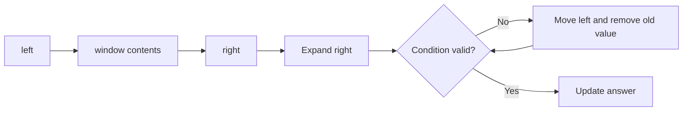

# 02. Sliding Window

> Sliding Window는 연속 구간을 유지하면서 조건을 만족하도록 왼쪽과 오른쪽 경계를 조절하는 패턴이다. 매번 구간을 다시 계산하지 않고 변화량만 반영하는 것이 핵심이다.

## 문제 신호

Sliding Window를 떠올릴 만한 신호입니다.

- contiguous subarray / substring
- “가장 긴”, “가장 짧은”, “길이 k” 구간
- 구간 안의 합, 빈도, distinct count, max/min
- 오른쪽으로 확장하고 왼쪽을 줄이며 조건을 유지할 수 있다.
- brute force로 모든 구간을 보면 O(n²)인데, 구간 변화량은 양끝 원소뿐이다.

핵심 질문은 다음입니다.

> 현재 구간의 집계값을 유지한 채, 오른쪽으로 한 번씩 확장하고 왼쪽을 필요한 만큼 줄일 수 있는가?

## 단순 접근의 병목

모든 연속 구간을 검사하면 보통 O(n²) 또는 O(n³)이 됩니다.

```python
def max_sum_bruteforce(nums: list[int], k: int) -> int:
    best = float("-inf")
    for left in range(0, len(nums) - k + 1):
        current = sum(nums[left:left + k])
        best = max(best, current)
    return int(best)
```

고정 길이 window에서는 이전 window에서 빠지는 값과 새로 들어오는 값만 갱신하면 됩니다.

## 핵심 전환

Sliding Window는 연속 구간 `[left, right)` 또는 `[left, right]`를 유지하며 다음을 반복합니다.

1. 오른쪽 끝을 확장한다.
2. window 집계값을 갱신한다.
3. 조건이 깨지면 왼쪽 끝을 줄인다.
4. 조건이 만족되는 순간 답을 갱신한다.

## Window 유형

| Type | Description | Typical Goal |
|---|---|---|
| Fixed-size window | 길이가 항상 `k` | max/min/sum over k elements |
| Variable-size window | 조건을 만족하도록 길이가 변함 | longest/shortest substring |
| Counting window | dict/Counter로 빈도 유지 | anagram, distinct count |
| Monotonic window | deque로 max/min 후보 유지 | sliding window max/min |

## 핵심 불변식

Sliding Window의 핵심 불변식은 **집계 상태가 실제 window와 정확히 일치한다**는 것입니다.

```text
window = nums[left:right]
window_sum == sum(nums[left:right])
counts[x] == frequency of x in nums[left:right]
```

이 불변식이 깨지면 답이 맞아도 우연입니다.

## 시각화



## 주요 도구

- [Array and List](../01.%20Data%20Structures/01.%20Array%20and%20List.md)
- [String](../01.%20Data%20Structures/02.%20String.md)
- [Hash Table](../01.%20Data%20Structures/03.%20Hash%20Table.md)
- [Queue and Deque](../01.%20Data%20Structures/07.%20Queue%20and%20Deque.md)
- [Monotonic Queue](07.%20Monotonic%20Queue.md)

## Python 템플릿

### 1. Fixed-size window sum

```python
def max_sum_of_size_k(nums: list[int], k: int) -> int:
    if k <= 0 or k > len(nums):
        raise ValueError("k must be between 1 and len(nums)")

    window_sum = sum(nums[:k])
    best = window_sum

    for right in range(k, len(nums)):
        entering = nums[right]
        leaving = nums[right - k]
        window_sum += entering - leaving
        best = max(best, window_sum)

    return best
```

불변식: loop가 끝날 때마다 `window_sum`은 길이 `k`인 현재 window의 합입니다.

### 2. Variable-size window: longest condition

```python
def longest_sum_at_most(nums: list[int], limit: int) -> int:
    """Assumes all numbers are non-negative."""
    left = 0
    window_sum = 0
    best = 0

    for right, value in enumerate(nums):
        window_sum += value

        while window_sum > limit:
            window_sum -= nums[left]
            left += 1

        best = max(best, right - left + 1)

    return best
```

주의: 이 template는 원소가 non-negative일 때 자연스럽습니다. 음수가 있으면 sum이 단조적으로 변하지 않아 window shrink 논리가 깨질 수 있습니다.

### 3. String window with frequency

```python
def longest_without_repeating(text: str) -> int:
    left = 0
    counts: dict[str, int] = {}
    best = 0

    for right, char in enumerate(text):
        counts[char] = counts.get(char, 0) + 1

        while counts[char] > 1:
            left_char = text[left]
            counts[left_char] -= 1
            if counts[left_char] == 0:
                del counts[left_char]
            left += 1

        best = max(best, right - left + 1)

    return best
```

불변식: window 안에는 중복 문자가 없습니다.

### 4. Minimum window shape

```python
def min_length_with_sum_at_least(nums: list[int], target: int) -> int:
    left = 0
    window_sum = 0
    best = len(nums) + 1

    for right, value in enumerate(nums):
        window_sum += value

        while window_sum >= target:
            best = min(best, right - left + 1)
            window_sum -= nums[left]
            left += 1

    return 0 if best == len(nums) + 1 else best
```

이 template도 양수/비음수 배열에서 특히 자연스럽습니다.

## 복잡도

| Pattern | Time | Space | Notes |
|---|---:|---:|---|
| Fixed-size sum | O(n) | O(1) | 합만 유지 |
| Variable-size with non-negative values | O(n) | O(1) | left/right 각각 최대 n번 이동 |
| Character frequency window | O(n) | O(k) | k는 alphabet/window distinct 수 |
| Monotonic queue window | O(n) | O(k) | 각 index가 deque에 한 번 들어가고 나옴 |

Sliding Window가 O(n)인 이유는 `left`와 `right`가 각각 한 방향으로만 움직이기 때문입니다.

## 잘 맞는 경우

- 연속 구간 문제다.
- 오른쪽 확장과 왼쪽 축소만으로 모든 후보를 대표할 수 있다.
- window 조건이 왼쪽을 줄이면 회복되는 구조다.
- 집계값을 O(1) 또는 작은 비용으로 update할 수 있다.

## 실패하는 경우

- 연속 구간이 아니라 subsequence 문제다.
- 음수가 있어 sum 조건의 단조성이 깨진다.
- window 조건을 회복하기 위해 중간 원소를 제거해야 한다.
- 정렬이 필요한 문제인데 원래 순서 window를 유지하고 있다.

## 실수 방지

### 1. `right - left`와 `right - left + 1` 혼동

`right`를 inclusive index로 쓰면 길이는 `right - left + 1`입니다. `[left, right)` half-open으로 쓰면 길이는 `right - left`입니다. 한 문서/풀이 안에서 섞지 않습니다.

### 2. left 이동 시 집계값 제거 누락

left를 움직이면 반드시 window에서 빠지는 값을 집계에서도 제거해야 합니다.

### 3. while 대신 if 사용

조건이 여러 번 깨져 있을 수 있습니다. 조건이 회복될 때까지 줄여야 하면 `while`을 사용합니다.

### 4. 답 갱신 시점 오류

longest window는 조건을 회복한 뒤 갱신하고, shortest window는 조건이 만족되는 동안 갱신하며 줄이는 경우가 많습니다.

### 5. 음수 배열에 sum window를 무조건 적용

음수가 있으면 오른쪽 확장 시 sum이 줄거나 왼쪽 축소 시 sum이 늘 수 있습니다. 이 경우 prefix sum + hash 또는 다른 알고리즘이 필요할 수 있습니다.

## 판단 체크리스트

1. 연속 구간 문제인가?
2. fixed-size인가 variable-size인가?
3. window가 만족해야 하는 조건은 무엇인가?
4. 오른쪽 확장 시 어떤 값이 들어오는가?
5. 왼쪽 축소 시 어떤 값이 나가는가?
6. 조건이 깨졌을 때 left를 움직이면 회복되는가?
7. 답은 언제 갱신해야 하는가?

## 문제 연결

실제 문제 풀이 링크는 [Problems](../04.%20Problems/README.md)에 작성한 뒤 이곳에 연결합니다.

## References

- [Python 3.14.6 Documentation - Sequence Types](https://docs.python.org/3/library/stdtypes.html#sequence-types-list-tuple-range)
- [Python 3.14.6 Documentation - Mapping Types dict](https://docs.python.org/3/library/stdtypes.html#mapping-types-dict)
- [Python 3.14.6 Documentation - collections.deque](https://docs.python.org/3/library/collections.html#collections.deque)
- [Tech Interview Handbook - Algorithms study cheatsheets](https://www.techinterviewhandbook.org/algorithms/study-cheatsheet/)
