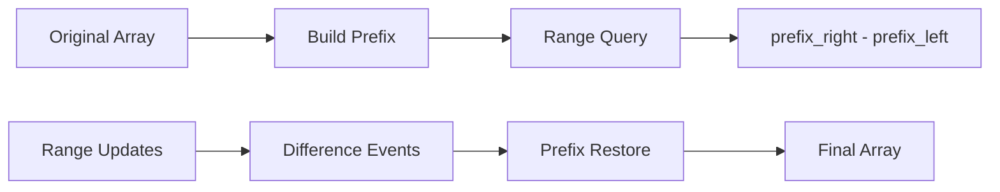

# 03. Prefix Sum and Difference Array

> Prefix Sum과 Difference Array는 구간 합과 구간 업데이트를 누적 관점으로 바꾸는 패턴이다. 반복되는 range query를 O(1)에 가깝게 만들거나 range update를 이벤트로 압축한다.

## 문제 신호

Prefix Sum 또는 Difference Array를 떠올릴 신호입니다.

- subarray sum, range sum query
- 여러 번 구간 합을 물어본다.
- “합이 k인 구간 개수”처럼 이전 누적값을 찾아야 한다.
- 구간에 같은 값을 여러 번 더하고, 마지막 결과만 필요하다.
- 2D grid에서 submatrix sum을 반복해서 구한다.

핵심 질문은 다음입니다.

> 매번 구간을 다시 훑지 않고, 누적값의 차이로 답을 구할 수 있는가?

## 단순 접근의 병목

구간 합을 매번 직접 계산하면 query 하나에 O(n)이 걸립니다.

```python
def range_sum_slow(nums: list[int], left: int, right: int) -> int:
    total = 0
    for i in range(left, right + 1):
        total += nums[i]
    return total
```

query가 많으면 prefix sum을 만들어 각 query를 O(1)에 처리할 수 있습니다.

## 핵심 전환

### Prefix Sum

`prefix[i]`를 `nums[:i]`의 합으로 정의합니다.

```text
prefix[0] = 0
prefix[i + 1] = prefix[i] + nums[i]

sum(nums[left:right]) = prefix[right] - prefix[left]
```

여기서 구간은 half-open `[left, right)`입니다.

### Difference Array

Difference Array는 “구간에 더하기”를 양끝 이벤트로 바꿉니다.

```text
add value to [left, right]
diff[left] += value
diff[right + 1] -= value
```

마지막에 diff를 prefix sum으로 복원하면 모든 업데이트가 반영됩니다.

## 핵심 불변식

| Pattern | Invariant |
|---|---|
| Prefix Sum | `prefix[i] == sum(nums[:i])` |
| Range Sum | `sum(nums[l:r]) == prefix[r] - prefix[l]` |
| Prefix Count | `counts[prefix]`는 이전 prefix들의 빈도다 |
| Difference Array | `diff`의 누적합이 실제 변화량이다 |
| 2D Prefix | `prefix[r][c]`는 `[0:r) x [0:c)` 영역 합이다 |

## 시각화



## 주요 도구

- [Array and List](../01.%20Data%20Structures/01.%20Array%20and%20List.md)
- [Hash Table](../01.%20Data%20Structures/03.%20Hash%20Table.md)
- [Matrix](../01.%20Data%20Structures/04.%20Matrix.md)
- [Hashing and Counting](04.%20Hashing%20and%20Counting.md)

## Python 템플릿

### 1. Build prefix sum

```python
def build_prefix(nums: list[int]) -> list[int]:
    prefix = [0]
    for value in nums:
        prefix.append(prefix[-1] + value)
    return prefix

nums = [2, 4, 1, 7]
prefix = build_prefix(nums)
assert prefix == [0, 2, 6, 7, 14]
```

### 2. Range sum with half-open interval

```python
def range_sum(prefix: list[int], left: int, right: int) -> int:
    """Return sum over nums[left:right]."""
    return prefix[right] - prefix[left]

nums = [2, 4, 1, 7]
prefix = build_prefix(nums)
assert range_sum(prefix, 1, 3) == 5  # 4 + 1
```

### 3. Count subarrays with target sum

```python
def count_subarrays_with_sum(nums: list[int], target: int) -> int:
    counts = {0: 1}
    prefix = 0
    answer = 0

    for value in nums:
        prefix += value
        answer += counts.get(prefix - target, 0)
        counts[prefix] = counts.get(prefix, 0) + 1

    return answer
```

불변식: 현재 위치를 처리하기 전의 `counts`에는 이전 prefix sum만 들어 있습니다. 그래서 빈 구간이나 현재 prefix 자기 자신을 잘못 세지 않습니다.

### 4. Difference array for range updates

```python
def apply_range_additions(length: int, updates: list[tuple[int, int, int]]) -> list[int]:
    """Each update is (left, right, delta), inclusive."""
    diff = [0] * (length + 1)

    for left, right, delta in updates:
        diff[left] += delta
        if right + 1 < len(diff):
            diff[right + 1] -= delta

    result: list[int] = []
    current = 0
    for i in range(length):
        current += diff[i]
        result.append(current)

    return result

assert apply_range_additions(5, [(1, 3, 2), (2, 4, 1)]) == [0, 2, 3, 3, 1]
```

### 5. 2D prefix sum

```python
def build_2d_prefix(grid: list[list[int]]) -> list[list[int]]:
    rows = len(grid)
    cols = len(grid[0]) if grid else 0
    prefix = [[0] * (cols + 1) for _ in range(rows + 1)]

    for r in range(rows):
        for c in range(cols):
            prefix[r + 1][c + 1] = (
                grid[r][c]
                + prefix[r][c + 1]
                + prefix[r + 1][c]
                - prefix[r][c]
            )

    return prefix


def sum_region(prefix: list[list[int]], r1: int, c1: int, r2: int, c2: int) -> int:
    """Return sum over [r1:r2) x [c1:c2)."""
    return (
        prefix[r2][c2]
        - prefix[r1][c2]
        - prefix[r2][c1]
        + prefix[r1][c1]
    )
```

## 복잡도

| Pattern | Build | Query / Update | Space | Notes |
|---|---:|---:|---:|---|
| 1D prefix sum | O(n) | O(1) query | O(n) | immutable input query에 적합 |
| Prefix + hash count | O(n) | O(1) average per step | O(n) | target subarray count |
| Difference array | O(n + q) | O(1) per range update before restore | O(n) | offline updates |
| 2D prefix sum | O(RC) | O(1) query | O(RC) | submatrix sum |

## 잘 맞는 경우

- 구간 합 query가 반복된다.
- 구간 업데이트를 한꺼번에 처리하고 마지막 결과만 필요하다.
- subarray sum이 target과 관련되어 있고 음수도 있을 수 있다.
- 연속 구간의 누적값 차이가 문제의 핵심이다.

## 실패하는 경우

- 중간에 원소 값이 계속 바뀌고 query도 섞인다 → Fenwick/Segment Tree 계열 필요
- 구간의 max/min이 필요하다 → prefix sum으로는 안 됨
- 구간 조건이 단순 합이 아니다 → 다른 집계 구조 필요
- prefix index 의미를 inclusive/exclusive로 섞는다 → off-by-one 발생

## 실수 방지

### 1. `prefix` 길이를 `n`으로 만듦

`prefix[0] = 0`을 추가해 길이를 `n + 1`로 만들면 빈 prefix와 half-open 구간 처리가 쉬워집니다.

### 2. Inclusive/Exclusive 혼동

`sum(nums[left:right])`와 `sum(nums[left:right + 1])`는 다릅니다. 문서와 코드에서 하나의 convention을 선택합니다.

### 3. 현재 prefix를 너무 빨리 저장

subarray count에서 현재 prefix를 먼저 저장하면 길이 0 구간을 세거나 자기 자신을 match할 수 있습니다. 보통 “조회 후 저장”입니다.

### 4. Difference array 끝 처리 누락

inclusive `[left, right]` 업데이트에서는 `right + 1` 위치에 빼야 합니다. 배열 끝을 넘어가지 않도록 diff 길이를 `n + 1`로 잡으면 편합니다.

### 5. 2D prefix에서 포함-배제 부호 실수

왼쪽/위쪽을 빼고, 겹쳐서 두 번 빠진 왼쪽 위 영역을 다시 더합니다.

## 판단 체크리스트

1. 연속 구간의 합/변화량이 핵심인가?
2. query가 여러 번인가?
3. 업데이트와 query가 섞이는가, offline인가?
4. 음수가 있어서 sliding window가 어려운가?
5. prefix index를 `[0:i)`로 정의했는가?
6. hash table에 저장하는 prefix는 현재 이전까지인가?

## 문제 연결

실제 문제 풀이 링크는 [Problems](../04.%20Problems/README.md)에 작성한 뒤 이곳에 연결합니다.

## References

- [Python 3.14.6 Documentation - Sequence Types](https://docs.python.org/3/library/stdtypes.html#sequence-types-list-tuple-range)
- [Python 3.14.6 Documentation - itertools.accumulate](https://docs.python.org/3/library/itertools.html#itertools.accumulate)
- [Python 3.14.6 Documentation - Mapping Types dict](https://docs.python.org/3/library/stdtypes.html#mapping-types-dict)
- [Tech Interview Handbook - Algorithms study cheatsheets](https://www.techinterviewhandbook.org/algorithms/study-cheatsheet/)
