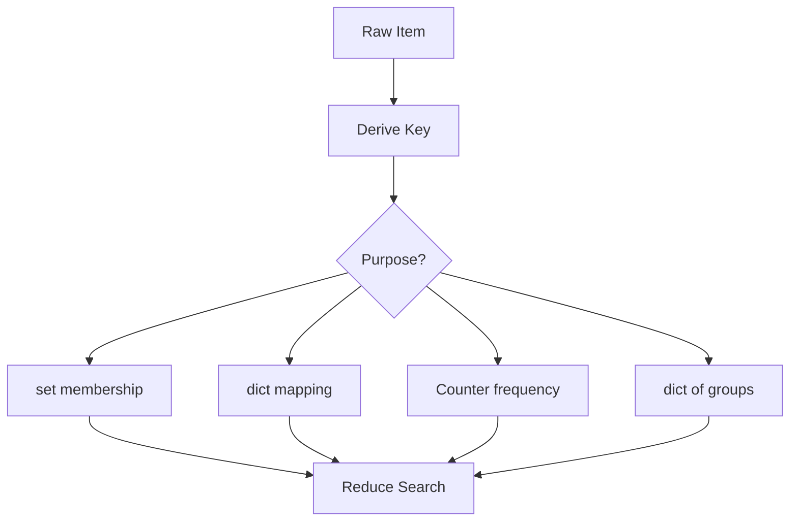

# 04. Hashing and Counting

> Hashing and Counting은 값의 존재, 빈도, 짝을 빠르게 찾기 위해 정보를 key로 저장하는 패턴이다. 무엇을 key로 삼을지 결정하는 순간 풀이의 절반이 정해진다.

## 문제 신호

Hashing and Counting을 떠올릴 신호입니다.

- “중복이 있는가?”
- “몇 번 등장하는가?”
- “같은 문자 구성인가?”
- “이전에 본 값 중 조건을 만족하는 값이 있는가?”
- “값을 index로 빠르게 찾아야 하는가?”
- “같은 기준으로 그룹화하라.”
- “O(n²) 비교를 O(n) lookup으로 줄일 수 있을 것 같다.”

핵심 질문은 다음입니다.

> 내가 반복해서 찾는 조건을 hashable key로 표현할 수 있는가?

## 단순 접근의 병목

pair 관계를 찾기 위해 모든 조합을 비교하면 O(n²)입니다.

```python
def has_duplicate_pair_slow(values: list[int]) -> bool:
    for i in range(len(values)):
        for j in range(i + 1, len(values)):
            if values[i] == values[j]:
                return True
    return False
```

Hashing은 “이미 본 값”을 저장해 비교 대상을 줄입니다.

## 핵심 전환

Hashing and Counting의 핵심은 문제의 상태를 key로 바꾸는 것입니다.

| Goal | Structure | Example Key |
|---|---|---|
| 존재 여부 | `set` | value |
| 빈도 | `dict` / `Counter` | value or char |
| 역매핑 | `dict[value] = index` | number |
| 그룹화 | `dict[key] -> list` | sorted letters / count tuple |
| 상태 방문 | `set` | tuple state |

좋은 key는 다음 조건을 만족합니다.

- hashable하다.
- 문제의 동치 조건을 정확히 표현한다.
- 만들기 위한 비용이 지나치게 크지 않다.
- 충돌 가능성보다 equality 의미가 명확하다.

## 핵심 불변식

| Pattern | Invariant |
|---|---|
| Seen set | `seen`에는 이미 처리한 값만 있다 |
| Frequency table | `counts[x]`는 현재까지 본 x의 개수다 |
| Complement lookup | `index_by_value`에는 현재 index 이전 값만 있다 |
| Sliding count | `counts`는 현재 window의 빈도와 일치한다 |
| Grouping | 같은 key의 원소는 같은 의미 그룹에 속한다 |

## 시각화



## 주요 도구

- [Hash Table](../01.%20Data%20Structures/03.%20Hash%20Table.md)
- [String](../01.%20Data%20Structures/02.%20String.md)
- [Array and List](../01.%20Data%20Structures/01.%20Array%20and%20List.md)
- [Prefix Sum and Difference Array](03.%20Prefix%20Sum%20and%20Difference%20Array.md)
- [Sliding Window](02.%20Sliding%20Window.md)

## Python 템플릿

### 1. Existence with set

```python
def contains_duplicate(nums: list[int]) -> bool:
    seen: set[int] = set()

    for value in nums:
        if value in seen:
            return True
        seen.add(value)

    return False
```

### 2. Counting with dict

```python
def count_values(values: list[str]) -> dict[str, int]:
    counts: dict[str, int] = {}

    for value in values:
        counts[value] = counts.get(value, 0) + 1

    return counts
```

### 3. Counting with Counter

```python
from collections import Counter


def are_anagrams(a: str, b: str) -> bool:
    return Counter(a) == Counter(b)
```

`Counter`는 빈도 비교를 매우 명확하게 표현합니다. 단, 입력 alphabet이 작고 성능이 매우 중요하면 고정 길이 list count도 고려할 수 있습니다.

### 4. Complement lookup

```python
def pair_indices(nums: list[int], target: int) -> tuple[int, int] | None:
    index_by_value: dict[int, int] = {}

    for index, value in enumerate(nums):
        needed = target - value
        if needed in index_by_value:
            return index_by_value[needed], index
        index_by_value[value] = index

    return None
```

불변식: `index_by_value`에는 현재 index 이전의 값만 있습니다.

### 5. Grouping by canonical key

```python
def group_by_letter_counts(words: list[str]) -> dict[tuple[int, ...], list[str]]:
    groups: dict[tuple[int, ...], list[str]] = {}

    for word in words:
        counts = [0] * 26
        for char in word:
            counts[ord(char) - ord("a")] += 1
        key = tuple(counts)
        groups.setdefault(key, []).append(word)

    return groups
```

이 template는 소문자 영어 알파벳 조건이 있을 때만 안전합니다.

### 6. Prefix sum + hash count

```python
def count_subarrays_with_sum(nums: list[int], target: int) -> int:
    prefix_counts = {0: 1}
    prefix = 0
    answer = 0

    for value in nums:
        prefix += value
        answer += prefix_counts.get(prefix - target, 0)
        prefix_counts[prefix] = prefix_counts.get(prefix, 0) + 1

    return answer
```

## 복잡도

| Pattern | Time | Space | Notes |
|---|---:|---:|---|
| seen set | O(n) average | O(n) | duplicate/existence |
| frequency dict | O(n) average | O(k) | k distinct keys |
| Counter compare | O(n + m) | O(k) | 문자열/iterable 빈도 |
| complement lookup | O(n) average | O(n) | pair search |
| grouping | O(total input + key cost) | O(n) | key 생성 비용 포함 |
| prefix hash count | O(n) average | O(n) | 음수 포함 subarray sum 가능 |

## 잘 맞는 경우

- 비교 기준을 key로 만들 수 있다.
- 순서보다 존재/빈도/그룹이 중요하다.
- 이전에 본 상태를 빠르게 조회해야 한다.
- 중첩 loop 중 하나를 lookup으로 바꿀 수 있다.
- window/prefix의 상태를 빈도 table로 유지할 수 있다.

## 실패하는 경우

- key 생성이 너무 비싸서 전체 이득이 사라진다.
- 원래 순서가 핵심인데 빈도만 남겨 순서 정보를 잃는다.
- mutable object를 key로 쓰려 한다.
- 같은 값이 여러 index에 등장하는데 하나의 index만 저장해 정보가 부족하다.
- 입력 조건과 다른 alphabet/counting strategy를 사용한다.

## 실수 방지

### 1. 같은 원소를 두 번 사용

pair 문제에서 현재 값을 dict에 먼저 넣으면 자기 자신을 complement로 찾을 수 있습니다. 보통 “찾고 나서 넣기”가 안전합니다.

### 2. key의 의미를 설명하지 못함

`key = ''.join(sorted(word))`는 anagram에는 좋지만 O(L log L)입니다. `tuple(counts)`는 alphabet 조건이 있을 때 O(L)입니다. 어떤 key가 왜 맞는지 설명해야 합니다.

### 3. Counter가 순서를 보존한다고 착각

Counter는 빈도 구조입니다. 순서가 필요한 문제에는 적합하지 않습니다.

### 4. dict 값 덮어쓰기

값에서 index로 mapping할 때 중복 값이 있으면 마지막 index만 남을 수 있습니다. 모든 index가 필요하면 `dict[value] -> list[int]`가 필요합니다.

### 5. 빈도 감소 후 0 key 방치

sliding window에서 빈도가 0이 된 key를 삭제하지 않으면 `len(counts)` 같은 distinct count가 틀릴 수 있습니다.

```python
counts[char] -= 1
if counts[char] == 0:
    del counts[char]
```

## 판단 체크리스트

1. 찾고 싶은 조건은 무엇인가?
2. key로 표현할 수 있는가?
3. key는 hashable한가?
4. existence, frequency, mapping, grouping 중 무엇인가?
5. update와 lookup 순서는 맞는가?
6. 순서 정보가 필요한데 잃어버리지 않았는가?
7. 중복 값이 있을 때 저장 구조가 충분한가?

## 문제 연결

실제 문제 풀이 링크는 [Problems](../04.%20Problems/README.md)에 작성한 뒤 이곳에 연결합니다.

## References

- [Python 3.14.6 Documentation - Mapping Types dict](https://docs.python.org/3/library/stdtypes.html#mapping-types-dict)
- [Python 3.14.6 Documentation - Set Types](https://docs.python.org/3/library/stdtypes.html#set-types-set-frozenset)
- [Python 3.14.6 Documentation - collections.Counter](https://docs.python.org/3/library/collections.html#collections.Counter)
- [Tech Interview Handbook - Algorithms study cheatsheets](https://www.techinterviewhandbook.org/algorithms/study-cheatsheet/)
