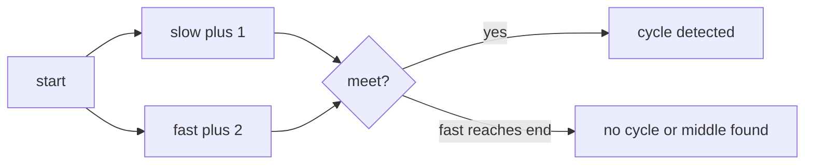

# 05. Fast and Slow Pointers

> Fast and Slow Pointers는 서로 다른 속도로 움직이는 pointer를 이용해 cycle, middle, entry point를 찾는 패턴이다. 추가 공간 없이 linked structure의 숨은 구조를 드러낸다.

## 문제 신호

Fast and Slow Pointers를 떠올릴 신호입니다.

- linked list에서 cycle 여부를 확인한다.
- linked list의 middle node를 찾는다.
- cycle 시작점을 찾아야 한다.
- 배열 값을 next pointer처럼 해석하는 문제다.
- 두 runner가 서로 다른 속도로 움직일 수 있다.

핵심 질문은 다음입니다.

> 한 pointer가 다른 pointer보다 빠르게 움직이면, 구조의 반복성 또는 중간 지점을 드러낼 수 있는가?

## 핵심 전환

두 pointer를 같은 출발점에서 시작하되, 한 pointer는 한 칸씩, 다른 pointer는 두 칸씩 움직입니다.

- cycle이 없으면 fast가 `None`에 도달합니다.
- cycle이 있으면 fast와 slow가 언젠가 만납니다.
- fast가 끝에 도달할 때 slow는 중간 근처에 있습니다.

## 핵심 불변식

| Invariant | Meaning |
|---|---|
| slow는 한 step씩 움직인다 | 기준 runner |
| fast는 두 step씩 움직인다 | cycle 또는 길이 절반 감지 |
| fast 이동 전 `fast`와 `fast.next`를 확인한다 | None 접근 방지 |
| cycle 안에서는 fast가 slow를 따라잡는다 | 만남으로 cycle 감지 |
| middle 문제에서 slow는 fast 이동 횟수의 절반 위치다 | 중간 node 감지 |

## 시각화



## 주요 도구

- [Linked List](../01.%20Data%20Structures/05.%20Linked%20List.md)
- [Two Pointers](01.%20Two%20Pointers.md)

## Python 템플릿

### 1. Detect cycle

```python
from __future__ import annotations
from dataclasses import dataclass

@dataclass
class ListNode:
    value: int
    next: ListNode | None = None


def has_cycle(head: ListNode | None) -> bool:
    slow = head
    fast = head

    while fast is not None and fast.next is not None:
        slow = slow.next
        fast = fast.next.next
        if slow is fast:
            return True

    return False
```

`is`를 쓰는 이유는 값이 같은지보다 같은 node 객체인지가 중요하기 때문입니다.

### 2. Find middle node

```python
from __future__ import annotations
from dataclasses import dataclass

@dataclass
class ListNode:
    value: int
    next: ListNode | None = None


def middle_node(head: ListNode | None) -> ListNode | None:
    slow = head
    fast = head

    while fast is not None and fast.next is not None:
        slow = slow.next
        fast = fast.next.next

    return slow
```

길이가 짝수일 때 이 template는 두 번째 middle을 반환합니다. 첫 번째 middle이 필요하면 조건을 조정합니다.

### 3. Find cycle entry

```python
from __future__ import annotations
from dataclasses import dataclass

@dataclass
class ListNode:
    value: int
    next: ListNode | None = None


def cycle_entry(head: ListNode | None) -> ListNode | None:
    slow = head
    fast = head

    while fast is not None and fast.next is not None:
        slow = slow.next
        fast = fast.next.next
        if slow is fast:
            break
    else:
        return None

    seeker = head
    while seeker is not slow:
        seeker = seeker.next
        slow = slow.next

    return seeker
```

만난 지점에서 한 pointer를 head로 되돌리고 둘 다 한 칸씩 움직이면 cycle entry에서 만납니다.

## 복잡도

| Case | Time | Space | Notes |
|---|---:|---:|---|
| Detect cycle | O(n) | O(1) | visited set 불필요 |
| Find middle | O(n) | O(1) | 한 번 traversal |
| Find cycle entry | O(n) | O(1) | Floyd cycle detection |

## 실수 방지

### 1. `fast.next.next` 접근 전 확인 누락

```python
while fast is not None and fast.next is not None:
    fast = fast.next.next
```

이 순서가 중요합니다.

### 2. 값 비교와 객체 비교 혼동

Linked List cycle에서는 `slow == fast`가 아니라 `slow is fast`가 더 명확합니다. dataclass가 값 기반 equality를 만들 수 있기 때문입니다.

### 3. 짝수 길이 middle 정의 불명확

첫 번째 middle인지 두 번째 middle인지 문제 요구를 확인합니다.

### 4. cycle entry 공식만 외움

왜 head에서 시작한 pointer와 meeting point에서 시작한 pointer가 entry에서 만나는지 이해해야 변형 문제에 대응할 수 있습니다.

## 판단 체크리스트

1. 구조가 pointer/reference 기반인가?
2. cycle 또는 middle을 찾아야 하는가?
3. fast가 두 칸 이동 가능한지 매번 확인했는가?
4. node identity를 비교해야 하는가?
5. 짝수 길이에서 어떤 middle을 원하는가?

## 문제 연결

실제 문제 풀이 링크는 [Problems](../04.%20Problems/README.md)에 작성한 뒤 이곳에 연결합니다.

## References

- [Python 3.14.6 Documentation - dataclasses](https://docs.python.org/3/library/dataclasses.html)
- [Tech Interview Handbook - Algorithms study cheatsheets](https://www.techinterviewhandbook.org/algorithms/study-cheatsheet/)
