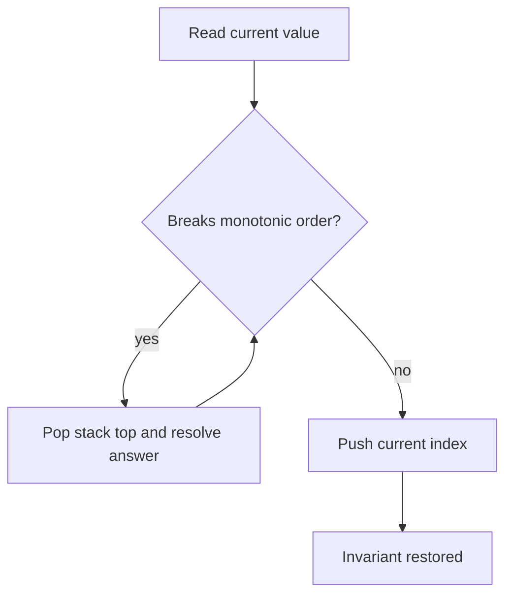

# 06. Monotonic Stack

> Monotonic Stack은 stack 안의 값이 단조성을 유지하도록 관리하며, 다음 큰 값·이전 작은 값·span·histogram boundary를 빠르게 찾는 패턴이다.

## 문제 신호

Monotonic Stack을 떠올릴 신호입니다.

- next greater element / next smaller element
- previous greater / previous smaller
- temperature, stock span, histogram rectangle
- 현재 값이 이전 후보들을 한꺼번에 해결한다.
- 각 원소의 오른쪽/왼쪽에서 처음 만나는 더 큰/작은 값을 찾는다.

핵심 질문은 다음입니다.

> 현재 값이 들어왔을 때, stack top의 후보들이 더 이상 미래 답이 될 수 없음을 증명할 수 있는가?

## 핵심 전환

Stack 안의 값 또는 index가 증가/감소 순서를 유지하도록 push 전에 pop합니다.

예를 들어 “다음 더 큰 값”을 찾을 때는 decreasing stack을 유지합니다.

```text
stack stores indices whose next greater value is not found yet
current value resolves smaller previous values
```

## 핵심 불변식

| Stack Type | Invariant | Used For |
|---|---|---|
| decreasing stack | stack values are decreasing | next greater |
| increasing stack | stack values are increasing | next smaller |
| index stack | stack stores positions, not just values | distance/span calculation |
| unresolved stack | stack items have not found their answer yet | next relation |

## 시각화



## 주요 도구

- [Stack](../01.%20Data%20Structures/06.%20Stack.md)
- [Array and List](../01.%20Data%20Structures/01.%20Array%20and%20List.md)

## Python 템플릿

### 1. Next greater value

```python
def next_greater_values(nums: list[int]) -> list[int]:
    result = [-1] * len(nums)
    stack: list[int] = []  # indices with unresolved next greater value

    for index, value in enumerate(nums):
        while stack and nums[stack[-1]] < value:
            previous_index = stack.pop()
            result[previous_index] = value
        stack.append(index)

    return result

assert next_greater_values([2, 1, 3]) == [3, 3, -1]
```

불변식: stack에 있는 index들의 값은 위로 갈수록 작거나 같은 decreasing order를 유지합니다.

### 2. Previous smaller index

```python
def previous_smaller_indices(nums: list[int]) -> list[int]:
    result = [-1] * len(nums)
    stack: list[int] = []

    for index, value in enumerate(nums):
        while stack and nums[stack[-1]] >= value:
            stack.pop()

        if stack:
            result[index] = stack[-1]

        stack.append(index)

    return result
```

`>=`를 쓸지 `>`를 쓸지는 중복값을 어떻게 처리할지에 따라 달라집니다.

### 3. Stock span shape

```python
def stock_span(prices: list[int]) -> list[int]:
    spans: list[int] = []
    stack: list[tuple[int, int]] = []  # price, accumulated span

    for price in prices:
        span = 1
        while stack and stack[-1][0] <= price:
            _, previous_span = stack.pop()
            span += previous_span
        stack.append((price, span))
        spans.append(span)

    return spans
```

### 4. Histogram boundary shape

```python
def previous_less_for_histogram(heights: list[int]) -> list[int]:
    result = [-1] * len(heights)
    stack: list[int] = []

    for index, height in enumerate(heights):
        while stack and heights[stack[-1]] >= height:
            stack.pop()
        if stack:
            result[index] = stack[-1]
        stack.append(index)

    return result
```

## 복잡도

| Case | Time | Space | Notes |
|---|---:|---:|---|
| Next greater/smaller | O(n) | O(n) | 각 index는 push/pop 최대 1회 |
| Previous greater/smaller | O(n) | O(n) | 한 방향 scan |
| Stock span | O(n) | O(n) | span 누적 |
| Histogram boundary | O(n) | O(n) | 좌/우 경계 계산 |

O(n)인 이유는 while이 중첩되어 보여도 각 원소가 stack에 한 번 들어가고 한 번 나오기 때문입니다.

## 실수 방지

### 1. 값만 저장해서 거리 계산 불가

거리, index, width가 필요하면 stack에 값이 아니라 index를 저장해야 합니다.

### 2. `<`와 `<=` 선택을 감으로 함

중복값 처리 방식에 따라 pop 조건이 달라집니다. “strictly greater”인지 “greater or equal”인지 문제 요구를 확인합니다.

### 3. Stack invariant를 설명하지 못함

Monotonic Stack은 template 암기가 아니라 불변식 유지가 핵심입니다. stack이 increasing인지 decreasing인지 매번 말할 수 있어야 합니다.

### 4. 남은 stack 처리 누락

next greater 문제에서는 끝까지 답을 못 찾은 index가 default `-1`로 남아야 합니다. 문제에 따라 끝에서 sentinel을 넣어 처리할 수도 있습니다.

### 5. Circular array 처리 누락

원형 배열이면 두 바퀴 순회하거나 modulo index를 사용해야 합니다.

## 판단 체크리스트

1. 다음/이전 큰 값 또는 작은 값을 찾는가?
2. 현재 값이 이전 후보의 답을 결정하는가?
3. stack에는 값이 필요한가 index가 필요한가?
4. stack은 증가해야 하는가 감소해야 하는가?
5. 중복값 pop 조건은 `<`, `<=`, `>`, `>=` 중 무엇인가?
6. 답을 못 찾은 원소의 default는 무엇인가?

## 문제 연결

실제 문제 풀이 링크는 [Problems](../04.%20Problems/README.md)에 작성한 뒤 이곳에 연결합니다.

## References

- [Python 3.14.6 Documentation - More on Lists](https://docs.python.org/3/tutorial/datastructures.html#using-lists-as-stacks)
- [Tech Interview Handbook - Algorithms study cheatsheets](https://www.techinterviewhandbook.org/algorithms/study-cheatsheet/)
