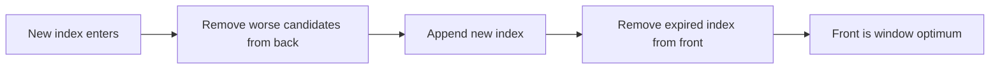

# 07. Monotonic Queue

> Monotonic Queue는 window 안의 최댓값이나 최솟값 후보만 deque에 남기는 패턴이다. Sliding Window의 반복 최댓값 계산을 선형 시간으로 줄인다.

## 문제 신호

Monotonic Queue를 떠올릴 신호입니다.

- sliding window maximum/minimum
- fixed-size window 안에서 매번 극값을 묻는다.
- window가 오른쪽으로 한 칸씩 이동한다.
- heap으로도 가능하지만 stale entry 관리가 번거롭다.
- 각 원소를 한 번씩만 넣고 빼서 O(n)으로 만들고 싶다.

핵심 질문은 다음입니다.

> window 안에서 절대 최적이 될 수 없는 후보를 뒤에서 제거할 수 있는가?

## 핵심 전환

Deque에는 index를 저장합니다. 값이 아니라 index를 저장해야 window 밖으로 나간 후보를 판단할 수 있습니다.

최댓값 window에서는 deque가 값 기준 감소 순서를 유지합니다.

```text
front = current maximum candidate
back  = newest candidate
```

새 값이 들어올 때, 새 값보다 작거나 같은 뒤쪽 후보는 미래에도 최댓값이 될 수 없으므로 제거합니다.

## 핵심 불변식

| Invariant | Meaning |
|---|---|
| deque indices are inside current window | window 밖 후보는 앞에서 제거한다 |
| values are monotonic | 최댓값이면 decreasing, 최솟값이면 increasing |
| deque front is best candidate | 현재 window의 극값 index다 |
| each index enters and leaves at most once | 전체 O(n) |

## 시각화



## 주요 도구

- [Queue and Deque](../01.%20Data%20Structures/07.%20Queue%20and%20Deque.md)
- [Sliding Window](02.%20Sliding%20Window.md)
- [Array and List](../01.%20Data%20Structures/01.%20Array%20and%20List.md)

## Python 템플릿

### 1. Sliding window maximum

```python
from collections import deque


def sliding_window_max(nums: list[int], k: int) -> list[int]:
    if k <= 0:
        raise ValueError("k must be positive")
    if not nums:
        return []

    candidates: deque[int] = deque()  # indices, values decreasing
    result: list[int] = []

    for right, value in enumerate(nums):
        while candidates and nums[candidates[-1]] <= value:
            candidates.pop()
        candidates.append(right)

        left = right - k + 1
        if candidates[0] < left:
            candidates.popleft()

        if right >= k - 1:
            result.append(nums[candidates[0]])

    return result

assert sliding_window_max([1, 3, 2, 5, 4], 3) == [3, 5, 5]
```

### 2. Sliding window minimum

```python
from collections import deque


def sliding_window_min(nums: list[int], k: int) -> list[int]:
    candidates: deque[int] = deque()  # indices, values increasing
    result: list[int] = []

    for right, value in enumerate(nums):
        while candidates and nums[candidates[-1]] >= value:
            candidates.pop()
        candidates.append(right)

        left = right - k + 1
        if candidates[0] < left:
            candidates.popleft()

        if right >= k - 1:
            result.append(nums[candidates[0]])

    return result
```

### 3. Generic max queue operations shape

```python
from collections import deque

class MaxQueue:
    def __init__(self) -> None:
        self.items: deque[int] = deque()
        self.max_candidates: deque[int] = deque()

    def push(self, value: int) -> None:
        self.items.append(value)
        while self.max_candidates and self.max_candidates[-1] < value:
            self.max_candidates.pop()
        self.max_candidates.append(value)

    def pop(self) -> int:
        value = self.items.popleft()
        if value == self.max_candidates[0]:
            self.max_candidates.popleft()
        return value

    def max(self) -> int:
        return self.max_candidates[0]
```

## 복잡도

| Case | Time | Space | Notes |
|---|---:|---:|---|
| Sliding window max/min | O(n) | O(k) | 각 index는 deque에 한 번 들어가고 나옴 |
| MaxQueue push | Amortized O(1) | O(n) | 후보 deque 유지 |
| MaxQueue pop | O(1) | O(n) | 앞쪽 동기화 |

## 잘 맞는 경우

- window가 한 방향으로 움직인다.
- window 안의 max/min을 반복해서 물어본다.
- 새 값이 기존 후보를 지배할 수 있다.
- 후보 제거가 미래 정답 가능성을 해치지 않는다.

## 실패하는 경우

- window가 임의로 확장/축소되며 중간 원소 삭제가 필요하다.
- 극값이 아니라 median/order statistic이 필요하다.
- 후보의 우선순위가 단순 값 비교가 아니다.
- index를 저장하지 않아 만료 여부를 알 수 없다.

## 실수 방지

### 1. 값만 저장해 window 만료 처리 불가

중복 값이 있을 때 값만 저장하면 어떤 값이 window 밖으로 나갔는지 구분하기 어렵습니다. window 문제에서는 index 저장이 안전합니다.

### 2. 만료 제거 시점 오류

보통 새 index를 처리한 뒤 `left = right - k + 1`을 계산하고, `candidates[0] < left`이면 제거합니다.

### 3. pop 조건의 등호 처리

`<=`를 쓰면 같은 값 중 최신 index만 남습니다. `<`를 쓰면 같은 값이 여러 개 남습니다. 둘 다 가능하지만, 불변식과 중복 처리 의미를 알고 선택해야 합니다.

### 4. 결과를 너무 일찍 append

window가 아직 길이 k가 되기 전에는 결과를 내면 안 됩니다. `right >= k - 1` 이후부터 append합니다.

## 판단 체크리스트

1. fixed-size sliding window인가?
2. window마다 max/min을 요구하는가?
3. deque에 index를 저장하고 있는가?
4. 값의 단조 방향은 맞는가?
5. window 밖 index를 제거했는가?
6. 결과 append 시점은 window가 완성된 뒤인가?

## 문제 연결

실제 문제 풀이 링크는 [Problems](../04.%20Problems/README.md)에 작성한 뒤 이곳에 연결합니다.

## References

- [Python 3.14.6 Documentation - collections.deque](https://docs.python.org/3/library/collections.html#collections.deque)
- [Tech Interview Handbook - Algorithms study cheatsheets](https://www.techinterviewhandbook.org/algorithms/study-cheatsheet/)
