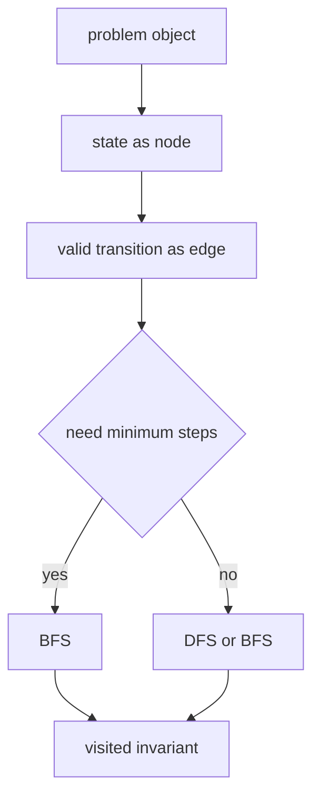

# 08. Graph Traversal Patterns

> Graph Traversal Pattern은 문제를 node와 edge로 바꾼 뒤, DFS/BFS로 reachable state를 확장하는 문제해결 기법이다. 핵심은 “무엇을 방문 처리할 것인가”와 “언제 방문 처리할 것인가”다.

## 문제 신호

다음 표현이 나오면 graph traversal을 의심한다.

- connected, reachable, route, network
- island, region, component
- shortest path with same edge cost
- transformation from one state to another
- minimum number of moves
- grid movement



## 적용 절차

1. 상태를 정의한다.
2. 한 상태에서 갈 수 있는 다음 상태를 정의한다.
3. 방문 중복을 막을 key를 정의한다.
4. 최단거리면 BFS, 전체 탐색/구성요소면 DFS 또는 BFS를 고른다.
5. disconnected graph라면 모든 시작점을 순회한다.

## BFS 거리 템플릿

```python
from collections import deque


def min_steps(graph: list[list[int]], start: int, target: int) -> int:
    distance = [-1] * len(graph)
    queue = deque([start])
    distance[start] = 0

    while queue:
        node = queue.popleft()
        if node == target:
            return distance[node]
        for nxt in graph[node]:
            if distance[nxt] == -1:
                distance[nxt] = distance[node] + 1
                queue.append(nxt)

    return -1
```

## DFS Component 템플릿

```python
def component_sizes(graph: list[list[int]]) -> list[int]:
    visited = [False] * len(graph)
    sizes: list[int] = []

    def dfs(node: int) -> int:
        visited[node] = True
        size = 1
        for nxt in graph[node]:
            if not visited[nxt]:
                size += dfs(nxt)
        return size

    for node in range(len(graph)):
        if not visited[node]:
            sizes.append(dfs(node))

    return sizes
```

## Visited 설계

| 문제 형태 | visited key |
|---|---|
| 일반 graph | node id |
| grid | `(row, col)` 또는 matrix marking |
| 상태 변환 | 상태 tuple/string |
| 열쇠/비트마스크 포함 | `(node, mask)` |
| 남은 제거 횟수 포함 | `(row, col, remaining)` |

상태가 추가되면 같은 위치라도 다른 상태일 수 있다. 예를 들어 벽을 한 번 부술 수 있는 grid 문제에서는 `(r, c)`만 방문 처리하면 오답이 된다.

```python
from collections import deque


def shortest_with_one_break(grid: list[list[int]]) -> int:
    if not grid:
        return -1

    rows, cols = len(grid), len(grid[0])
    queue = deque([(0, 0, 1, 0)])
    visited = {(0, 0, 1)}
    directions = [(1, 0), (-1, 0), (0, 1), (0, -1)]

    while queue:
        r, c, breaks_left, dist = queue.popleft()
        if r == rows - 1 and c == cols - 1:
            return dist

        for dr, dc in directions:
            nr, nc = r + dr, c + dc
            if not (0 <= nr < rows and 0 <= nc < cols):
                continue
            next_breaks = breaks_left - grid[nr][nc]
            state = (nr, nc, next_breaks)
            if next_breaks >= 0 and state not in visited:
                visited.add(state)
                queue.append((nr, nc, next_breaks, dist + 1))

    return -1
```

## 실수 방지

- BFS에서 queue에 넣을 때 방문 처리하지 않아 중복 삽입이 폭발함
- shortest path 문제인데 DFS로 먼저 찾은 답을 반환함
- disconnected graph인데 start 하나만 탐색함
- directed/undirected 방향을 반대로 구성함
- 상태 일부를 visited key에서 누락함

## 연결되는 노트

- [Graph](../01.%20Data%20Structures/09.%20Graph.md)
- [DFS and BFS](../02.%20Algorithms/04.%20DFS%20and%20BFS.md)
- [Shortest Path](../02.%20Algorithms/08.%20Shortest%20Path.md)
- [Matrix Traversal](12.%20Matrix%20Traversal.md)