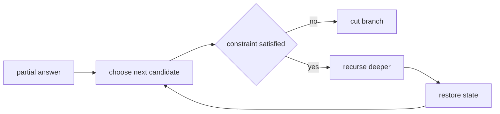

# 09. Backtracking Search Patterns

> Backtracking Search Pattern은 후보를 만드는 과정 자체를 탐색 tree로 보고, 불가능한 가지를 조기에 제거하는 기법이다. 정답 후보의 개수가 본질적으로 큰 문제에서 특히 중요하다.

## 문제 신호

- all combinations, all permutations, all subsets
- place pieces, fill board
- choose k items
- generate valid parentheses
- path with constraints
- dictionary word search



## 설계 순서

1. path가 무엇을 의미하는지 정의한다.
2. depth 또는 index가 무엇을 의미하는지 정의한다.
3. 후보 생성 범위를 정한다.
4. pruning 조건을 먼저 적용한다.
5. append/pop 또는 mark/unmark를 정확히 짝지운다.

## 공통 템플릿

```python
def search(candidates: list[int]) -> list[list[int]]:
    result: list[list[int]] = []
    path: list[int] = []

    def backtrack(start: int) -> None:
        result.append(path.copy())
        for i in range(start, len(candidates)):
            path.append(candidates[i])
            backtrack(i + 1)
            path.pop()

    backtrack(0)
    return result
```

## Parentheses 생성

열린 괄호는 `n`개까지, 닫힌 괄호는 열린 괄호보다 많아질 수 없다.

```python
def generate_parentheses(n: int) -> list[str]:
    result: list[str] = []
    path: list[str] = []

    def dfs(opened: int, closed: int) -> None:
        if len(path) == 2 * n:
            result.append("".join(path))
            return

        if opened < n:
            path.append("(")
            dfs(opened + 1, closed)
            path.pop()

        if closed < opened:
            path.append(")")
            dfs(opened, closed + 1)
            path.pop()

    dfs(0, 0)
    return result
```

## Board Search

Grid에서 현재 경로 방문은 전체 visited가 아니라 path-local visited다.

```python
def exist(board: list[list[str]], word: str) -> bool:
    if not board:
        return False

    rows, cols = len(board), len(board[0])
    directions = [(1, 0), (-1, 0), (0, 1), (0, -1)]

    def dfs(r: int, c: int, index: int) -> bool:
        if index == len(word):
            return True
        if not (0 <= r < rows and 0 <= c < cols):
            return False
        if board[r][c] != word[index]:
            return False

        original = board[r][c]
        board[r][c] = "#"
        for dr, dc in directions:
            if dfs(r + dr, c + dc, index + 1):
                board[r][c] = original
                return True
        board[r][c] = original
        return False

    for r in range(rows):
        for c in range(cols):
            if dfs(r, c, 0):
                return True
    return False
```

## 중복 후보 처리

정렬 후 같은 depth에서 같은 값을 다시 선택하지 않는다.

```python
def subsets_with_dup(nums: list[int]) -> list[list[int]]:
    nums.sort()
    result: list[list[int]] = []
    path: list[int] = []

    def dfs(start: int) -> None:
        result.append(path.copy())
        prev: int | None = None
        for i in range(start, len(nums)):
            if prev is not None and nums[i] == prev:
                continue
            path.append(nums[i])
            dfs(i + 1)
            path.pop()
            prev = nums[i]

    dfs(0)
    return result
```

## Pruning 기준 예시

| 조건 | pruning |
|---|---|
| 합이 target 초과 | 더 깊이 가지 않음 |
| 남은 후보 수 부족 | 반복 범위 축소 |
| prefix가 dictionary에 없음 | Trie로 즉시 중단 |
| board 위치가 범위 밖 | 즉시 return |
| 같은 depth 중복 값 | skip |

## 연결되는 노트

- [Backtracking](../02.%20Algorithms/05.%20Backtracking.md)
- [Recursion](../02.%20Algorithms/03.%20Recursion.md)
- [Trie Prefix Search](10.%20Trie%20Prefix%20Search.md)
- [Matrix Traversal](12.%20Matrix%20Traversal.md)