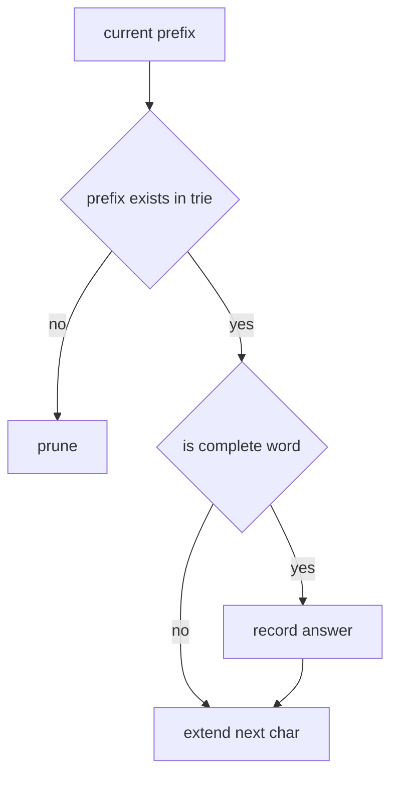

# 10. Trie Prefix Search

> Trie Prefix Search Pattern은 문자열 후보를 한 글자씩 확장하면서 prefix가 불가능해지는 순간 탐색을 중단하는 기법이다. 단순 hash set보다 “부분 문자열 경로”를 활용한다는 점이 다르다.

## 문제 신호

- prefix로 시작하는 단어 찾기
- autocomplete
- wildcard search
- word dictionary
- 여러 단어를 board에서 동시에 찾기
- 문자열 후보를 한 글자씩 만들며 pruning



## 기본 Trie + Prefix Count

prefix가 몇 번 등장했는지까지 저장하면 prefix query가 더 풍부해진다.

```python
from __future__ import annotations
from dataclasses import dataclass, field

@dataclass
class TrieNode:
    children: dict[str, TrieNode] = field(default_factory=dict)
    word_count: int = 0
    prefix_count: int = 0


class PrefixTrie:
    def __init__(self) -> None:
        self.root = TrieNode()

    def insert(self, word: str) -> None:
        node = self.root
        node.prefix_count += 1
        for ch in word:
            node = node.children.setdefault(ch, TrieNode())
            node.prefix_count += 1
        node.word_count += 1

    def count_words_equal_to(self, word: str) -> int:
        node = self._find(word)
        return 0 if node is None else node.word_count

    def count_words_starting_with(self, prefix: str) -> int:
        node = self._find(prefix)
        return 0 if node is None else node.prefix_count

    def _find(self, text: str) -> TrieNode | None:
        node = self.root
        for ch in text:
            if ch not in node.children:
                return None
            node = node.children[ch]
        return node
```

## Wildcard Search

`.` 같은 wildcard가 있으면 해당 위치에서 모든 자식을 시도한다.

```python
from __future__ import annotations
from dataclasses import dataclass, field

@dataclass
class TrieNode:
    children: dict[str, TrieNode] = field(default_factory=dict)
    is_word: bool = False


class WordDictionary:
    def __init__(self) -> None:
        self.root = TrieNode()

    def add_word(self, word: str) -> None:
        node = self.root
        for ch in word:
            node = node.children.setdefault(ch, TrieNode())
        node.is_word = True

    def search(self, pattern: str) -> bool:
        def dfs(index: int, node: TrieNode) -> bool:
            if index == len(pattern):
                return node.is_word

            ch = pattern[index]
            if ch == ".":
                return any(dfs(index + 1, child) for child in node.children.values())
            if ch not in node.children:
                return False
            return dfs(index + 1, node.children[ch])

        return dfs(0, self.root)
```

## Board Search에서의 역할

Trie는 “현재 경로가 어떤 단어의 prefix인가?”를 O(1)에 가까운 다음 글자 lookup으로 판단하게 해준다.

```python
from __future__ import annotations
from dataclasses import dataclass, field

@dataclass
class TrieNode:
    children: dict[str, TrieNode] = field(default_factory=dict)
    word: str | None = None


def build_trie(words: list[str]) -> TrieNode:
    root = TrieNode()
    for word in words:
        node = root
        for ch in word:
            node = node.children.setdefault(ch, TrieNode())
        node.word = word
    return root
```

## 실수 방지

- `is_word`와 prefix 존재를 혼동하지 않는다.
- 중복 단어 결과를 막기 위해 찾은 뒤 `word = None` 처리할 수 있다.
- 삭제가 필요한 문제라면 prefix_count를 정확히 감소시켜야 한다.
- alphabet이 작으면 list children도 가능하지만, Python에서는 dict가 유연하다.
- 매우 많은 노드가 생길 수 있으므로 memory를 고려한다.

## 연결되는 노트

- [Trie](../01.%20Data%20Structures/11.%20Trie.md)
- [String](../01.%20Data%20Structures/02.%20String.md)
- [Backtracking Search Patterns](09.%20Backtracking%20Search%20Patterns.md)