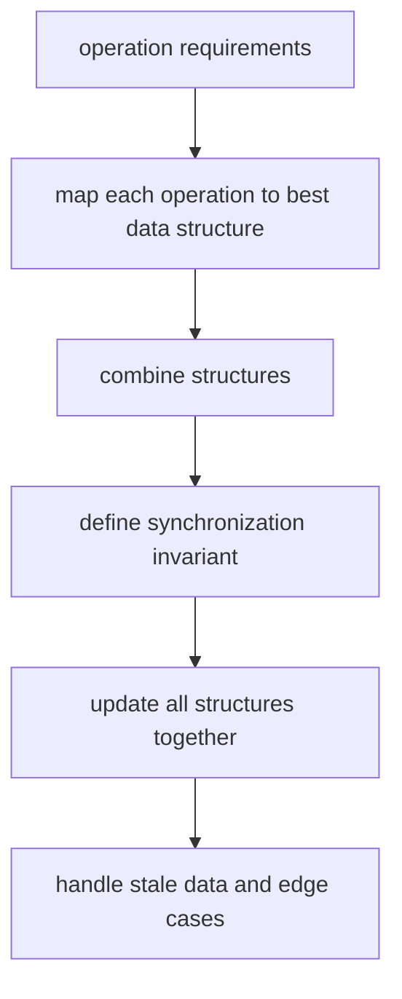

# 11. Design with Multiple Structures

> Design with Multiple Structures는 여러 연산 요구를 각 자료구조의 강점에 나누어 맡기는 설계 패턴이다. 핵심은 자료구조를 많이 쓰는 것이 아니라 동기화 불변식을 유지하는 것이다.

## 문제 신호

다음처럼 여러 연산을 동시에 빠르게 요구하면 단일 자료구조로는 부족할 가능성이 높다.

- `get`, `put`, `delete`가 모두 O(1)에 가까워야 한다.
- `insert`, `remove`, `getRandom`이 모두 필요하다.
- key lookup과 recency/order 관리가 동시에 필요하다.
- priority update와 lazy deletion이 필요하다.
- 같은 데이터를 여러 view로 조회해야 한다.



## 핵심 전환

이 패턴의 핵심은 “자료구조를 많이 쓰는 것”이 아니라, **각 자료구조가 맡는 책임을 분리하고 동기화 불변식을 유지하는 것**이다.

예를 들어 `RandomizedSet`은 다음처럼 나눈다.

| 요구 연산 | 담당 자료구조 |
|---|---|
| 값 존재 확인 | `dict[value] -> index` |
| 임의 접근 | `list[index] -> value` |
| 삭제 | 삭제할 값을 마지막 값과 swap 후 pop |

## RandomizedSet

```python
import random


class RandomizedSet:
    def __init__(self) -> None:
        self.values: list[int] = []
        self.index_of: dict[int, int] = {}

    def insert(self, value: int) -> bool:
        if value in self.index_of:
            return False
        self.index_of[value] = len(self.values)
        self.values.append(value)
        return True

    def remove(self, value: int) -> bool:
        if value not in self.index_of:
            return False

        index = self.index_of[value]
        last_value = self.values[-1]
        self.values[index] = last_value
        self.index_of[last_value] = index

        self.values.pop()
        del self.index_of[value]
        return True

    def get_random(self) -> int:
        return random.choice(self.values)
```

### 불변식

- `index_of[value]`는 항상 `values` 안에서 value가 위치한 index다.
- `values[index_of[value]] == value`가 모든 value에 대해 성립한다.
- 삭제 시 list 중간을 직접 제거하지 않고 마지막 원소와 swap한다.

## LRU Cache

LRU Cache는 key lookup과 recency order가 동시에 필요하다. Python에서는 `collections.OrderedDict` 또는 직접 doubly linked list + dict로 구현할 수 있다. 코딩 테스트에서는 직접 구현을 요구하는 경우가 많다.

```python
from collections import OrderedDict


class LRUCache:
    def __init__(self, capacity: int) -> None:
        self.capacity = capacity
        self.cache: OrderedDict[int, int] = OrderedDict()

    def get(self, key: int) -> int:
        if key not in self.cache:
            return -1
        self.cache.move_to_end(key)
        return self.cache[key]

    def put(self, key: int, value: int) -> None:
        if key in self.cache:
            self.cache.move_to_end(key)
        self.cache[key] = value
        if len(self.cache) > self.capacity:
            self.cache.popitem(last=False)
```

직접 구현할 때의 책임 분리는 다음과 같다.

| 구성요소 | 책임 |
|---|---|
| `dict[key] -> node` | O(1) lookup |
| doubly linked list | recency order 유지 |
| head/tail dummy | edge case 단순화 |

## Lazy Deletion with Heap

Python `heapq`는 중간 원소 삭제나 priority update를 직접 지원하지 않는다. 따라서 heap에는 새 값을 넣고, 오래된 값은 꺼낼 때 버리는 lazy deletion을 자주 사용한다.

```python
import heapq


class FrequencyTracker:
    def __init__(self) -> None:
        self.count: dict[str, int] = {}
        self.heap: list[tuple[int, str]] = []

    def add(self, word: str) -> None:
        self.count[word] = self.count.get(word, 0) + 1
        heapq.heappush(self.heap, (-self.count[word], word))

    def most_frequent(self) -> str | None:
        while self.heap:
            neg_count, word = self.heap[0]
            if -neg_count == self.count.get(word, 0):
                return word
            heapq.heappop(self.heap)
        return None
```

### 불변식

- `count`가 현재 진실의 원천이다.
- heap에는 stale entry가 있을 수 있다.
- heap top을 사용할 때마다 현재 `count`와 일치하는지 검증한다.

## Multi-index Design

하나의 item을 여러 기준으로 조회해야 한다면 여러 index를 유지한다.

```python
from dataclasses import dataclass

@dataclass(frozen=True)
class User:
    user_id: int
    email: str
    name: str


class UserStore:
    def __init__(self) -> None:
        self.by_id: dict[int, User] = {}
        self.id_by_email: dict[str, int] = {}

    def add(self, user: User) -> None:
        if user.user_id in self.by_id or user.email in self.id_by_email:
            raise ValueError("duplicate user")
        self.by_id[user.user_id] = user
        self.id_by_email[user.email] = user.user_id

    def get_by_email(self, email: str) -> User | None:
        user_id = self.id_by_email.get(email)
        if user_id is None:
            return None
        return self.by_id[user_id]

    def remove(self, user_id: int) -> bool:
        user = self.by_id.pop(user_id, None)
        if user is None:
            return False
        del self.id_by_email[user.email]
        return True
```

## 설계 절차

1. 요구 연산을 모두 표로 쓴다.
2. 각 연산에 가장 유리한 자료구조를 배정한다.
3. 데이터의 원천을 하나 정한다.
4. 나머지 자료구조는 index/cache/view로 본다.
5. 삽입/삭제/갱신 시 모든 구조를 어떻게 동기화할지 정한다.
6. stale data를 허용할지, 즉시 정리할지 결정한다.

## 실수 방지

- 한 구조만 업데이트하고 다른 index를 갱신하지 않는 실수
- list 삭제 후 index mapping을 고치지 않는 실수
- heap의 stale entry를 현재 값처럼 사용하는 실수
- cache capacity가 0인 edge case 누락
- 중복 key/value 정책을 정하지 않는 실수
- “진실의 원천”이 여러 개가 되어 불일치가 생기는 설계

## 복잡도

| 설계 | 주요 연산 | 시간 | 공간 |
|---|---|---:|---:|
| list + dict RandomizedSet | insert/remove/random | O(1) average | O(n) |
| dict + linked order LRU | get/put | O(1) average | O(capacity) |
| heap + dict lazy deletion | push/top | O(log n), stale pop 추가 | O(n) |
| multi-index dict | lookup by multiple keys | O(1) average | O(n × index 수) |

## 연결되는 노트

- [Hash Table](../01.%20Data%20Structures/03.%20Hash%20Table.md)
- [Array and List](../01.%20Data%20Structures/01.%20Array%20and%20List.md)
- [Linked List](../01.%20Data%20Structures/05.%20Linked%20List.md)
- [Heap](../01.%20Data%20Structures/10.%20Heap.md)
- [Top K with Heap](18.%20Top%20K%20with%20Heap.md)

## References

- [Python 3.14.6 collections.OrderedDict](https://docs.python.org/3/library/collections.html#ordereddict-objects)
- [Python 3.14.6 heapq](https://docs.python.org/3/library/heapq.html)
