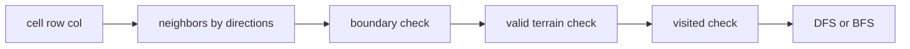

# 12. Matrix Traversal

> Matrix Traversal Pattern은 2차원 grid를 graph로 보고 좌표를 이동하는 기법이다. row/col boundary, direction 배열, visited 처리가 품질을 결정한다.

## 문제 신호

- island, region, area
- shortest path in grid
- spread, rot, flood fill
- maze
- word search board
- connected cells



## Direction 배열

```python
FOUR_DIRECTIONS = [(1, 0), (-1, 0), (0, 1), (0, -1)]
EIGHT_DIRECTIONS = [
    (1, 0), (-1, 0), (0, 1), (0, -1),
    (1, 1), (1, -1), (-1, 1), (-1, -1),
]
```

## Flood Fill DFS

```python
def flood_fill(image: list[list[int]], sr: int, sc: int, color: int) -> list[list[int]]:
    original = image[sr][sc]
    if original == color:
        return image

    rows, cols = len(image), len(image[0])

    def dfs(r: int, c: int) -> None:
        if not (0 <= r < rows and 0 <= c < cols):
            return
        if image[r][c] != original:
            return

        image[r][c] = color
        dfs(r + 1, c)
        dfs(r - 1, c)
        dfs(r, c + 1)
        dfs(r, c - 1)

    dfs(sr, sc)
    return image
```

## Multi-source BFS

여러 시작점에서 동시에 퍼지는 문제는 모든 시작점을 queue에 먼저 넣는다.

```python
from collections import deque


def minutes_to_spread(grid: list[list[int]]) -> int:
    if not grid:
        return 0

    rows, cols = len(grid), len(grid[0])
    queue = deque()
    fresh = 0

    for r in range(rows):
        for c in range(cols):
            if grid[r][c] == 2:
                queue.append((r, c, 0))
            elif grid[r][c] == 1:
                fresh += 1

    minutes = 0
    directions = [(1, 0), (-1, 0), (0, 1), (0, -1)]

    while queue:
        r, c, minutes = queue.popleft()
        for dr, dc in directions:
            nr, nc = r + dr, c + dc
            if 0 <= nr < rows and 0 <= nc < cols and grid[nr][nc] == 1:
                grid[nr][nc] = 2
                fresh -= 1
                queue.append((nr, nc, minutes + 1))

    return minutes if fresh == 0 else -1
```

## Boundary Guard 함수

복잡한 문제일수록 guard를 함수로 빼면 실수가 줄어든다.

```python
def in_bounds(r: int, c: int, rows: int, cols: int) -> bool:
    return 0 <= r < rows and 0 <= c < cols
```

## visited 처리 전략

| 방식 | 장점 | 주의점 |
|---|---|---|
| 별도 `visited` matrix | 원본 보존 | 공간 O(RC) |
| grid 값을 직접 변경 | 간결함 | 원본이 필요하면 복구 필요 |
| set of tuples | sparse state에 유리 | tuple 생성 비용 |
| state tuple | 열쇠/벽 부수기 등 확장 가능 | 방문 상태 폭발 주의 |

## 실수 방지

- row와 col을 바꿔 쓰는 실수
- `len(grid)`와 `len(grid[0])` 혼동
- 빈 grid 처리 누락
- diagonal 이동 가능 여부 오해
- BFS level을 queue length로 처리할지 dist를 tuple에 넣을지 일관성 부족
- backtracking 문제에서 전역 visited로 처리하는 실수

## 연결되는 노트

- [Matrix](../01.%20Data%20Structures/04.%20Matrix.md)
- [Graph Traversal Patterns](08.%20Graph%20Traversal%20Patterns.md)
- [DFS and BFS](../02.%20Algorithms/04.%20DFS%20and%20BFS.md)
- [Backtracking Search Patterns](09.%20Backtracking%20Search%20Patterns.md)