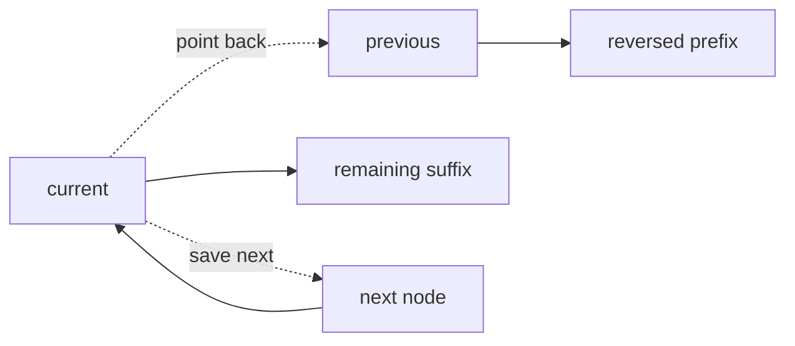

# 13. In-place Reversal

> In-place Reversal은 추가 배열 없이 pointer나 index를 바꾸어 순서를 뒤집는 패턴이다. Linked List와 array 구간 처리에서 공간을 아끼되 연결 손상을 막는 것이 중요하다.

## 문제 신호

In-place Reversal을 떠올릴 신호입니다.

- linked list를 reverse하라.
- 배열 구간을 제자리에서 뒤집어라.
- extra space O(1) 요구가 있다.
- palindrome 검사 후 원상복구가 필요하다.
- k-group reverse, sublist reverse처럼 pointer 재배치가 핵심이다.

핵심 질문은 다음입니다.

> 값을 복사하지 않고 연결 또는 위치를 바꿀 때, 잃어버리면 안 되는 다음 상태는 무엇인가?

## 핵심 전환

### Array/List reversal

양끝 값을 swap하고 pointer를 안쪽으로 이동합니다.

### Linked List reversal

`previous`, `current`, `next_node` 세 포인터를 유지합니다.

```text
next_node = current.next
current.next = previous
previous = current
current = next_node
```

## 핵심 불변식

| Structure | Invariant |
|---|---|
| Array/List | `[left_original:right_original]` 바깥은 이미 올바른 위치다 |
| Linked List | `previous`는 이미 뒤집힌 prefix의 head다 |
| Linked List | `current`는 아직 처리하지 않은 suffix의 head다 |
| Linked List | `next_node`를 저장한 뒤 연결을 바꾼다 |
| Sublist reverse | sublist 이전/이후 연결 anchor를 잃지 않는다 |

## 시각화



## 주요 도구

- [Linked List](../01.%20Data%20Structures/05.%20Linked%20List.md)
- [Array and List](../01.%20Data%20Structures/01.%20Array%20and%20List.md)
- [Two Pointers](01.%20Two%20Pointers.md)

## Python 템플릿

### 1. Reverse list segment in array

```python
def reverse_segment(nums: list[int], left: int, right: int) -> None:
    """Reverse nums[left:right] in-place. right is exclusive."""
    i = left
    j = right - 1

    while i < j:
        nums[i], nums[j] = nums[j], nums[i]
        i += 1
        j -= 1

nums = [1, 2, 3, 4, 5]
reverse_segment(nums, 1, 4)
assert nums == [1, 4, 3, 2, 5]
```

### 2. Reverse whole linked list

```python
from __future__ import annotations
from dataclasses import dataclass

@dataclass
class ListNode:
    value: int
    next: ListNode | None = None


def reverse_list(head: ListNode | None) -> ListNode | None:
    previous = None
    current = head

    while current is not None:
        next_node = current.next
        current.next = previous
        previous = current
        current = next_node

    return previous
```

### 3. Reverse first k nodes shape

```python
from __future__ import annotations
from dataclasses import dataclass

@dataclass
class ListNode:
    value: int
    next: ListNode | None = None


def reverse_first_k(head: ListNode | None, k: int) -> tuple[ListNode | None, ListNode | None]:
    previous = None
    current = head
    count = 0

    while current is not None and count < k:
        next_node = current.next
        current.next = previous
        previous = current
        current = next_node
        count += 1

    return previous, current
```

반환값은 뒤집힌 prefix의 head와 아직 처리하지 않은 suffix의 head입니다. k-group 문제에서는 이 둘을 다시 연결해야 합니다.

### 4. Palindrome linked list shape

```python
from __future__ import annotations
from dataclasses import dataclass

@dataclass
class ListNode:
    value: int
    next: ListNode | None = None


def is_same_values(a: ListNode | None, b: ListNode | None) -> bool:
    while a is not None and b is not None:
        if a.value != b.value:
            return False
        a = a.next
        b = b.next
    return True
```

실전에서는 중간을 찾고, 뒤 절반을 reverse하고, 비교한 뒤 필요하면 원상복구합니다.

## 복잡도

| Case | Time | Space | Notes |
|---|---:|---:|---|
| Array segment reverse | O(k) | O(1) | k는 segment length |
| Linked list reverse | O(n) | O(1) | node 연결만 변경 |
| k-group reverse | O(n) | O(1) | 연결 anchor 관리 필요 |
| Palindrome with reverse | O(n) | O(1) | 원상복구 여부 확인 |

## 실수 방지

### 1. `next_node` 저장 전 연결 변경

가장 치명적인 실수입니다. `current.next`를 바꾸기 전에 원래 다음 node를 저장해야 합니다.

### 2. Sublist anchor를 잃음

부분 reverse에서는 sublist 이전 node와 sublist 이후 node를 보존해야 전체 list가 끊기지 않습니다.

### 3. Array right boundary 혼동

`right`를 inclusive로 쓸지 exclusive로 쓸지 정해야 합니다. 이 노트는 Python slicing과 맞춰 `[left:right)`를 기본으로 둡니다.

### 4. 원본 복구 요구 누락

문제가 “list 구조를 유지해야 한다”고 해석될 수 있으면 palindrome 검사 후 reverse한 절반을 다시 복구하는 편이 좋습니다.

### 5. k보다 남은 node 수가 적은 경우

k-group reverse에서는 남은 node가 k개 미만이면 뒤집지 않는 변형이 많습니다. 먼저 충분한 node 수를 확인해야 합니다.

## 판단 체크리스트

1. in-place 요구가 있는가?
2. array/list인가 linked list인가?
3. boundary는 inclusive인가 exclusive인가?
4. 다음 상태를 잃지 않도록 저장했는가?
5. 부분 reverse라면 앞/뒤 anchor를 저장했는가?
6. 원상복구가 필요한가?

## 문제 연결

실제 문제 풀이 링크는 [Problems](../04.%20Problems/README.md)에 작성한 뒤 이곳에 연결합니다.

## References

- [Python 3.14.6 Documentation - Sequence Types](https://docs.python.org/3/library/stdtypes.html#sequence-types-list-tuple-range)
- [Python 3.14.6 Documentation - dataclasses](https://docs.python.org/3/library/dataclasses.html)
- [Tech Interview Handbook - Algorithms study cheatsheets](https://www.techinterviewhandbook.org/algorithms/study-cheatsheet/)
