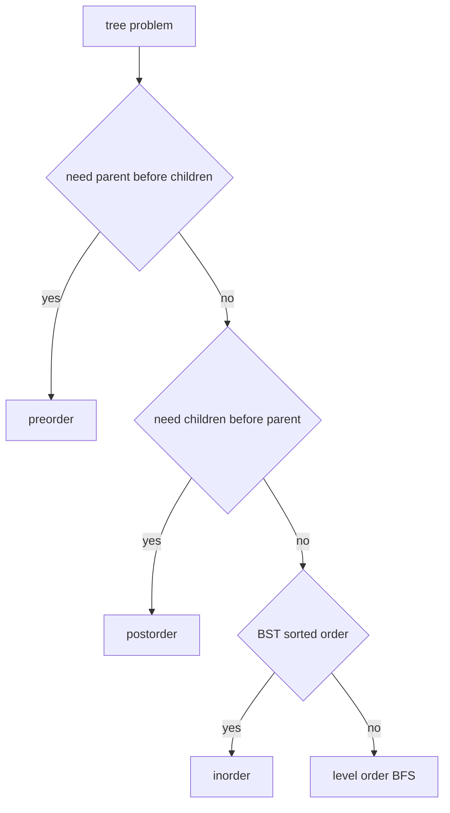

# 14. Tree Traversal Patterns

> Tree Traversal Pattern은 node를 방문하는 순서보다 “서브트리에서 어떤 정보를 받아 현재 노드에서 무엇을 결정할지”를 정리하는 기법이다.

## Traversal 선택



## Parameter로 내려보내기

경로 누적값, depth, 현재 문자열처럼 부모 정보가 자식에게 필요하면 parameter로 내려보낸다.

```python
from __future__ import annotations
from dataclasses import dataclass

@dataclass
class TreeNode:
    val: int
    left: TreeNode | None = None
    right: TreeNode | None = None


def root_to_leaf_paths(root: TreeNode | None) -> list[list[int]]:
    result: list[list[int]] = []
    path: list[int] = []

    def dfs(node: TreeNode | None) -> None:
        if node is None:
            return

        path.append(node.val)
        if node.left is None and node.right is None:
            result.append(path.copy())
        else:
            dfs(node.left)
            dfs(node.right)
        path.pop()

    dfs(root)
    return result
```

## Return으로 올려보내기

height, subtree size, max gain처럼 자식 결과가 부모 계산에 필요하면 반환값으로 올린다.

```python
from __future__ import annotations
from dataclasses import dataclass

@dataclass
class TreeNode:
    val: int
    left: TreeNode | None = None
    right: TreeNode | None = None


def diameter(root: TreeNode | None) -> int:
    best = 0

    def height(node: TreeNode | None) -> int:
        nonlocal best
        if node is None:
            return 0

        left = height(node.left)
        right = height(node.right)
        best = max(best, left + right)
        return 1 + max(left, right)

    height(root)
    return best
```

## Level Order

깊이별 묶음이 필요하면 BFS를 사용한다.

```python
from __future__ import annotations
from collections import deque
from dataclasses import dataclass

@dataclass
class TreeNode:
    val: int
    left: TreeNode | None = None
    right: TreeNode | None = None


def right_side_view(root: TreeNode | None) -> list[int]:
    if root is None:
        return []

    result: list[int] = []
    queue = deque([root])

    while queue:
        level_size = len(queue)
        for i in range(level_size):
            node = queue.popleft()
            if i == level_size - 1:
                result.append(node.val)
            if node.left is not None:
                queue.append(node.left)
            if node.right is not None:
                queue.append(node.right)

    return result
```

## BST Inorder 활용

BST에서 kth smallest, sorted values, valid BST 검증은 inorder와 자주 연결된다.

```python
from __future__ import annotations
from dataclasses import dataclass

@dataclass
class TreeNode:
    val: int
    left: TreeNode | None = None
    right: TreeNode | None = None


def kth_smallest(root: TreeNode | None, k: int) -> int | None:
    stack: list[TreeNode] = []
    cur = root
    count = 0

    while cur is not None or stack:
        while cur is not None:
            stack.append(cur)
            cur = cur.left
        cur = stack.pop()
        count += 1
        if count == k:
            return cur.val
        cur = cur.right

    return None
```

## 실수 방지

- leaf 조건을 `node is None`과 혼동하지 않는다.
- path를 result에 넣을 때 copy한다.
- 전역 best와 반환값의 의미를 분리한다.
- BST 문제에서 중복값 허용 여부를 확인한다.
- skewed tree에서 recursion depth를 고려한다.

## 연결되는 노트

- [Tree](../01.%20Data%20Structures/08.%20Tree.md)
- [Recursion](../02.%20Algorithms/03.%20Recursion.md)
- [DFS and BFS](../02.%20Algorithms/04.%20DFS%20and%20BFS.md)
- [Queue and Deque](../01.%20Data%20Structures/07.%20Queue%20and%20Deque.md)