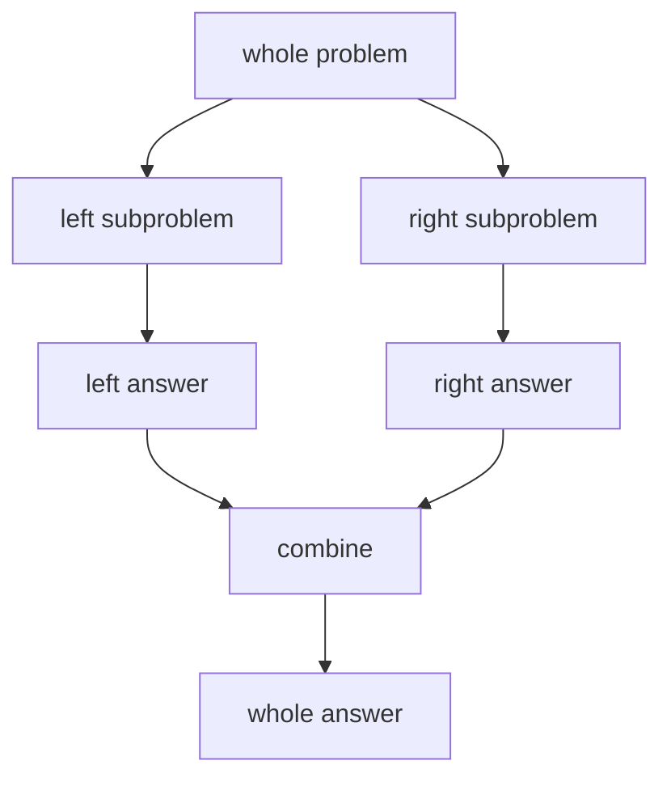

# 15. Recursive Divide and Conquer

> Recursive Divide and Conquer는 문제를 독립적인 부분 문제로 나누고, 각 답을 합쳐 전체 답을 만드는 패턴이다. 재귀와 비슷하지만 특히 “분할”과 “병합”이 명확하다.

## 핵심 모델



## 적용 절차

1. 더 이상 나눌 수 없는 base case를 정한다.
2. 문제를 어떤 기준으로 나눌지 정한다.
3. 부분 문제들이 독립적인지 확인한다.
4. 부분 답을 어떻게 합칠지 정한다.
5. 분할 비용과 병합 비용을 따로 계산한다.

## Merge Sort

```python
def merge_sort(nums: list[int]) -> list[int]:
    if len(nums) <= 1:
        return nums[:]

    mid = len(nums) // 2
    left = merge_sort(nums[:mid])
    right = merge_sort(nums[mid:])

    merged: list[int] = []
    i = j = 0
    while i < len(left) and j < len(right):
        if left[i] <= right[j]:
            merged.append(left[i])
            i += 1
        else:
            merged.append(right[j])
            j += 1

    merged.extend(left[i:])
    merged.extend(right[j:])
    return merged
```

## Binary Search도 Divide and Conquer다

탐색 범위를 절반으로 줄이고, 한쪽 부분 문제만 유지한다.

```python
def binary_search(nums: list[int], target: int) -> int:
    left, right = 0, len(nums) - 1

    while left <= right:
        mid = (left + right) // 2
        if nums[mid] == target:
            return mid
        if nums[mid] < target:
            left = mid + 1
        else:
            right = mid - 1

    return -1
```

## Tree 문제의 Divide and Conquer

Tree는 구조 자체가 이미 divide되어 있다. 왼쪽 subtree와 오른쪽 subtree의 답을 합치면 된다.

```python
from __future__ import annotations
from dataclasses import dataclass

@dataclass
class TreeNode:
    val: int
    left: TreeNode | None = None
    right: TreeNode | None = None


def count_nodes(root: TreeNode | None) -> int:
    if root is None:
        return 0
    return 1 + count_nodes(root.left) + count_nodes(root.right)
```

## 병합 단계가 핵심인 문제

부분 문제를 푸는 것보다 병합에서 추가 정보를 세야 하는 문제가 있다.

- inversion count
- closest pair
- maximum subarray crossing mid
- segment tree query merge
- tree diameter

## 복잡도 사고

Divide and Conquer는 보통 recurrence로 본다.

| 형태 | 예시 | 복잡도 |
|---|---|---:|
| T(n)=T(n/2)+O(1) | binary search | O(log n) |
| T(n)=2T(n/2)+O(n) | merge sort | O(n log n) |
| T(n)=2T(n/2)+O(1) | full binary split count | O(n) |
| T(n)=T(n-1)+O(1) | skewed recursion | O(n) |

## 실수 방지

- slice를 쓰면 코드가 쉬운 대신 추가 공간/복사 비용이 생긴다.
- base case가 너무 늦으면 무한 재귀가 된다.
- 부분 문제 답만 합치면 되는지, cross-boundary 정보를 따로 봐야 하는지 확인한다.
- 같은 부분 문제가 반복되면 divide and conquer가 아니라 DP/memoization 후보일 수 있다.

## 연결되는 노트

- [Recursion](../02.%20Algorithms/03.%20Recursion.md)
- [Binary Search](../02.%20Algorithms/02.%20Binary%20Search.md)
- [Sorting](../02.%20Algorithms/01.%20Sorting.md)
- [Tree Traversal Patterns](14.%20Tree%20Traversal%20Patterns.md)