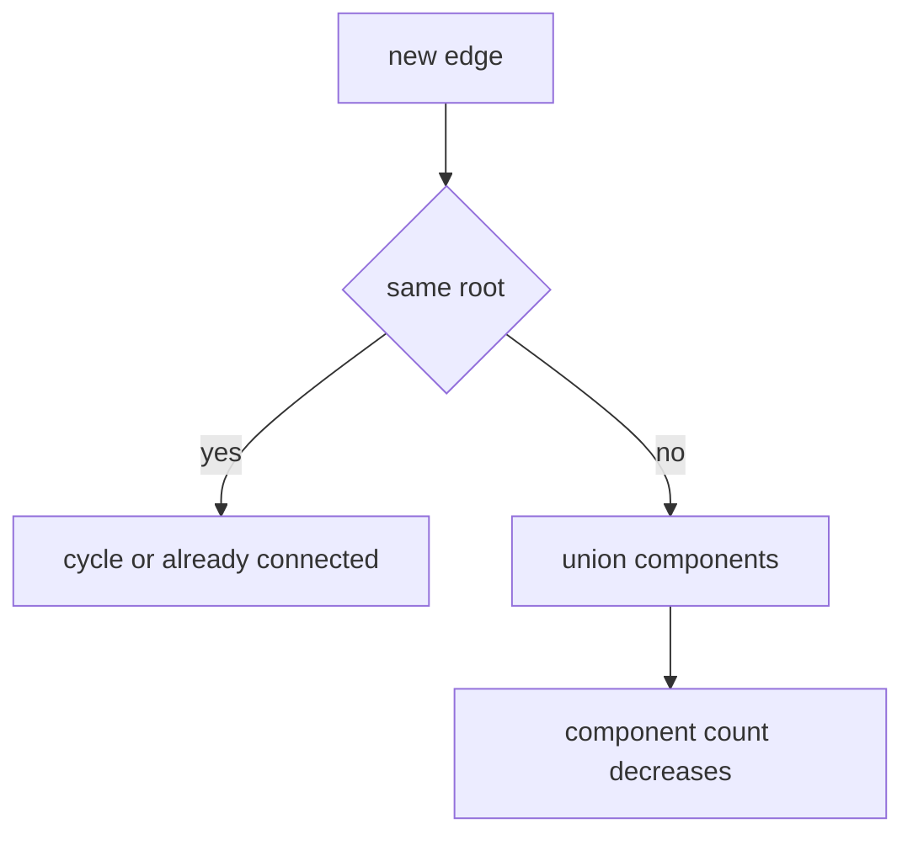

# 16. Union Find Connectivity

> Union Find Connectivity Pattern은 연결 관계가 순차적으로 추가될 때 component를 합치고, 같은 집합인지 빠르게 질의하는 기법이다.

## 문제 신호

- connected components
- number of provinces
- redundant connection
- accounts merge
- dynamic connectivity
- minimum spanning tree
- “같은 그룹인가?” 질의가 많음



## 핵심 불변식

- `find(x)`는 x가 속한 집합의 대표자를 반환한다.
- 두 원소의 대표자가 같으면 같은 component다.
- `union(a, b)`는 두 대표자가 다를 때만 component를 합친다.

```python
class DSU:
    def __init__(self, n: int) -> None:
        self.parent = list(range(n))
        self.size = [1] * n
        self.components = n

    def find(self, x: int) -> int:
        while self.parent[x] != x:
            self.parent[x] = self.parent[self.parent[x]]
            x = self.parent[x]
        return x

    def union(self, a: int, b: int) -> bool:
        ra, rb = self.find(a), self.find(b)
        if ra == rb:
            return False
        if self.size[ra] < self.size[rb]:
            ra, rb = rb, ra
        self.parent[rb] = ra
        self.size[ra] += self.size[rb]
        self.components -= 1
        return True
```

## Redundant Connection

```python
class DSU:
    def __init__(self, n: int) -> None:
        self.parent = list(range(n + 1))
        self.size = [1] * (n + 1)

    def find(self, x: int) -> int:
        if self.parent[x] != x:
            self.parent[x] = self.find(self.parent[x])
        return self.parent[x]

    def union(self, a: int, b: int) -> bool:
        ra, rb = self.find(a), self.find(b)
        if ra == rb:
            return False
        if self.size[ra] < self.size[rb]:
            ra, rb = rb, ra
        self.parent[rb] = ra
        self.size[ra] += self.size[rb]
        return True


def find_redundant_connection(edges: list[tuple[int, int]]) -> tuple[int, int] | None:
    dsu = DSU(len(edges))
    for a, b in edges:
        if not dsu.union(a, b):
            return a, b
    return None
```

## Accounts Merge 사고

문자열 key를 DSU index로 매핑한다.

```python
class DSU:
    def __init__(self, n: int) -> None:
        self.parent = list(range(n))

    def find(self, x: int) -> int:
        if self.parent[x] != x:
            self.parent[x] = self.find(self.parent[x])
        return self.parent[x]

    def union(self, a: int, b: int) -> None:
        ra, rb = self.find(a), self.find(b)
        if ra != rb:
            self.parent[rb] = ra


def group_pairs(items: list[str], pairs: list[tuple[str, str]]) -> dict[int, list[str]]:
    index = {item: i for i, item in enumerate(items)}
    dsu = DSU(len(items))

    for a, b in pairs:
        dsu.union(index[a], index[b])

    groups: dict[int, list[str]] = {}
    for item, i in index.items():
        root = dsu.find(i)
        groups.setdefault(root, []).append(item)
    return groups
```

## DFS/BFS와의 선택 기준

| 상황 | 추천 |
|---|---|
| 실제 경로가 필요함 | DFS/BFS |
| edge 추가 후 연결 여부 반복 질의 | Union Find |
| component count만 필요 | 둘 다 가능 |
| directed graph cycle | DFS state / Topology |
| grid flood fill | DFS/BFS가 보통 간단 |

## 실수 방지

- directed graph 문제에 무리하게 적용하지 않는다.
- union 전후 component count를 정확히 관리한다.
- size/rank는 root에만 의미가 있다.
- 문자열 node는 index mapping을 먼저 만든다.
- 최종 grouping 시 반드시 `find`로 root를 압축한다.

## 연결되는 노트

- [Union Find](../02.%20Algorithms/09.%20Union%20Find.md)
- [Graph](../01.%20Data%20Structures/09.%20Graph.md)
- [Graph Traversal Patterns](08.%20Graph%20Traversal%20Patterns.md)