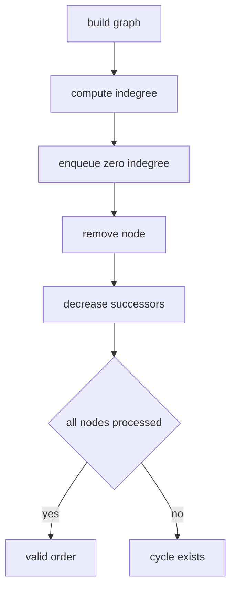

# 17. Topological Ordering

> Topological Ordering Pattern은 dependency가 있는 작업들을 선행 조건이 먼저 오도록 배열하는 기법이다. 핵심은 edge 방향과 indegree의 의미를 흔들리지 않게 잡는 것이다.

## 문제 신호

- prerequisite
- dependency
- build order
- task scheduling
- alien dictionary
- course schedule
- before / after constraints



## 방향 잡기

`a`를 먼저 해야 `b`를 할 수 있다면 edge는 `a -> b`다. 이때 `b`의 indegree가 1 증가한다.

```python
def build_dependency_graph(n: int, edges: list[tuple[int, int]]) -> tuple[list[list[int]], list[int]]:
    graph = [[] for _ in range(n)]
    indegree = [0] * n
    for before, after in edges:
        graph[before].append(after)
        indegree[after] += 1
    return graph, indegree
```

## Kahn Pattern

```python
from collections import deque


def ordering(n: int, edges: list[tuple[int, int]]) -> list[int]:
    graph, indegree = build_dependency_graph(n, edges)
    queue = deque(i for i, degree in enumerate(indegree) if degree == 0)
    order: list[int] = []

    while queue:
        node = queue.popleft()
        order.append(node)
        for nxt in graph[node]:
            indegree[nxt] -= 1
            if indegree[nxt] == 0:
                queue.append(nxt)

    if len(order) != n:
        return []
    return order
```

## Alien Dictionary 사고

문자열 순서 비교에서는 인접한 두 단어에서 처음 다른 문자만 edge가 된다.

```python
from collections import deque


def alien_order(words: list[str]) -> str:
    graph = {ch: set() for word in words for ch in word}
    indegree = {ch: 0 for ch in graph}

    for first, second in zip(words, words[1:]):
        if len(first) > len(second) and first.startswith(second):
            return ""
        for a, b in zip(first, second):
            if a != b:
                if b not in graph[a]:
                    graph[a].add(b)
                    indegree[b] += 1
                break

    queue = deque(ch for ch, degree in indegree.items() if degree == 0)
    order: list[str] = []

    while queue:
        ch = queue.popleft()
        order.append(ch)
        for nxt in graph[ch]:
            indegree[nxt] -= 1
            if indegree[nxt] == 0:
                queue.append(nxt)

    return "".join(order) if len(order) == len(graph) else ""
```

## Cycle 판단

Topological ordering에서는 cycle이 있으면 indegree 0인 노드를 모두 제거해도 남는 노드가 있다. 따라서 `len(order) == n` 검사가 필수다.

## 실수 방지

- prerequisite tuple의 의미를 문제마다 다시 확인한다.
- 같은 edge를 중복 추가하면 indegree가 부풀 수 있다.
- alien dictionary에서 prefix invalid case를 빼먹지 않는다.
- 가능한 순서가 여러 개면 아무거나 되는지, lexicographically smallest가 필요한지 확인한다.
- graphlib의 입력 방향은 `node -> predecessors`라 직접 구현과 반대일 수 있다.

## 연결되는 노트

- [Topological Sort](../02.%20Algorithms/10.%20Topological%20Sort.md)
- [Graph](../01.%20Data%20Structures/09.%20Graph.md)
- [DFS and BFS](../02.%20Algorithms/04.%20DFS%20and%20BFS.md)