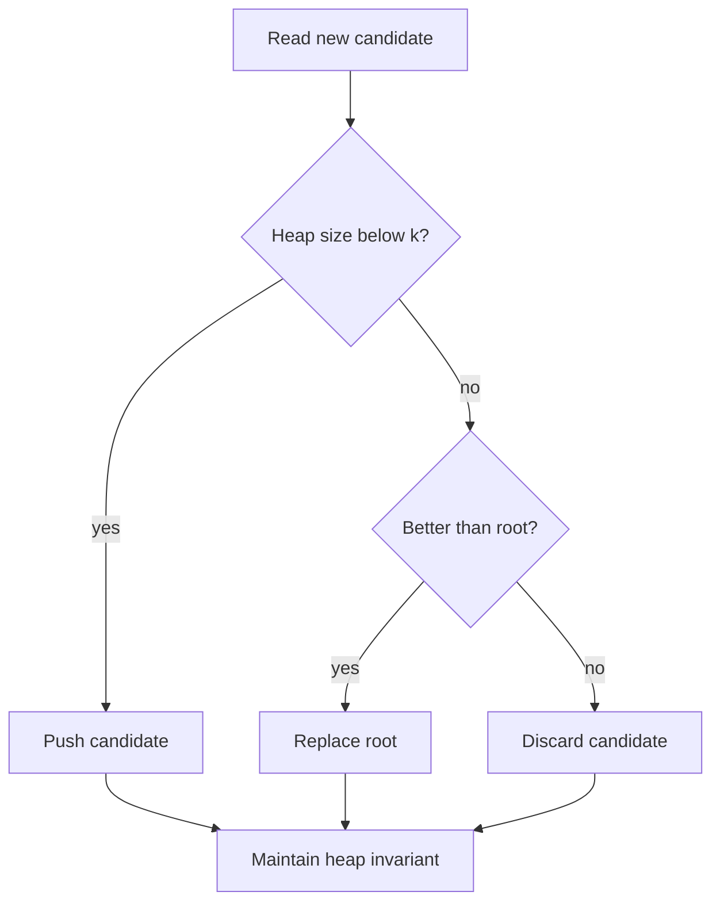

# 18. Top K with Heap

> Top K with Heap은 전체를 정렬하지 않고 필요한 k개의 후보만 유지하는 패턴이다. streaming, ranking, nearest candidate 문제에서 시간과 공간을 동시에 줄인다.

## 문제 신호

Top K with Heap을 떠올릴 신호입니다.

- k largest, k smallest, kth largest, kth smallest
- stream에서 상위 k개만 유지한다.
- 전체 정렬은 과한데 우선순위 일부만 필요하다.
- 매번 가장 가까운/작은/큰 후보를 꺼낸다.
- priority queue로 frontier를 관리한다.

핵심 질문은 다음입니다.

> 전체 n개를 정렬하지 않고도, 현재 필요한 k개 후보만 유지할 수 있는가?

## 핵심 전환

Top-K 문제에서 heap은 보통 **크기 k의 반대 heap**으로 사용합니다.

| Goal | Heap Strategy | Root Meaning |
|---|---|---|
| k largest | min-heap of size k | 현재 top k 중 가장 작은 값 |
| k smallest | max-heap of size k | 현재 bottom k 중 가장 큰 값 |
| kth largest | min-heap of size k | kth largest |
| kth smallest | max-heap of size k | kth smallest |

Python 3.14에서는 max-heap API가 있지만, 플랫폼 호환성을 고려해 음수 priority 방식도 알아야 합니다.

## 핵심 불변식

| Invariant | Meaning |
|---|---|
| heap size never exceeds k | 필요한 후보만 유지한다 |
| root is the weakest kept candidate | 새 후보와 비교해 교체 여부 판단 |
| all discarded candidates are worse than root | 버려도 top-k 결과에 영향 없다 |
| tuple priority is explicit | tie-breaker 포함 여부를 의식한다 |

## 시각화



## 주요 도구

- [Heap](../01.%20Data%20Structures/10.%20Heap.md)
- [Sorting](../02.%20Algorithms/01.%20Sorting.md)
- [Greedy](../02.%20Algorithms/07.%20Greedy.md)

## Python 템플릿

### 1. k largest values

```python
from heapq import heappop, heappush


def k_largest(nums: list[int], k: int) -> list[int]:
    if k <= 0:
        return []

    heap: list[int] = []
    for value in nums:
        heappush(heap, value)
        if len(heap) > k:
            heappop(heap)

    return sorted(heap, reverse=True)
```

불변식: heap에는 지금까지 본 값 중 가장 큰 k개만 들어 있습니다.

### 2. kth largest value

```python
from heapq import heappop, heappush


def kth_largest(nums: list[int], k: int) -> int:
    if not 1 <= k <= len(nums):
        raise ValueError("k out of range")

    heap: list[int] = []
    for value in nums:
        heappush(heap, value)
        if len(heap) > k:
            heappop(heap)

    return heap[0]
```

### 3. k smallest using Python 3.14 max-heap

```python
from heapq import heapify_max, heappop_max, heappush_max


def k_smallest_python314(nums: list[int], k: int) -> list[int]:
    if k <= 0:
        return []

    heap: list[int] = []
    for value in nums:
        heappush_max(heap, value)
        if len(heap) > k:
            heappop_max(heap)

    heapify_max(heap)
    return sorted(heap)
```

Python 3.14 미만 플랫폼에서는 `heappush_max`가 없을 수 있습니다. 아래 음수 방식이 더 호환성 높습니다.

### 4. k smallest with negative max-heap trick

```python
from heapq import heappop, heappush


def k_smallest(nums: list[int], k: int) -> list[int]:
    if k <= 0:
        return []

    heap: list[int] = []
    for value in nums:
        heappush(heap, -value)
        if len(heap) > k:
            heappop(heap)

    return sorted(-value for value in heap)
```

### 5. Top-K by derived key

```python
from heapq import heappop, heappush


def k_closest_to_origin(points: list[tuple[int, int]], k: int) -> list[tuple[int, int]]:
    heap: list[tuple[int, tuple[int, int]]] = []

    for x, y in points:
        distance = x * x + y * y
        heappush(heap, (-distance, (x, y)))
        if len(heap) > k:
            heappop(heap)

    return [point for _, point in heap]
```

여기서는 k smallest distance를 유지해야 하므로 max-heap 역할을 위해 `-distance`를 사용합니다.

## 복잡도

| Strategy | Time | Space | Notes |
|---|---:|---:|---|
| sort all | O(n log n) | O(n) | 단순하지만 전체 정렬 |
| heap size k | O(n log k) | O(k) | k가 n보다 작을 때 유리 |
| heapify then pop k | O(n + k log n) | O(n) | k개를 순서대로 꺼낼 때 |
| streaming heap | O(n log k) | O(k) | 입력이 stream이어도 가능 |

## 잘 맞는 경우

- k가 n보다 훨씬 작다.
- 전체 정렬 결과가 아니라 일부 top/bottom만 필요하다.
- stream처럼 모든 데이터를 저장하기 어렵다.
- priority 기준이 명확하다.

## 실패하는 경우

- k가 n에 가깝고 전체 정렬이 더 단순하다.
- 중간값/순위 통계가 계속 바뀌며 삭제도 필요하다.
- 특정 원소의 priority update가 많다.
- output을 완전히 정렬된 상태로 요구하는데 heap 내부 순서를 그대로 반환한다.

## 실수 방지

### 1. Heap 크기 k 유지 누락

heap 크기가 k를 넘으면 root를 제거해야 합니다. 그렇지 않으면 top-k가 아니라 전체 heap이 됩니다.

### 2. Min-heap과 max-heap 방향 혼동

k largest는 min-heap size k가 자연스럽습니다. root는 kept candidates 중 가장 약한 값입니다.

### 3. 결과 정렬 여부 착각

heap 내부 list는 정렬되어 있지 않습니다. 정렬된 출력이 필요하면 마지막에 `sorted`를 호출합니다.

### 4. k 범위 검증 누락

`k <= 0`, `k > len(nums)` 같은 edge case를 문제 조건에서 보장하는지 확인합니다.

### 5. tuple 비교 tie 문제

priority가 같을 때 다음 tuple 요소가 비교됩니다. 비교 불가능한 객체면 tie-breaker를 넣어야 합니다.

## 판단 체크리스트

1. 전체 정렬이 필요한가, top-k만 필요한가?
2. k가 n보다 충분히 작은가?
3. largest인가 smallest인가?
4. root는 무엇을 의미하는가?
5. heap 크기 불변식은 유지되는가?
6. 결과 정렬이 필요한가?
7. Python 실행 환경이 3.14 max-heap API를 지원하는가?

## 문제 연결

실제 문제 풀이 링크는 [Problems](../04.%20Problems/README.md)에 작성한 뒤 이곳에 연결합니다.

## References

- [Python 3.14.6 Documentation - heapq](https://docs.python.org/3/library/heapq.html)
- [Python Sorting HOWTO](https://docs.python.org/3/howto/sorting.html)
- [Tech Interview Handbook - Algorithms study cheatsheets](https://www.techinterviewhandbook.org/algorithms/study-cheatsheet/)
