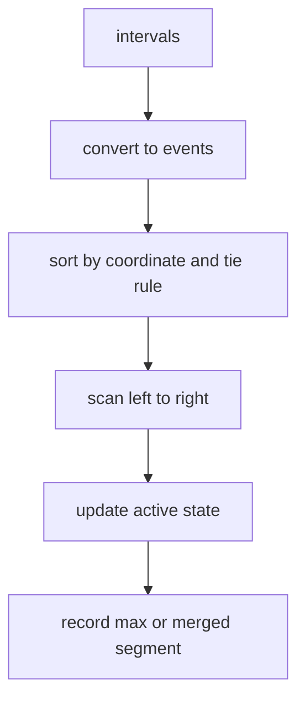

# 19. Sweep Line and Intervals

> Sweep Line은 시작점과 끝점을 event로 바꾸고, 왼쪽에서 오른쪽으로 훑으면서 활성 상태를 갱신하는 패턴이다. Interval 문제에서는 “겹친다”를 직접 비교하지 말고 **시간축 위의 변화량**으로 바꾸면 단순해진다.

## 문제 신호

- intervals, meetings, calendar
- overlap, merge, conflict
- maximum active count
- start/end event
- timeline, reservation, room count
- range add/remove



## 핵심 불변식

> 현재 sweep 위치까지 처리한 event를 기준으로 `active`는 지금 열려 있는 interval의 개수 또는 상태를 정확히 나타낸다.

이 불변식을 깨뜨리는 가장 흔한 원인은 같은 좌표에서 start와 end의 처리 순서를 잘못 정하는 것이다.

## Event Delta 템플릿

회의실 수처럼 동시에 열린 interval의 최대 개수를 구할 때는 start를 `+1`, end를 `-1`로 둔다.

```python
def max_overlap(intervals: list[tuple[int, int]]) -> int:
    events: list[tuple[int, int]] = []
    for start, end in intervals:
        events.append((start, 1))
        events.append((end, -1))

    events.sort(key=lambda event: (event[0], event[1]))

    active = 0
    best = 0
    for _, delta in events:
        active += delta
        best = max(best, active)

    return best
```

위 코드는 `[start, end)` 반열린 구간 기준이다. 같은 시각에 끝나는 회의와 시작하는 회의가 있으면 end를 먼저 처리해야 같은 방을 재사용할 수 있다.

## Meeting Rooms: Heap 방식

활성 interval의 종료 시간만 필요하면 heap이 더 직관적일 수 있다.

```python
import heapq


def min_meeting_rooms(intervals: list[tuple[int, int]]) -> int:
    intervals.sort()
    active: list[int] = []

    for start, end in intervals:
        while active and active[0] <= start:
            heapq.heappop(active)
        heapq.heappush(active, end)

    return len(active)
```

## Merge Intervals

겹치는 구간을 병합하는 문제는 sort then scan의 대표 예시이기도 하다.

```python
def merge_intervals(intervals: list[tuple[int, int]]) -> list[tuple[int, int]]:
    if not intervals:
        return []

    intervals.sort()
    merged: list[list[int]] = [[intervals[0][0], intervals[0][1]]]

    for start, end in intervals[1:]:
        last = merged[-1]
        if start <= last[1]:
            last[1] = max(last[1], end)
        else:
            merged.append([start, end])

    return [(start, end) for start, end in merged]
```

## Difference Array와의 관계

좌표 범위가 작거나 압축 가능하면 event delta를 배열에 저장할 수 있다.

```python
def max_overlap_small_range(intervals: list[tuple[int, int]], limit: int) -> int:
    diff = [0] * (limit + 2)
    for start, end in intervals:
        diff[start] += 1
        diff[end] -= 1

    active = 0
    best = 0
    for delta in diff:
        active += delta
        best = max(best, active)
    return best
```

## Tie-breaker 설계

| 구간 정의 | 같은 좌표 처리 |
|---|---|
| `[start, end)` | end 먼저, start 나중 |
| `[start, end]` | start 먼저 처리해야 겹침으로 계산 |
| 예약 종료 시각 재사용 가능 | end 먼저 |
| 점 포함 개수 | start 먼저, query, end 순서 등 문제별 정의 |

## 복잡도

- event 정렬: O(n log n)
- scan: O(n)
- heap 방식: O(n log n)
- 작은 좌표 diff array: O(n + U), `U`는 좌표 범위

## 실수 방지

- inclusive/exclusive 구간 정의를 먼저 확인한다.
- end event와 start event의 tie-breaker를 문제 정의에 맞춘다.
- 좌표가 매우 크면 diff array를 직접 만들지 않는다.
- heap 방식에서 종료된 interval을 하나만 뺄지, while로 모두 뺄지 확인한다.
- 병합 문제와 최대 겹침 문제를 같은 코드로 억지로 처리하지 않는다.

## 연결되는 노트

- [Greedy](../02.%20Algorithms/07.%20Greedy.md)
- [Sorting](../02.%20Algorithms/01.%20Sorting.md)
- [Heap](../01.%20Data%20Structures/10.%20Heap.md)
- [Interval](../01.%20Data%20Structures/12.%20Interval.md)
- [Prefix Sum and Difference Array](03.%20Prefix%20Sum%20and%20Difference%20Array.md)