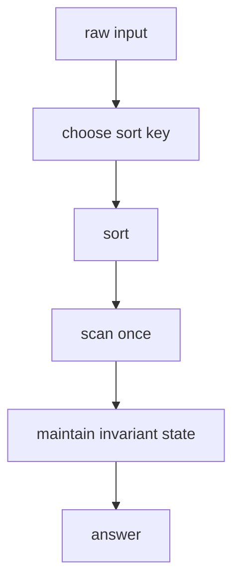

# 20. Sort Then Scan

> Sort Then Scan은 입력을 정렬해 의미 있는 인접 관계를 만든 뒤, 한 번 훑으면서 답을 축적하는 패턴이다. 핵심은 “정렬 기준이 불변식을 만든다”는 점이다.

## 문제 신호

- 순서가 흩어진 interval, point, pair가 주어진다.
- 정렬하면 인접한 것끼리만 비교해도 된다.
- 최소/최대 차이, 병합, 중복 제거, grouping이 필요하다.
- greedy 선택 기준이 정렬 key로 표현된다.



## 정렬 기준을 먼저 문장으로 쓰기

좋은 정렬 key는 코드보다 먼저 문장으로 설명된다.

- interval은 시작점 오름차순, 필요하면 끝점 오름차순
- 끝나는 시간이 중요한 greedy는 end 오름차순
- 큰 값을 먼저 써야 하면 내림차순
- 같은 값에서 짧은 것/긴 것을 먼저 볼지 tie-breaker 결정

```python
def sort_points(points: list[tuple[int, int]]) -> list[tuple[int, int]]:
    return sorted(points, key=lambda p: (p[0], p[1]))
```

## Merge Intervals

정렬 후에는 현재 병합 구간의 끝만 보면 된다.

```python
def merge(intervals: list[tuple[int, int]]) -> list[tuple[int, int]]:
    intervals = sorted(intervals)
    merged: list[tuple[int, int]] = []

    for start, end in intervals:
        if not merged or start > merged[-1][1]:
            merged.append((start, end))
        else:
            prev_start, prev_end = merged[-1]
            merged[-1] = (prev_start, max(prev_end, end))

    return merged
```

## Grouping after Sort

정렬한 뒤 같은 key끼리 연속되므로 scan으로 group을 만들 수 있다.

```python
def group_anagrams(words: list[str]) -> list[list[str]]:
    keyed = sorted(("".join(sorted(word)), word) for word in words)
    groups: list[list[str]] = []
    current_key: str | None = None

    for key, word in keyed:
        if key != current_key:
            groups.append([word])
            current_key = key
        else:
            groups[-1].append(word)

    return groups
```

실전에서는 hash table이 더 자연스러운 경우도 많다. 이 예시는 “정렬 후 같은 key가 연속된다”는 scan 감각을 보여주기 위한 것이다.

## Greedy Pairing

정렬 후 양끝에서 선택하는 문제는 Two Pointers와 결합된다.

```python
def num_rescue_boats(people: list[int], limit: int) -> int:
    people.sort()
    left, right = 0, len(people) - 1
    boats = 0

    while left <= right:
        if people[left] + people[right] <= limit:
            left += 1
        right -= 1
        boats += 1

    return boats
```

## Sort Stability 활용

Python sort는 안정 정렬이다. 여러 기준을 단계적으로 적용해야 할 때 key tuple을 쓰는 것이 보통 가장 명확하다.

```python
def rank_players(players: list[tuple[str, int, int]]) -> list[tuple[str, int, int]]:
    return sorted(players, key=lambda item: (-item[1], item[2], item[0]))
```

위 key는 score 내림차순, penalty 오름차순, name 오름차순이다.

## 복잡도

대부분 O(n log n) 정렬 + O(n) scan이므로 O(n log n)이다. 입력이 이미 정렬되어 있거나 counting sort 가능한 작은 정수 범위라면 별도 최적화 여지가 있다.

## 실수 방지

- 정렬 기준이 문제의 우선순위와 정확히 일치하는지 확인한다.
- tie-breaker를 생략해도 되는지 확인한다.
- 원본 순서가 필요한 문제인지 확인한다.
- 정렬 후 scan state가 어떤 불변식을 유지하는지 설명한다.
- hash table로 O(n)에 풀 수 있는 문제를 굳이 O(n log n)으로 풀고 있지 않은지 점검한다.

## 연결되는 노트

- [Sorting](../02.%20Algorithms/01.%20Sorting.md)
- [Greedy](../02.%20Algorithms/07.%20Greedy.md)
- [Two Pointers](01.%20Two%20Pointers.md)
- [Sweep Line and Intervals](19.%20Sweep%20Line%20and%20Intervals.md)
- [Interval](../01.%20Data%20Structures/12.%20Interval.md)

## References

- [Python 3.14.6 Sorting HOWTO](https://docs.python.org/3/howto/sorting.html)