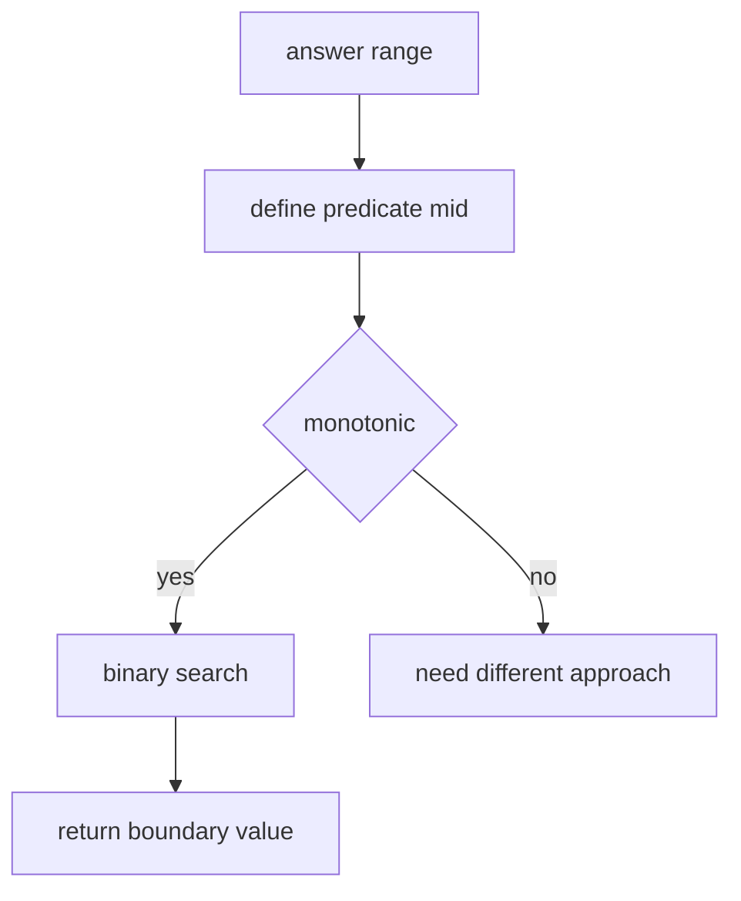

# 21. Binary Search on Answer

> Binary Search on Answer는 정답 자체를 직접 구하기 어렵지만, “이 값으로 가능한가?”라는 판별은 쉬울 때 사용하는 패턴이다. 핵심은 가능한 값의 영역이 단조적이어야 한다는 것이다.

## 문제 신호

- minimum possible X
- maximum possible X
- capacity, speed, time, distance
- “최소화하라”인데 어떤 값 `x`가 가능하면 더 큰 값도 가능하다.
- “최대화하라”인데 어떤 값 `x`가 가능하면 더 작은 값도 가능하다.



## First True 템플릿

가장 흔한 형태는 `False False False True True`에서 첫 True를 찾는 것이다.

```python
def first_true(left: int, right: int, predicate) -> int:
    while left < right:
        mid = (left + right) // 2
        if predicate(mid):
            right = mid
        else:
            left = mid + 1
    return left
```

`right`는 가능한 답을 포함하는 닫힌 경계로 둔다. `predicate(right)`가 True라는 확신이 있어야 한다.

## Koko Eating Bananas 스타일

속도 `speed`가 충분하면 더 큰 속도도 항상 충분하다.

```python
def min_eating_speed(piles: list[int], hours: int) -> int:
    def can_finish(speed: int) -> bool:
        total = 0
        for pile in piles:
            total += (pile + speed - 1) // speed
        return total <= hours

    left, right = 1, max(piles)
    while left < right:
        mid = (left + right) // 2
        if can_finish(mid):
            right = mid
        else:
            left = mid + 1

    return left
```

## Capacity 스타일

용량이 충분하면 더 큰 용량도 가능하다.

```python
def ship_within_days(weights: list[int], days: int) -> int:
    def can_ship(capacity: int) -> bool:
        used_days = 1
        current = 0
        for weight in weights:
            if current + weight > capacity:
                used_days += 1
                current = 0
            current += weight
        return used_days <= days

    left, right = max(weights), sum(weights)
    while left < right:
        mid = (left + right) // 2
        if can_ship(mid):
            right = mid
        else:
            left = mid + 1

    return left
```

## Last True 템플릿

`True True True False False`에서 마지막 True를 찾는 형태도 있다.

```python
def last_true(left: int, right: int, predicate) -> int:
    while left < right:
        mid = (left + right + 1) // 2
        if predicate(mid):
            left = mid
        else:
            right = mid - 1
    return left
```

## 경계 잡기

| 문제 | left | right |
|---|---:|---:|
| 최소 speed | 1 | max workload |
| 최소 capacity | max item | sum items |
| 최대 minimum distance | 0 | max position - min position |
| 최소 time | 0 또는 1 | 충분히 큰 upper bound |

경계가 틀리면 predicate가 맞아도 답이 틀린다.

## 실수 방지

- predicate가 정말 단조적인지 작은 예시로 확인한다.
- `mid`가 가능한 값인지, 불가능한 값인지에 따라 어느 쪽을 버리는지 고정한다.
- 최소값 탐색은 `right = mid`, 최대값 탐색은 `left = mid` 계열을 쓴다.
- 무한 루프 방지를 위해 last true에서는 upper mid를 쓴다.
- division ceiling은 `(x + d - 1) // d`로 안전하게 처리한다.

## 연결되는 노트

- [Binary Search](../02.%20Algorithms/02.%20Binary%20Search.md)
- [Greedy](../02.%20Algorithms/07.%20Greedy.md)
- [Sort Then Scan](20.%20Sort%20Then%20Scan.md)