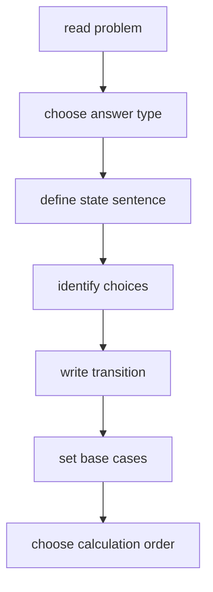

# 22. DP State Design

> DP State Design은 DP 풀이의 80%다. `dp[i]`를 만들고 나서 의미를 끼워 맞추는 것이 아니라, 먼저 **state를 문장으로 정의하고** 그 정의에서 transition을 끌어내야 한다.

## 문제 신호

- 이전 선택에 따라 현재 선택 가능성이 달라진다.
- 최댓값/최솟값/경우의 수/가능 여부를 묻는다.
- brute force recursion의 인자가 반복된다.
- index, remaining, capacity, last choice, mask 같은 축이 보인다.



## State 문장 템플릿

좋은 state 정의는 다음 문장을 완성한다.

> `dp[state]`는 `[범위/조건]`에서 `[답의 의미]`이다.

예시:

- `dp[i]`: `i`번째 계단에 도달하는 방법 수
- `dp[i]`: `0..i` 집을 고려했을 때 훔칠 수 있는 최대 금액
- `dp[i][c]`: 처음 `i`개 item으로 capacity `c`를 넘지 않게 얻을 수 있는 최대 가치
- `dp[i][j]`: `text1[:i]`와 `text2[:j]`의 LCS 길이

## House Robber: 선택 여부 state

현재 집을 훔치면 이전 집은 훔칠 수 없다.

```python
def rob(nums: list[int]) -> int:
    prev2 = 0
    prev1 = 0

    for money in nums:
        current = max(prev1, prev2 + money)
        prev2, prev1 = prev1, current

    return prev1
```

여기서 `prev1`은 지금까지 본 prefix에서의 최대값, `prev2`는 그 이전 prefix의 최대값이다.

## Top-down으로 state 발견하기

먼저 재귀 인자를 정하면 state가 자연스럽게 드러난다.

```python
from functools import cache


def min_cost_climbing_stairs(cost: list[int]) -> int:
    n = len(cost)

    @cache
    def best(i: int) -> int:
        if i >= n:
            return 0
        return cost[i] + min(best(i + 1), best(i + 2))

    return min(best(0), best(1))
```

`best(i)`는 “`i`번째 계단에서 시작해 정상까지 가는 최소 비용”이다.

## Bottom-up으로 계산 순서 만들기

재귀가 `i + 1`, `i + 2`를 참조하면 bottom-up은 뒤에서 앞으로 채우면 된다.

```python
def min_cost_climbing_stairs_bottom_up(cost: list[int]) -> int:
    n = len(cost)
    dp = [0] * (n + 2)

    for i in range(n - 1, -1, -1):
        dp[i] = cost[i] + min(dp[i + 1], dp[i + 2])

    return min(dp[0], dp[1])
```

## State 차원 줄이기

처음에는 명확한 2D/3D state로 시작하고, 의존성이 직전 row/column에만 있으면 공간을 줄인다.

```python
def unique_paths(rows: int, cols: int) -> int:
    dp = [1] * cols

    for _ in range(1, rows):
        for c in range(1, cols):
            dp[c] += dp[c - 1]

    return dp[-1]
```

`dp[c]`는 현재 row에서 column `c`까지 오는 방법 수다. 업데이트 후의 `dp[c - 1]`는 현재 row의 왼쪽 값이고, 업데이트 전의 `dp[c]`는 위쪽 값이다.

## State 설계 체크리스트

| 질문 | 설명 |
|---|---|
| 답의 종류는? | max/min/count/bool |
| index 범위는? | prefix인지 suffix인지 |
| 선택이 미래에 남기는 정보는? | last choice, remaining, holding state |
| 같은 state가 반복되는가? | memoization 가치 |
| transition이 참조하는 state는? | 계산 순서 결정 |
| base case는 state 정의와 일치하는가? | 빈 prefix, capacity 0, index 끝 |

## 흔한 State 축

- `i`: 현재 index 또는 prefix length
- `j`: 다른 sequence의 index
- `capacity`: 남은 자원 또는 사용한 자원
- `mask`: 선택한 subset
- `holding`: 주식 보유 여부 같은 mode
- `last`: 직전 선택 또는 직전 값
- `k`: 남은 횟수, transaction count, split count

## 실수 방지

- `dp[i]`가 i번째 원소를 포함하는지, i번째까지 고려하는지 혼동하지 않는다.
- top-down의 state 정의와 bottom-up table 정의를 다르게 쓰지 않는다.
- base case를 단순히 0으로 두기 전에 의미를 검증한다.
- 최솟값 DP에서 도달 불가능 state를 0으로 두지 않는다.
- rolling array 최적화는 원래 table 전이가 맞은 뒤에 한다.

## 연결되는 노트

- [Dynamic Programming](../02.%20Algorithms/06.%20Dynamic%20Programming.md)
- [Knapsack Style DP](23.%20Knapsack%20Style%20DP.md)
- [Sequence DP](24.%20Sequence%20DP.md)
- [Recursion](../02.%20Algorithms/03.%20Recursion.md)

## References

- [Python 3.14.6 functools.cache](https://docs.python.org/3/library/functools.html#functools.cache)