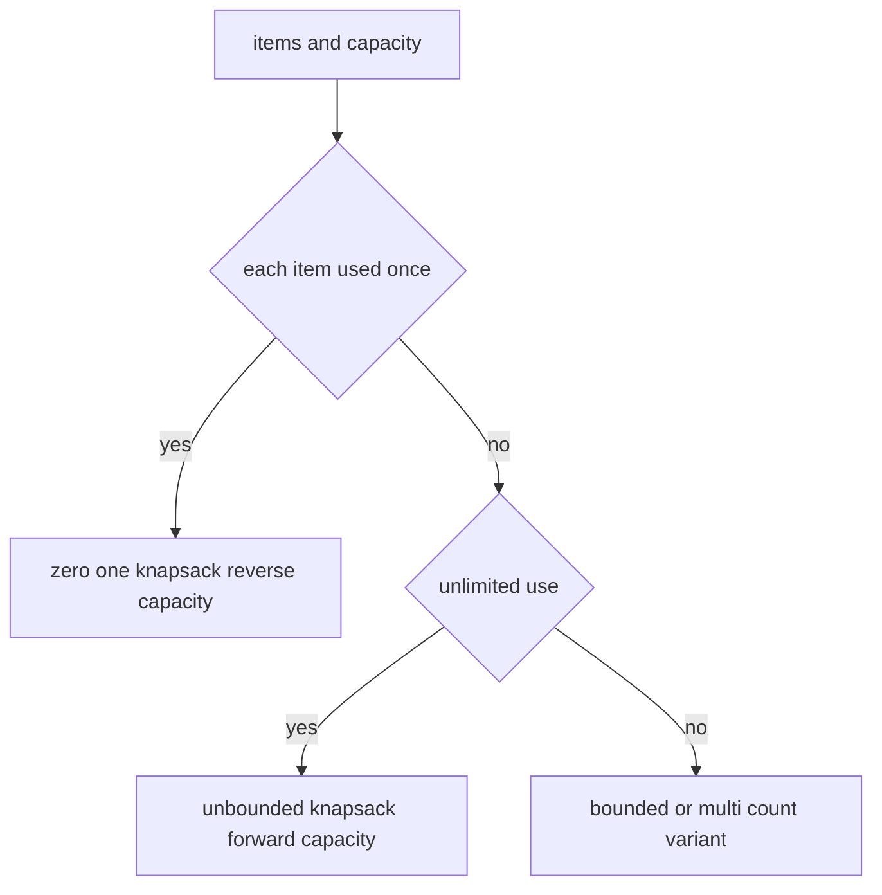

# 23. Knapsack Style DP

> Knapsack Style DP는 제한된 자원 안에서 item을 선택하는 문제 패턴이다. 핵심은 “각 item을 몇 번 사용할 수 있는가”에 따라 capacity 순회 방향이 달라진다는 점이다.

## 문제 신호

- capacity, weight, value
- subset sum
- partition equal subset sum
- target sum
- choose or skip
- resource limit under budget



## 0/1 Knapsack

각 item을 한 번만 사용할 수 있으면 capacity를 뒤에서 앞으로 순회한다. 그래야 같은 item을 같은 round에서 두 번 쓰지 않는다.

```python
def knapsack_01(weights: list[int], values: list[int], capacity: int) -> int:
    dp = [0] * (capacity + 1)

    for weight, value in zip(weights, values):
        for cap in range(capacity, weight - 1, -1):
            dp[cap] = max(dp[cap], dp[cap - weight] + value)

    return dp[capacity]
```

## Subset Sum

가능 여부만 묻는 0/1 knapsack이다.

```python
def can_partition(nums: list[int]) -> bool:
    total = sum(nums)
    if total % 2 == 1:
        return False

    target = total // 2
    possible = [False] * (target + 1)
    possible[0] = True

    for num in nums:
        for value in range(target, num - 1, -1):
            possible[value] = possible[value] or possible[value - num]

    return possible[target]
```

`possible[0] = True`의 의미는 “아무것도 선택하지 않으면 합 0은 만들 수 있다”이다.

## Unbounded Knapsack

각 item을 여러 번 사용할 수 있으면 capacity를 앞에서 뒤로 순회한다.

```python
def coin_change_count(coins: list[int], amount: int) -> int:
    dp = [0] * (amount + 1)
    dp[0] = 1

    for coin in coins:
        for value in range(coin, amount + 1):
            dp[value] += dp[value - coin]

    return dp[amount]
```

위 코드는 조합 수를 센다. coin loop가 바깥에 있으므로 순서만 다른 경우를 중복해서 세지 않는다.

## 순서가 중요한 경우

순열처럼 순서가 다른 선택을 다른 경우로 세려면 amount loop를 바깥에 둔다.

```python
def combination_sum_ordered(nums: list[int], target: int) -> int:
    dp = [0] * (target + 1)
    dp[0] = 1

    for value in range(1, target + 1):
        for num in nums:
            if num <= value:
                dp[value] += dp[value - num]

    return dp[target]
```

## 2D에서 1D로 줄이기

처음에는 다음처럼 2D로 의미를 명확히 잡아도 좋다.

```python
def knapsack_01_2d(weights: list[int], values: list[int], capacity: int) -> int:
    n = len(weights)
    dp = [[0] * (capacity + 1) for _ in range(n + 1)]

    for i in range(1, n + 1):
        weight = weights[i - 1]
        value = values[i - 1]
        for cap in range(capacity + 1):
            dp[i][cap] = dp[i - 1][cap]
            if weight <= cap:
                dp[i][cap] = max(dp[i][cap], dp[i - 1][cap - weight] + value)

    return dp[n][capacity]
```

1D 최적화는 같은 의미를 유지하되 이전 row를 현재 row에 덮어쓰는 기술이다.

## 순회 방향 요약

| 유형 | item 사용 횟수 | capacity 순회 |
|---|---|---|
| 0/1 knapsack | 한 번 | 뒤에서 앞으로 |
| unbounded knapsack | 여러 번 | 앞에서 뒤로 |
| 조합 수 | item loop 바깥 | 중복 순서 제거 |
| 순열 수 | amount loop 바깥 | 순서 다른 경우 포함 |

## 실수 방지

- `dp[0]`의 의미를 확인한다.
- 0/1인데 capacity를 앞에서 돌면 같은 item을 여러 번 쓰게 된다.
- 조합 수와 순열 수의 loop 순서를 구분한다.
- value 최대화인지 경우의 수 counting인지 bool 가능 여부인지 답의 타입을 먼저 정한다.
- target이 음수이거나 총합 조건이 맞지 않는 경우를 먼저 제거한다.

## 연결되는 노트

- [Dynamic Programming](../02.%20Algorithms/06.%20Dynamic%20Programming.md)
- [DP State Design](22.%20DP%20State%20Design.md)
- [Array and List](../01.%20Data%20Structures/01.%20Array%20and%20List.md)