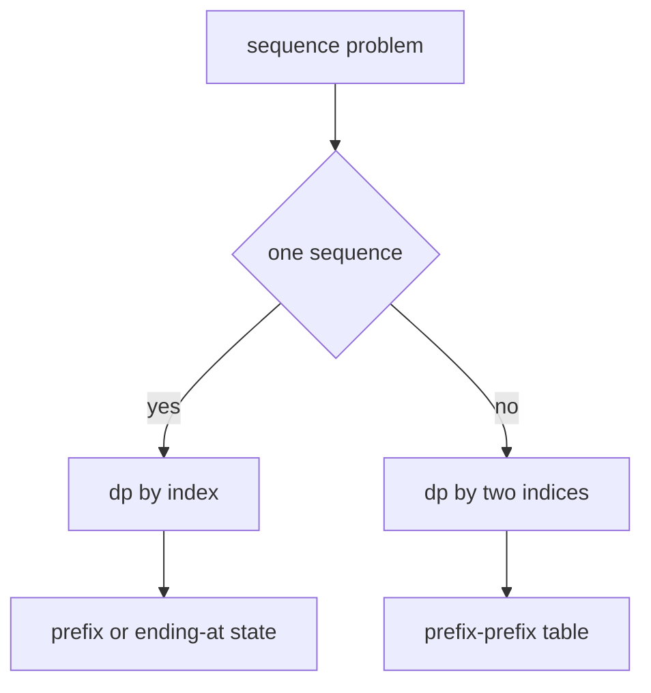

# 24. Sequence DP

> Sequence DP는 문자열이나 배열의 순서를 유지한 채 prefix/suffix 관계를 state로 삼는 DP 패턴이다. 핵심은 index가 의미하는 범위를 정확히 고정하는 것이다.

## 문제 신호

- subsequence, substring
- longest increasing subsequence
- longest common subsequence
- edit distance
- palindrome partition
- prefix relation
- 두 문자열/배열을 비교



## 1D Sequence DP: Ending at i

`dp[i]`를 “i에서 끝나는 답”으로 정의하면 이전 위치들을 비교하는 전이가 자주 나온다.

```python
def length_of_lis_quadratic(nums: list[int]) -> int:
    if not nums:
        return 0

    dp = [1] * len(nums)
    for i in range(len(nums)):
        for j in range(i):
            if nums[j] < nums[i]:
                dp[i] = max(dp[i], dp[j] + 1)

    return max(dp)
```

## LIS O(n log n)

LIS 길이만 필요하면 `tails[length]`를 “해당 길이 증가 부분수열의 가능한 최소 꼬리값”으로 유지한다.

```python
from bisect import bisect_left


def length_of_lis(nums: list[int]) -> int:
    tails: list[int] = []

    for num in nums:
        idx = bisect_left(tails, num)
        if idx == len(tails):
            tails.append(num)
        else:
            tails[idx] = num

    return len(tails)
```

이 방법은 실제 subsequence를 그대로 저장하는 DP가 아니라, 길이를 보존하는 greedy + binary search 최적화다.

## 2D Sequence DP: LCS

`dp[i][j]`를 `text1[:i]`와 `text2[:j]`의 LCS 길이로 정의한다.

```python
def longest_common_subsequence(text1: str, text2: str) -> int:
    n, m = len(text1), len(text2)
    dp = [[0] * (m + 1) for _ in range(n + 1)]

    for i in range(1, n + 1):
        for j in range(1, m + 1):
            if text1[i - 1] == text2[j - 1]:
                dp[i][j] = dp[i - 1][j - 1] + 1
            else:
                dp[i][j] = max(dp[i - 1][j], dp[i][j - 1])

    return dp[n][m]
```

## Edit Distance

`dp[i][j]`는 `word1[:i]`를 `word2[:j]`로 바꾸는 최소 연산 수다.

```python
def edit_distance(word1: str, word2: str) -> int:
    n, m = len(word1), len(word2)
    dp = [[0] * (m + 1) for _ in range(n + 1)]

    for i in range(n + 1):
        dp[i][0] = i
    for j in range(m + 1):
        dp[0][j] = j

    for i in range(1, n + 1):
        for j in range(1, m + 1):
            if word1[i - 1] == word2[j - 1]:
                dp[i][j] = dp[i - 1][j - 1]
            else:
                dp[i][j] = 1 + min(
                    dp[i - 1][j],
                    dp[i][j - 1],
                    dp[i - 1][j - 1],
                )

    return dp[n][m]
```

## Substring vs Subsequence

| 개념 | 연속성 | 전이 감각 |
|---|---|---|
| Substring/Subarray | 연속 | 끊기면 reset |
| Subsequence | 비연속 허용 | 이전 index 중 선택 |
| Prefix | 시작점 고정 | `[:i]` |
| Suffix | 끝점 고정 | `[i:]` |

Longest common substring은 문자가 다르면 0으로 reset하지만, LCS는 `max(위, 왼쪽)`으로 이어간다.

```python
def longest_common_substring(a: str, b: str) -> int:
    n, m = len(a), len(b)
    dp = [[0] * (m + 1) for _ in range(n + 1)]
    best = 0

    for i in range(1, n + 1):
        for j in range(1, m + 1):
            if a[i - 1] == b[j - 1]:
                dp[i][j] = dp[i - 1][j - 1] + 1
                best = max(best, dp[i][j])

    return best
```

## 공간 최적화

2D DP에서 이전 row만 필요하면 1D로 줄일 수 있다.

```python
def lcs_optimized(text1: str, text2: str) -> int:
    if len(text2) > len(text1):
        text1, text2 = text2, text1

    prev = [0] * (len(text2) + 1)
    for ch1 in text1:
        cur = [0] * (len(text2) + 1)
        for j, ch2 in enumerate(text2, start=1):
            if ch1 == ch2:
                cur[j] = prev[j - 1] + 1
            else:
                cur[j] = max(prev[j], cur[j - 1])
        prev = cur

    return prev[-1]
```

## 실수 방지

- `dp[i]`가 prefix 답인지, i에서 끝나는 답인지 구분한다.
- subsequence와 substring을 혼동하지 않는다.
- 2D table에서 `i`는 보통 `text1[:i]`, 실제 문자는 `text1[i - 1]`이다.
- 빈 문자열/빈 배열 base row와 base column을 먼저 채운다.
- LIS O(n log n)의 `tails`는 실제 정답 subsequence와 같지 않을 수 있다.

## 연결되는 노트

- [Dynamic Programming](../02.%20Algorithms/06.%20Dynamic%20Programming.md)
- [DP State Design](22.%20DP%20State%20Design.md)
- [Binary Search](../02.%20Algorithms/02.%20Binary%20Search.md)
- [String](../01.%20Data%20Structures/02.%20String.md)
- [Array and List](../01.%20Data%20Structures/01.%20Array%20and%20List.md)

## References

- [Python 3.14.6 bisect](https://docs.python.org/3/library/bisect.html)