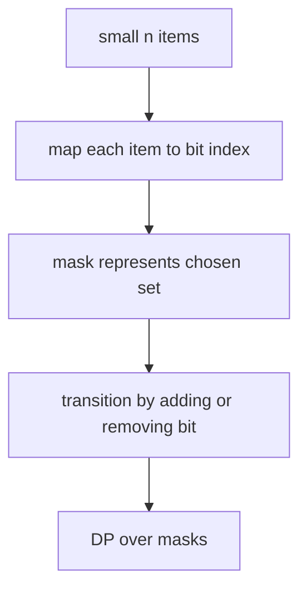

# 25. Bitmask State Compression

> Bitmask State Compression은 작은 집합의 선택/방문 상태를 정수 하나로 압축하는 패턴이다. 핵심은 `mask`의 각 bit가 어떤 원소를 의미하는지 끝까지 일관되게 유지하는 것이다.

## 문제 신호

- `n <= 20` 정도의 작은 원소 집합
- 모든 subset을 고려해야 함
- 방문한 노드 집합이 state에 포함됨
- “각 원소를 선택/미선택”하는 상태
- TSP, assignment, shortest path visiting all nodes



## 기본 Mapping

```python
def encode_subset(items: list[str], chosen: list[str]) -> int:
    index = {item: i for i, item in enumerate(items)}
    mask = 0
    for item in chosen:
        mask |= 1 << index[item]
    return mask
```

## Mask DP 기본형

`dp[mask]`를 “mask에 포함된 원소를 선택했을 때의 최적값”으로 정의한다.

```python
def min_cost_pick_all(cost: list[int]) -> int:
    n = len(cost)
    full = (1 << n) - 1
    dp = [10**18] * (1 << n)
    dp[0] = 0

    for mask in range(1 << n):
        for i in range(n):
            if mask & (1 << i):
                continue
            nxt = mask | (1 << i)
            dp[nxt] = min(dp[nxt], dp[mask] + cost[i])

    return dp[full]
```

이 예시는 단순하지만 구조가 중요하다. “현재 선택 집합”에서 “원소 하나를 더 선택한 집합”으로 전이한다.

## Assignment DP

`mask`의 bit count가 지금까지 배정한 worker 수를 의미한다.

```python
def min_assignment_cost(cost: list[list[int]]) -> int:
    n = len(cost)
    inf = 10**18
    dp = [inf] * (1 << n)
    dp[0] = 0

    for mask in range(1 << n):
        worker = mask.bit_count()
        if worker >= n:
            continue
        for job in range(n):
            if mask & (1 << job):
                continue
            nxt = mask | (1 << job)
            dp[nxt] = min(dp[nxt], dp[mask] + cost[worker][job])

    return dp[(1 << n) - 1]
```

## TSP 스타일 DP

`dp[mask][last]`를 “mask에 포함된 도시를 방문했고 마지막 도시가 last일 때의 최소 비용”으로 정의한다.

```python
def tsp_cost(dist: list[list[int]]) -> int:
    n = len(dist)
    inf = 10**18
    full = (1 << n) - 1
    dp = [[inf] * n for _ in range(1 << n)]
    dp[1][0] = 0

    for mask in range(1 << n):
        for last in range(n):
            if dp[mask][last] == inf:
                continue
            for nxt in range(n):
                if mask & (1 << nxt):
                    continue
                next_mask = mask | (1 << nxt)
                dp[next_mask][nxt] = min(
                    dp[next_mask][nxt],
                    dp[mask][last] + dist[last][nxt],
                )

    return min(dp[full][last] + dist[last][0] for last in range(n))
```

## Graph BFS + Mask

방문 집합 자체가 BFS state에 들어갈 수 있다.

```python
from collections import deque


def shortest_path_visiting_all(graph: list[list[int]]) -> int:
    n = len(graph)
    if n <= 1:
        return 0

    full = (1 << n) - 1
    queue = deque()
    visited: set[tuple[int, int]] = set()

    for node in range(n):
        mask = 1 << node
        queue.append((node, mask, 0))
        visited.add((node, mask))

    while queue:
        node, mask, dist = queue.popleft()
        for nxt in graph[node]:
            next_mask = mask | (1 << nxt)
            state = (nxt, next_mask)
            if next_mask == full:
                return dist + 1
            if state not in visited:
                visited.add(state)
                queue.append((nxt, next_mask, dist + 1))

    return -1
```

## Submask Enumeration

부분집합을 다시 부분집합으로 나누는 DP에서 사용한다.

```python
def all_submasks(mask: int) -> list[int]:
    result: list[int] = []
    sub = mask
    while sub:
        result.append(sub)
        sub = (sub - 1) & mask
    result.append(0)
    return result
```

## 복잡도 감각

| 패턴 | State 수 | 전이 | 시간 |
|---|---:|---:|---:|
| `dp[mask]` | O(2ⁿ) | O(n) | O(n2ⁿ) |
| `dp[mask][last]` | O(n2ⁿ) | O(n) | O(n²2ⁿ) |
| BFS `(node, mask)` | O(n2ⁿ) | degree | O(E2ⁿ) 수준 |
| mask-submask 전체 | O(3ⁿ) | - | 매우 큼 |

## 실수 방지

- `full = (1 << n) - 1`를 정확히 쓴다.
- bit index와 원소 index를 섞지 않는다.
- `mask.bit_count()`가 현재 depth를 의미하는지 확인한다.
- BFS에서는 같은 node라도 mask가 다르면 다른 state다.
- `n`이 25 이상이면 `2**n` 자체가 너무 커질 수 있다.

## 연결되는 노트

- [Bit Manipulation](../02.%20Algorithms/11.%20Bit%20Manipulation.md)
- [Dynamic Programming](../02.%20Algorithms/06.%20Dynamic%20Programming.md)
- [Graph Traversal Patterns](08.%20Graph%20Traversal%20Patterns.md)